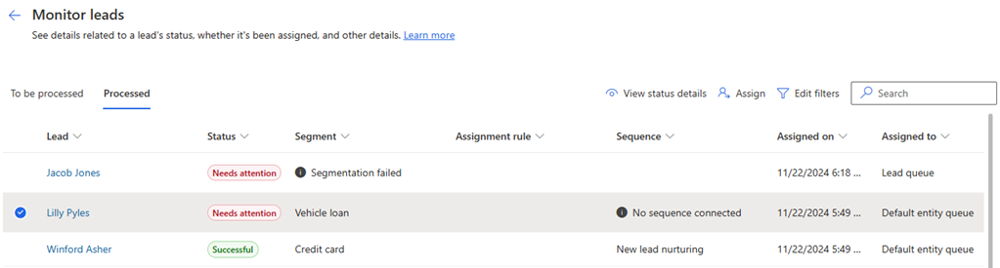

# View and manage unassigned records

Monitoring of unassigned records allows you to view the lead or opportunity records that aren't assigned to any seller. As an administrator, sales manager, or sequence manager, you can view these unassigned records and assign to sellers. 

## License and role requirements
| Requirement type | You must have |
|-----------------------|---------|
| **License** | Dynamics 365 Sales Premium or Dynamics 365 Sales Enterprise   More information: [Dynamics 365 Sales pricing](https://dynamics.microsoft.com/sales/pricing/) |
| **Security roles** | System Administrator, Sequence Manager, or Sales Manager    More information: [Predefined security roles for Sales](security-roles-for-sales.md)|

## View unassigned records

You can view the list of records that aren't assigned to sellers and assign them to sellers either manually or by creating an assignment rule. More information: [Create and activate an assignment rule](create-and-activate-assignment-rule.md#to-create-and-activate-an-assignment-rule).  
The records aren't assigned automatically because of one of the following reasons: 

| Reason | Description |
|--------|-------------|
| Eligible sellers don't have availability | Record couldn’t be assigned as eligible sellers aren't available. |
| Eligible sellers don't have capacity | Record couldn’t be assigned as eligible sellers don't have the capacity. |
| No assignment rule for this record's segment | Record doesn't match any assignment rule that is currently active and available in the organization.|
| No sellers meet the conditions | Record isn't assigned as none of the sellers meet the conditions that are defined in the matched assignment rule. | 
| Owner assigned manually | Owner is manually assigned to the record. |
| Owner assigned successfully | Owner is assigned to the record. |
| Record doesn't meet any conditions | Record isn't assigned as it doesn't match any conditions that are defined for the assignment rule. |
| Run is in progress | Specifies that the assignment is in progress for the record. |
| There was an issue with the server | Record isn't assigned as there's an issue with the server that your organization is hosted on. |

**To view the unassigned records** 

1.	Sign in to your Dynamics 365 Sales Hub app.    
2.	Go to **Change area** in the lower-left corner of the page, and select **Sales Insights settings**.   
3. Under **Sales accelerator**, select **Assignment rules**.  

    >[!div class="mx-imgBorder"]
    >

3. Select the **Monitor** tab, and then select a tab according to your requirement. In this example, we're selecting the **Unassigned Lead** tab and a list of unassigned lead records is displayed.

    >[!div class="mx-imgBorder"]
    > 

    The **Status Reason** column displays why the record isn't assigned to a seller. By analyzing the reason, you can take appropriate action by assigning these leads to sellers, creating an assignment rule, or by adding conditions to existing assignment rule. More information: [Create and activate an assignment rule](create-and-activate-assignment-rule.md#to-create-and-activate-an-assignment-rule). 

## Assign records manually

You can assign the unassigned records to sellers or a team. 

1. Select the record that you want to assign to a seller and then select **Assign**. In this example, we're selecting a lead record. 
    
    >[!NOTE]
    >You can select multiple records at once to assign to a seller.  

    >[!div class="mx-imgBorder"]
    > 

2. On the **Assign leads to a seller or team** page, select a seller to who you want to assign the record.   

    >[!NOTE]
    >- Enable the **Show eligible sellers** option to view only the seller who are added to assignment rules through team settings. More information: [Manage sales teams in assignment rules](manage-sales-teams.md)
    >- To assign the record to a team, select **Team** tab.

    >[!div class="mx-imgBorder"]
    > 
        
3. Select **Assign**.    
    The record is assigned to the seller and the list refreshes to remove the assigned record.    
    To view the details of the assigned records, select the **Assignment history** tab. A list of previously assigned records is displayed.

[!INCLUDE[cant-find-option](../includes/cant-find-option.md)]

### See also

[Manage assignment rules](create-manage-assignment-rules.md)

[!INCLUDE[footer-include](../includes/footer-banner.md)]
