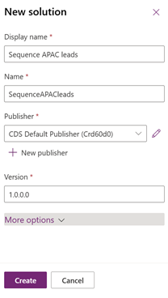
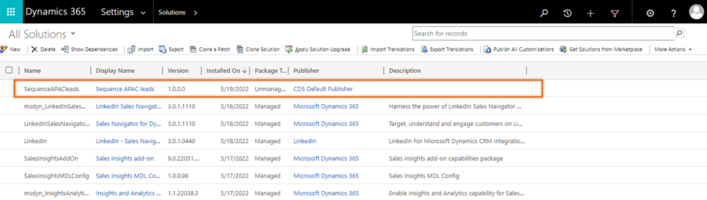
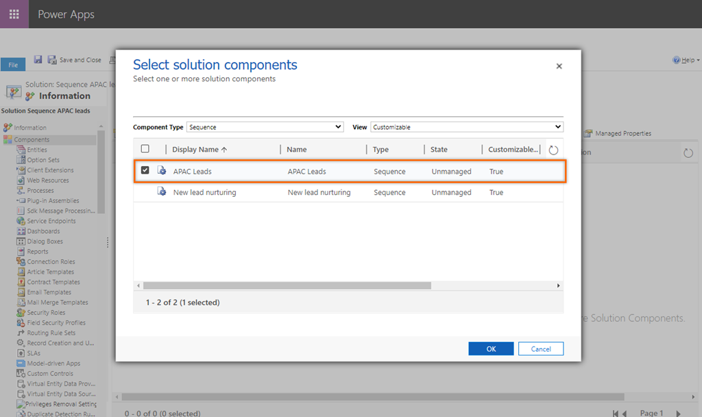
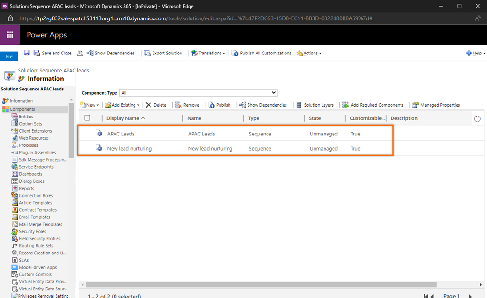
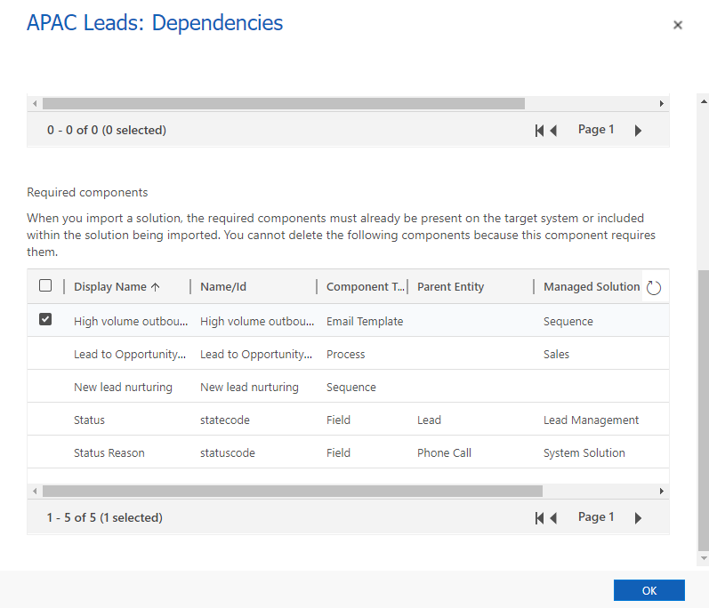
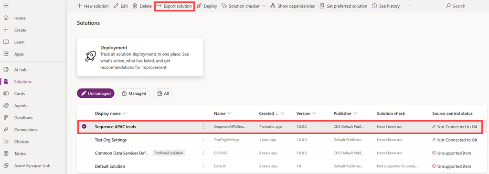
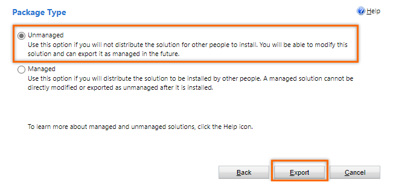
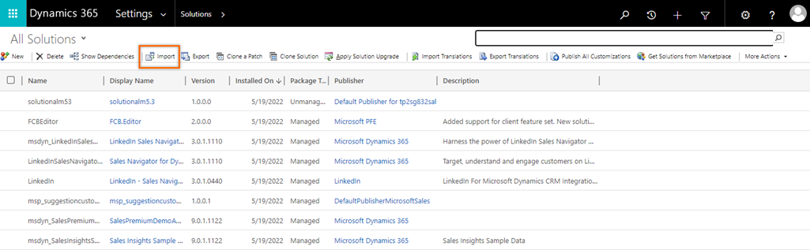
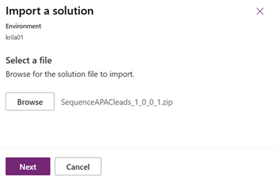
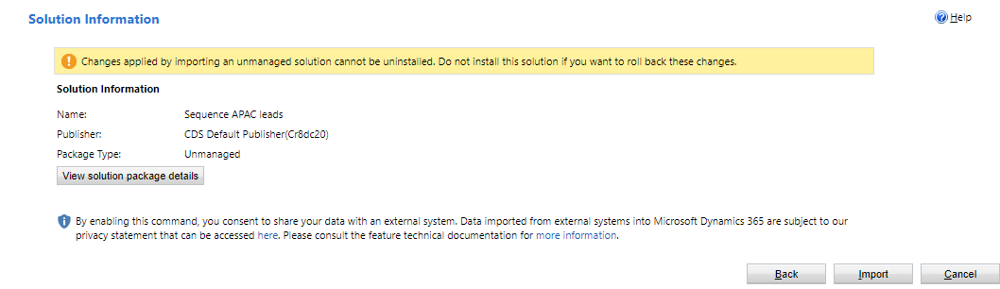

# Migrate sequences from one environment to another

Use the solution export and import functionality to migrate sequences from one environment to another in Dynamics 365 Sales.

## License and role requirements
| Requirement type | You must have |
|-----------------------|---------|
| **License** | Dynamics 365 Sales Premium or Dynamics 365 Sales Enterprise  More information: [Dynamics 365 Sales pricing](https://dynamics.microsoft.com/sales/pricing/) |
| **Security roles** | System Administrator or Sequence Manager    More information: [Predefined security roles for Sales](security-roles-for-sales.md)|

## Migrate sequences

Organizations use staging (non-production) environments to set up and test complex steps, such as sequences, assignment rules, and segments. Organizations then use the staging environments to test these steps to avoid any disruption in their operations, saving time and money. Also, the staging environments help in training the sellers. 
    
Administrators and sales managers can now migrate sequences along with their dependent entities from one environment to the other. To migrate sequences, complete the following steps:

1.	[Create a solution](#create-a-solution)
2.	[Add sequence to the solution](#add-sequence-to-the-solution)
3.	[Export the solution](#export-the-solution)
4.	[Import the solution](#import-the-solution)

## Create a solution

Let’s create a sequence solution with an example.

1.	Sign in to the Sales Hub app and go to **Settings** > **Advanced Settings**.

2. On the **Advanced settings** page, go to **Setting** > **Customization** > **Solutions**.   

2.	On the **Solutions** page, select **New** and then on the **New solution** dialog, enter the values for the following fields:
            
    | Column | Description |
    |--------|-------------|    
    | Display name | Specify a meaningful name. Display name appears in the list of solutions and can be changed later. Example: **Sequence APAC leads** |
    | Name | Specify a unique name for the solution. This field is populated using the value you enter in the Display name field. You can edit this before you save the solution, but not after. |    
    | Publisher | Select the default publisher or create a new publisher. We recommend that you create a publisher for your organization to use consistently across your environments where you'll use the solution. Example: **CDS Default Publisher**. |
    | Version | Specify a version number for the solution.  This version number will be included in the file name when you export the solution. |    

    >[!div class="mx-imgBorder"]
    >            

3.	Select **Save and close**.
        
    The solution is created and listed under solutions.

    >[!div class="mx-imgBorder"]
    >            
     
Now, let’s add the required sequences into the solution.       

## Add sequence to the solution

After you create the solution, add the sequences that you want to export through the solution. 

1.	Open the solution. In this example, we’re opening the **Sequence APAC leads** solution.

    >[!div class="mx-imgBorder"]
    > 
 
2.	Select **Add existing** > **Sequence**.    

    The **Add existing sequence** page opens with a list of sequences.

3.	Select and add the sequences that you want to include in this solution. In this example, we’re selecting and adding **APAC Leads**.

    >[!div class="mx-imgBorder"]
    > 
     
    The sequence and its dependent components such as sequences, email templates, business process flows (BPF) record, sequence tags, and attributes are added to the solution. 

    In our example, the **New lead nurturing** sequence is added to the list because the **APAC Leads** sequence contains it as a step.

    >[!div class="mx-imgBorder"]
    > 
    
    To see other dependent entities of the added sequences, select the sequence, and then select **Show Dependencies** and go to the **Required components** section. In this example, we are viewing the other dependencies of **APAC Leads** sequence.
    
    >[!NOTE]
    >If the sequence contains managed components, they won't be added to the solution. Therefore, when the solution is imported, the steps that are dependent on the missed components will show an error. To resolve the errors in the target organization, go to [Troubleshoot solution import errors in Microsoft Dynamics 365](/troubleshoot/dynamics-365/sales/troubleshoot-solution-import-errors-in-dynamics-365).

    >[!div class="mx-imgBorder"]
    > 
 
Now that you've added the sequences, export the solution.

## Export the solution

Always export the sequence as an unmanaged solution. The unmanaged dependent components of the sequences are automatically added to the solution package; managed components aren't added. When the solution is imported, the steps that depend on the missing components will show an error. To resolve the error, install the dependent components in the target environment. More information: [Solution install fails due to missing dependencies](/troubleshoot/dynamics-365/sales/solution-install-fails-due-dependencies). 

Also, you can edit the sequences and their dependent components in the target environment after the import. 

1.	On the **Solutions** page, select the solution. In this example, let’s select **Sequence APAC leads**.

2.	From the tool bar, select **Export**.

    >[!div class="mx-imgBorder"]
    >
 
3.	On the **Publish Customizations** dialog, select **Next**.

    >[!NOTE]
    >After you’ve added the sequence and its dependent components to the solution and if you’ve made any changes that you would like to export, select **Publish All Customizations**. The updates are added to the solution.

4.	On the **Export System Settings (Advanced)** dialog, select the required system settings and then select **Next**.

5. On the **Package Type** dialog, select **Unmanaged** and then select **Export**.    
    
    More information: [Managed and unmanaged solutions](/power-platform/alm/solution-concepts-alm#managed-and-unmanaged-solutions) |

    >[!div class="mx-imgBorder"]
    >
 
    The export can take several minutes to complete. Once finished, the exported *.zip* file is available in the download folder specified by your web browser. Download the zip file to your local computer. For example, **SequenceAPACleads_1_0_0_1.zip**.

Now, the solution is ready for import.

## Import the solution

1.	Sign in to the Sales Hub app and go to **Settings** > **Advanced Settings**.

2. On the **Advanced settings** page, go to **Setting** > **Customization** > **Solutions** and select **Import**.   

    >[!div class="mx-imgBorder"]
    >
 
3.	On the **Select Solution Package** dialog, select **Choose File** and open the solution that you've downloaded.

    >[!div class="mx-imgBorder"]
    >
 
4.	Select **Next**.

5. On the **Solution Information** dialog, select **Import**.
    
    >[!NOTE]
    >To view the details of the imported solution, select **View solution package details**. 

    >[!div class="mx-imgBorder"]
    >

    The solution is imported into the target environment along with its dependent components. Also, when you delete the sequence, the dependent components remain in the imported environment, in case the components are used by other sequences or entities. 

    >[!NOTE]
    >If the import fails due to missing dependencies, a message is displayed on the top of the dialog. 
    >To troubleshoot import-related issues for solutions, go to [Troubleshoot solution import errors in Microsoft Dynamics 365](/troubleshoot/dynamics-365/sales/troubleshoot-solution-import-errors-in-dynamics-365).

6. On the **Importing Solution** dialog, select **Close**.

[!INCLUDE[cant-find-option](../includes/cant-find-option.md)]

### See also

[Create and activate a sequence](create-and-activate-a-sequence.md)

[Manage sequences](create-manage-sequences.md)
