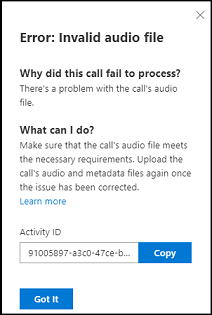

# Monitor call and insight processing  

As a user of conversation intelligence, you might want to track and understand the status of calls with customers. The **System monitoring** page in the conversation intelligence app helps you ensure that the calls were successfully processed. You can monitor the status of calls that have been processed, are yet to be processed, or could not be processed. When call processing errors occur, you can view the reasons for each error and take the appropriate steps.

## License and role requirements

| Requirement type | You must have |
|-----------------------|---------|
| **License** | Dynamics 365 Sales Premium  More information: [Dynamics 365 Sales pricing](https://dynamics.microsoft.com/sales/pricing/) |
| **Security roles** | Any primary sales role, such as salesperson or sales manager   More information: [Primary sales roles](security-roles-for-sales.md#primary-sales-roles)|

## View the System monitoring page
 
The call processing information you can view and track on the page depends on the role that you are assigned.

| Role | Which calls can I track? |
|------|--------------------------|
| Administrator | Call processing information of the entire organization. |
| Sales Manager | Call processing information of your and your teams'. |
| Seller | Call processing information of your calls. |

1.	Sign in to the [Conversation intelligence app](https://sales.ai.dynamics.com/) and select **System Monitoring** to open the system monitoring page.

    > [!div class="mx-imgBorder"]
    > 

    | Number | Feature | Description |
    |--------|---------|-------------|
    | 1 | Time period filter | You can filter the information on the page based on a time period, such as last 24 hours, last seven days, last month, current month, or a custom time period. For example, to view the information of the current month, select **This month**, and the information is filtered to display the current month's status in the **Total call status**, **Completion rate**, and **list of calls**. |
    | 2 | Completion rate | This insight shows the average percentage of total calls that are processed successfully at a given time. **Note**: If calls aren’t uploaded at all, for any reason, they will not appear in the graph. |
    | 3 | Total call status | This insight shows a pie chart of the total number of calls uploaded and the average percentage of calls in progress, failed, and completed. In this example you can see that a total of 3,302 calls were uploaded in which an average of 87% of calls were completed (successfully processed), 10% of calls failed, and 3% of calls are in progress. |
    | 4 | View list of calls | This table lists the total number of calls that are uploaded for processing. The table has four columns: Call process date, File name, Seller, and Status. By default, the calls are sorted according to the date they are processed in descending order. You can also sort the call list according to file name, seller name, or status. The **Status** column helps you identify the status of a call, such as completed, in progress, or failed. If a call is failed, an error is displayed. When you select the error, a pop-up window is displayed with information such as why the call failed to process, what you can do to resolve the error, and an **Activity ID**. You can copy the activity ID and provide it to your support team (or Microsoft Support) for further investigation, which can help you to debug the call process and resolve the error.  **Note**: To view the list of calls according to their status, select one of the tabs: **Completed**, **In progress**, or **Failed**. |

[!INCLUDE[cant-find-option](../includes/cant-find-option.md)] 

[!INCLUDE[footer-include](../includes/footer-banner.md)]
