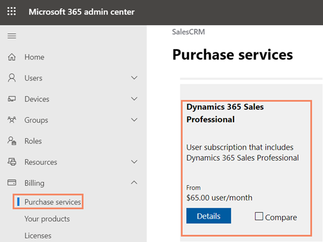
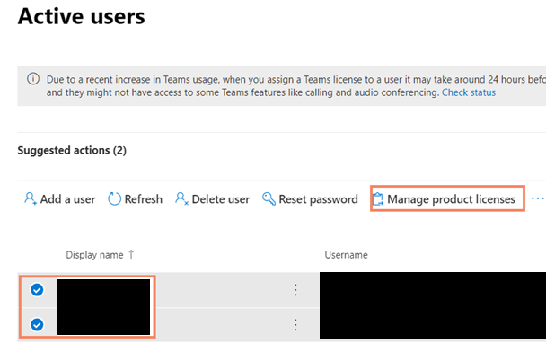

# Move from Dynamics 365 Sales Enterprise edition to Dynamics 365 Sales Professional 

Learn how to purchase, assign, and install Sales Professional license so that you can switch from Sales Enterprise to Sales Professional.

## License and role requirements
| Requirement type | You must have |
|-----------------------|---------|
| **License** | Dynamics 365 Sales Enterprise and Dynamics 365 Sales Professional  More information: [Dynamics 365 Sales pricing](https://dynamics.microsoft.com/sales/pricing/) |
| **Security roles** | System Administrator   More information: [Predefined security roles for Sales](security-roles-for-sales.md)|

## Move from Sales Enterprise to Sales Professional

[!INCLUDE[pn-dyn-365-sales](../includes/pn-dyn-365-sales.md)] Professional is targeted at businesses that have simpler sales needs and do not require the full sales capabilities. If you ever want to switch from [!INCLUDE[pn-dyn-365-sales](../includes/pn-dyn-365-sales.md)] Enterprise to [!INCLUDE[pn-dyn-365-sales](../includes/pn-dyn-365-sales.md)] Professional, do the following:

1.	Purchase a [!INCLUDE[pn-dyn-365-sales](../includes/pn-dyn-365-sales.md)] Professional subscription.

2.	Assign [!INCLUDE[pn-dyn-365-sales](../includes/pn-dyn-365-sales.md)] Professional licenses to the users.

3.	Install the [!INCLUDE[pn-dyn-365-sales](../includes/pn-dyn-365-sales.md)] Professional edition solution.

## Purchase Dynamics 365 Sales Professional subscription

1.  Sign in to [Microsoft 365 admin center](https://admin.microsoft.com) with the Dynamics 365 account that has admin permissions.

2.  In the navigation pane, select **Purchase Services**, and then select the Dynamics 365 Sales Professional tile. 

    > [!div class="mx-imgBorder"]
    >  

3.  Select **Buy**, and then follow the steps to purchase new licenses. 

    > [!div class="mx-imgBorder"]
    >  

## Assign licenses to your users

After you’ve purchased the licenses, assign the licenses to users. 

1.	Go to Microsoft 365 admin center, and in the navigation pane, select **Users** > **Active users**.

2.	Select multiple users, and then select **Manage product licenses**. 
    
    > [!div class="mx-imgBorder"]
    > 

3.	Select **Replace existing product license assignments**, and then select **Next**. 

4.	Turn on the license for your Dynamics 365 Sales plan. 

5.	Select **Replace**, and then select **Close** twice. 

6.	Review the license status on the **Active users** page and make other assignments as needed. 

## Install Dynamics 365 Sales Professional solution

Go to the Microsoft 365 admin center to install Dynamics 365 Sales app (solution) to your production environment. For more information, see [Install Dynamics 365 Sales Professional](../sales-professional/provision-sales-professional-instance.md#install-app)

After you complete these steps, your organization will be effectively moved to [!INCLUDE[pn-dyn-365-sales](../includes/pn-dyn-365-sales.md)] Professional.

> [!IMPORTANT]
> [Hide](/power-apps/maker/model-driven-apps/deactivate-app) the Sales Hub app as it's only applicable for Sales Enterprise and Sales Premium licenses. Sales Professional users are entitled to use only the Sales Professional app.

[!INCLUDE [cant-find-option](../includes/cant-find-option.md)]

## Related information

[Dynamics 365 Licensing Update](/dynamics365/licensing/update)

[!INCLUDE[footer-include](../includes/footer-banner.md)]
