# Personalize sales accelerator 

Use personal settings to determine how activities are scheduled based on work availability and decide what happens when an activity is complete.

## License and role requirements
| Requirement type | You must have |
|-----------------------|---------|
| **License** | Dynamics 365 Sales Premium or Dynamics 365 Sales Enterprise  More information: [Dynamics 365 Sales pricing](https://dynamics.microsoft.com/sales/pricing/) |
| **Security roles** | Any primary sales role, such as salesperson or sales manager   More information: [Primary sales roles](security-roles-for-sales.md#primary-sales-roles)|

## What can you personalize?

As a seller, you can personalize the sales accelerator by determining how activities are scheduled based on your work availability and deciding what happens when you complete an activity. The following personal settings are available for you to configure:

-	[Configure your work availability](#configure-your-work-availability)
-	[Configure the auto advance steps](#configure-the-auto-advance-steps)
-	[Configure steps and activities](#configure-steps-and-activities)
-	[Show or hide filters](#show-or-hide-filters)

## Configure your work availability

Configure your working days, hours, and days off to adjust scheduled tasks and lead assignment according to your availability. For example, you're taking a day off on April 1, 2021, and you have a few activities to complete that day. When you configure the calendar with your day off, any activities that were scheduled for that day will be moved to your next available date or time.

>[!NOTE]
>As a sales manager, you can configure the availability of sellers who report to you. More information: [Manage seller availability](manage-seller-availability.md) 

Depending on the license you have in the organization, you use one of the following ways to configure your work availability:
- Sales Premium: [Through work list settings](#through-work-list-settings)
- Sales Enterprise: [Through personal settings](#through-personal-settings)

>[!NOTE]
>- Ensure that you have read and write privileges to the **Calendar** entity. More information: [Security roles and privileges](/power-platform/admin/security-roles-privileges)
>- Verify that the administrator has enabled the option to configure your availability: 
>    - Through sequence settings. More information: [Seller availability](customize-sales-accelerator-sellers.md#seller-availability)
>    - Through sales accelerator configuration. More information: step 4 in [Configure sales accelerator for assignment rules](sales-accelerator-assignment-rules.md)

### Through work list settings (Sales Premium)

1. Sign in to the Dynamics 365 Sales Hub app, and go to **My work** > **Sales accelerator**. 

2. In the work list section, select **More options** > **Settings**.   

    >[!div class="mx-imgBorder"]
    >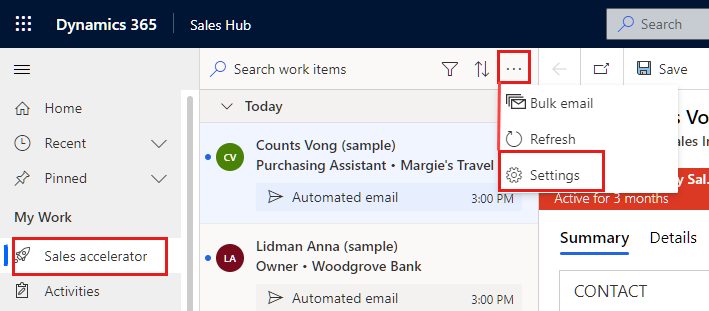     

3. On the **Personal settings** page, select **Availability**.

    >[!div class="mx-imgBorder"]
    >      

    >[!NOTE]
    >If your administrator has chosen the Outlook calendar option, a message is displayed to configure your work availability through Outlook.
    >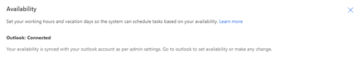    
    >Go to your Outlook calendar, set your work hours and vacation days, and then save the calendar events. Your availability will be automatically updated in the Dynamics 365 application calendar.

4. Select **New**, and choose an option to configure your calendar according to your requirements:

   - **Working hours**: Configure your regular working hours between dates you define. This helps the sales accelerator to consider the assignment of activities to your work list.

      >[!div class="mx-imgBorder"]
      >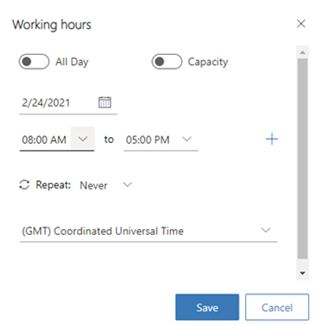

       Configure the following options:
       1. Select a date for which you want to configure your working hours.

       2. Select the working hours in your day. By default, nine working hours are configured from 8&ratio;00 AM to 5&ratio;00 PM, without any breaks. To add a general break or lunch hours between working hours, select **Add** (**+**). In the following example, you can see that a break of 30 minutes has been added to the working hours. You can continue adding breaks as needed.

          >[!div class="mx-imgBorder"]
          >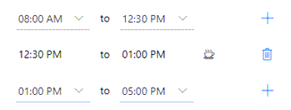    

       3. Choose whether you want to repeat this working hour configuration each day or only on this day of the week:    

           - If you select **Every day**, the configured working hours are applied to each day of the week, including Saturday and Sunday. You can select any days for which you don't want to apply these working hours. In the following example, Saturday and Sunday have been removed from this working hour configuration. Also, you can **choose an end date** on which you want to end this working hour configuration.

              >[!div class="mx-imgBorder"]
              >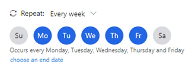

           - If you select **Every week**, the configured working hours are applied to the same day every week. In the following example, the configuration is applied on Wednesday, and all subsequent Wednesdays will have the same working hour configuration. Also, you can **choose an end date** on which you want to end this working hour configuration.

               >[!div class="mx-imgBorder"]
               >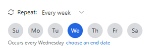    

       4. Select your time zone. The time zone allows you to match the time properly when your team is spread across countries or regions. By default, Coordinated Universal Time (Greenwich Mean Time) is selected.    

       5. Save the configurations.      

   - **Non-working hours**: Configure a break or time you're taking off from work on a particular day. Choose the period of time you want to take off, and then select **Save**.

       In the following example, you have an appointment with a doctor for a checkup between 1:00 and 4:00 PM on March 2, 2021. When you use the **Non-working hours** option to update your calendar, the sales accelerator will consider the break and adjust your activity timeline to match your working hours.

        >[!div class="mx-imgBorder"]
        >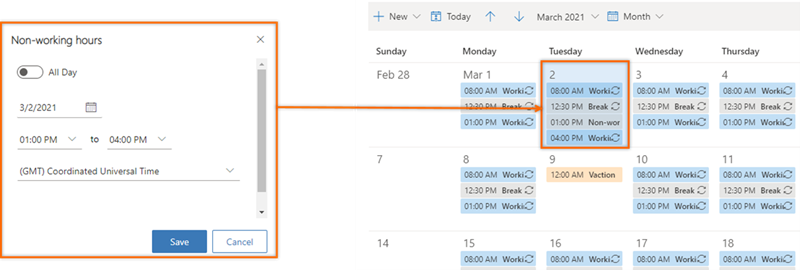    

   - **Time off**: Configure vacations or personal days off from work. This option blocks a full day or multiple days. When you're applying for multiple days, select the **All-day** option, and then choose start and end dates.

     Provide a description so other sellers can know your status and your reason for being away. Select your time zone, and then save the configurations.

     In the following example, you plan to go on vacation with family from March 9 to March 12, and you use the **Time off** option to update your calendar. The sales accelerator will consider the vacation and adjust the activity timeline to match your vacation.

     >[!div class="mx-imgBorder"]
     >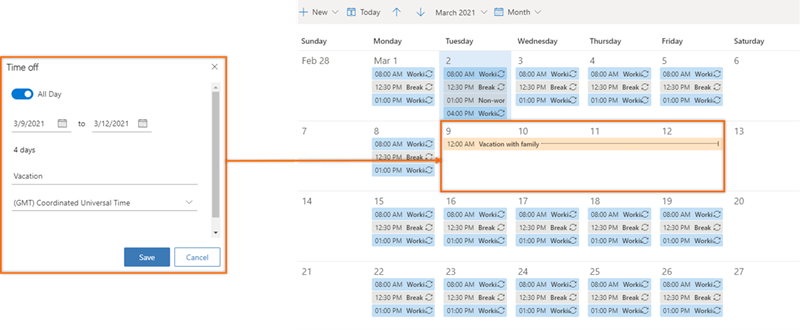    

### Through personal settings (Sales Enterprise)

1.	Sign in to your Sales Hub app, and in the lower-left corner, go to **Change area** > **Personal settings**. 

2.	Select **Calendar**.

    The calendar opens for the current month with your work availability. Also, at the bottom of the calendar, you can see the default local time of your organization.

    > [!div class="mx-imgBorder"]
    > 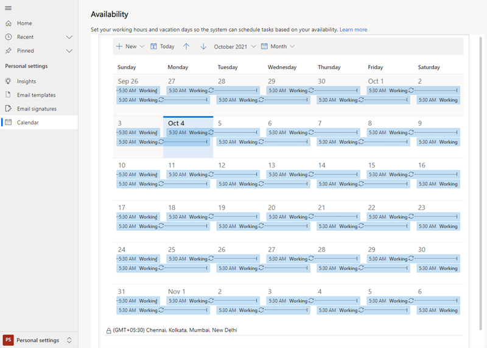

    >[!NOTE]
    >If your administrator has chosen the **Outlook** option, a message is displayed to configure your work availability through your Outlook calendar.     
    >    
    >Go to your Outlook calendar, set your work hours and vacation time, and then save the calender events. Your availability will be automatically updated in the Dynamics 365 application calendar.

3.	Configure your calendar according to your requirements as described in step 4 of the [Through work list settings](#through-work-list-settings) section, earlier in this topic.     

## Configure the auto advance steps

The **Auto advance** settings specify the next course of action to take when you complete or skip a step.

1.	Sign in to the Dynamics 365 Sales Hub app, and go to **My Work** > **Sales accelerator**.
2.	In the work list, select the settings icon.   
    >[!div class="mx-imgBorder"]
    >      
3.	On the **Personal settings** page, select **Auto advance**.      
    >[!div class="mx-imgBorder"]   
    >      

    The following settings are available for completing or skipping an activity:       
    -	**Ask before moving to the next work item**: When an activity is completed or skipped, a message is displayed before you move to the next record in the work list. On the message, you select an appropriate option to proceed. The following image shows the message that's displayed when you skip an activity.    
        >[!div class="mx-imgBorder"]
        >       
    -	**Automatically go to the next work item**: When an activity is completed or skipped, the next record in the work list queue is automatically displayed.   
    -	**Stay on the same record**: When an activity is completed or skipped, the same record still is displayed, and the **Up next** widget displays the next activity that has been defined in the sequence.    
4.	Save and close the settings page.

## Configure steps and activities

When a step is displayed in the **Up next** widget, a corresponding activity is automatically created on the timeline and linked to the step. When you complete the action, such as sending an email or making a call through the timeline, the step is updated. By configuring the activities and steps, you can choose how the actions you perform on steps will affect the linked activities and sequence steps.

> [!NOTE]
> Verify that the administrator has enabled the option to configure steps and activities. More information: [Enable the availability option in sequence settings](customize-sales-accelerator-sellers.md#sequence-activities)

1.	Sign in to the Dynamics 365 Sales Hub app, and go to **My work** > **Sales accelerator**.
2.	In the work list, select the settings icon.   
    >[!div class="mx-imgBorder"]
    >     
3.	On the **Personal settings** page, select **Steps and activities**.       
4.	On the **Steps and activities** page, configure the following options as required:     
    -	**When I send an email**: When you select this checkbox and send an email through the timeline, the sequence step that's related to this activity is automatically marked as complete.     
    -	**When I mark a phone call activity record as complete**: When you select this checkbox and make a phone call through the timeline, the sequence step that's related to this activity is automatically marked as complete.      
    -	**When I mark a phone call sequence step as complete**: When you complete a phone call activity in the sequence step, you can choose to enter the status of the activity or enter a default value that has been defined for your organization.    

    >[!div class="mx-imgBorder"]
    >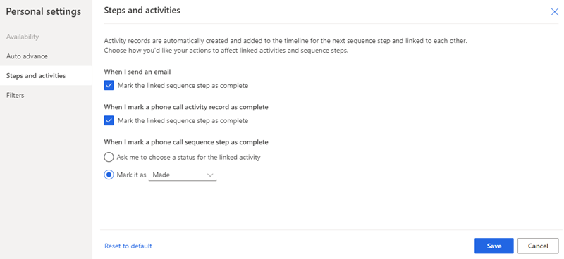     
 
5.	Save and close the settings page.

## Show or hide filters

As a seller, you can hide any filter that's available in the filter list. After hiding a filter, you can't view the filter option in your list.   

1.	In the work list section, select **More options** > **Settings**.    

    > [!div class="mx-imgBorder"]    
    > 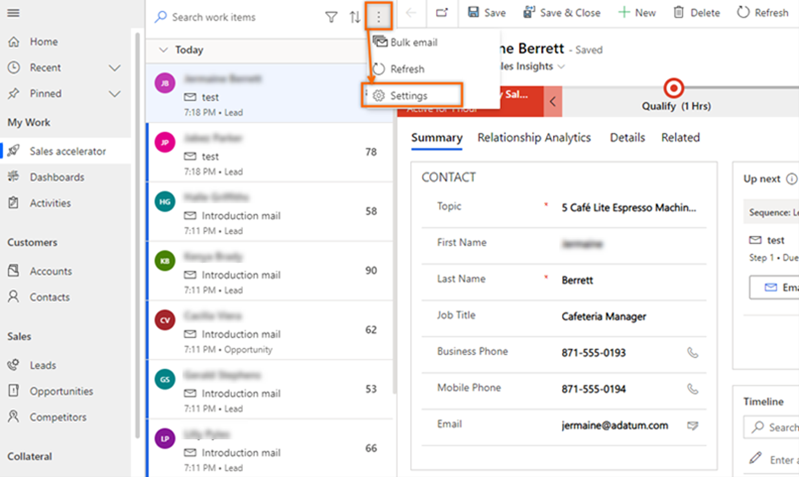  
 
3.	On the **Personal settings** page, select **Filters**.   

    > [!div class="mx-imgBorder"]    
    > 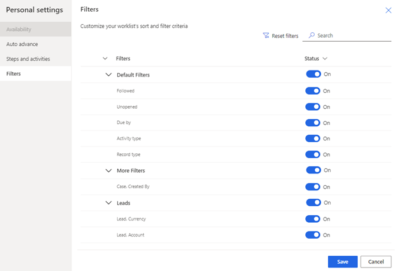  
 
4.	Go to the filter that you want to hide, and turn off the toggle. 

    >[!NOTE]
    >-	To hide a group, turn off the toggle for the group.
    >-	If the administrator hides filters or groups, you can't see them in your list. Contact your administrator to show the filters for you to use. More information: [Hide filters](customize-workspace-sales-accelerator.md#hide-filters)
 
    > [!div class="mx-imgBorder"]    
    > 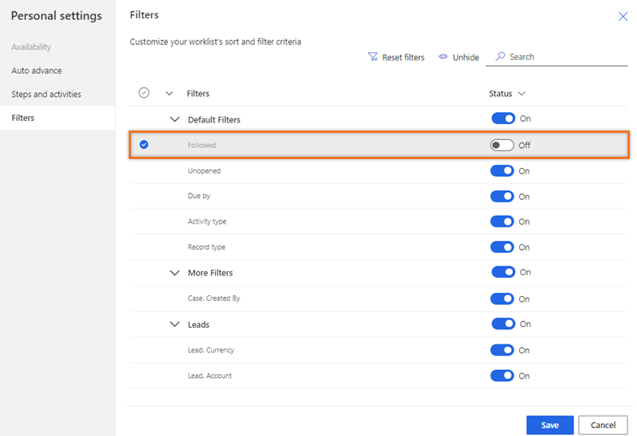      

5.	Select **Save**.

The filter is hidden from your list.

[!INCLUDE[cant-find-option](../includes/cant-find-option.md)]

### See also

[Configure sales accelerator settings for sellers to personalize](customize-sales-accelerator-sellers.md)  
[Prioritize your sales pipeline by using the work list](prioritize-sales-pipeline-through-work-list.md)   
   

[!INCLUDE[footer-include](../includes/footer-banner.md)]
