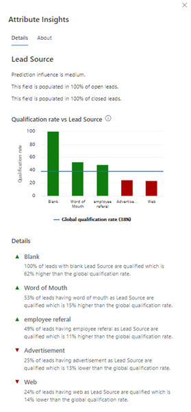

# View the influence of an attribute on the model

When you define a model, you'd like to get insights on the influence of each attribute on the prediction score. Based on these insights, you can analyze and understand:

- Why certain attributes carry more prediction influence than others.
- How the attribute values compare to the attribute global qualification rate.
- How the model harnesses your data to drive predictive scores.

> [!NOTE]
> This article applies to both opportunity scoring and lead scoring. Though the examples in this article are referring to leads, the same are applicable to opportunities as well.

## License and role requirements

| Requirement type | You must have |
|-----------------------|---------|
| **License** | Dynamics 365 Sales Premium or Dynamics 365 Sales Enterprise  More information: [Dynamics 365 Sales pricing](https://dynamics.microsoft.com/sales/pricing/) |
| **Security roles** | System Administrator    More information: [Predefined security roles for Sales](security-roles-for-sales.md)|

## View attribute insights and influence

1. [Edit a model](pls-edit-and-retrain-model.md).

1. On the **Edit fields** page, select the attribute for which you want to view insights, either from **Primary entity** or **Related entities**. 
    The **Attribute Insights** pane is displayed on the right side of the page. The following image shows an example of the **Attribute Insights** pane for the **Lead Source** attribute.

    > [!div class="mx-imgBorder"]
    > 

On the **Attribute Insights** pane, you can view detailed information about an attribute, such as its qualification rate and the most important reasons&mdash;both positive and negative&mdash;for that rate.  

Additionally, you can connect the attribute value's relative impact on the score with the data input behaviors of your sellers and how that might affect the accuracy of the predictive score.

The insights displayed on the **Attribute Insights** pane are based on your organization's data and how it correlates to qualified outcomes. For example, when a lead has an attribute value that correlates with a qualification rate above the attribute's global qualification rate, the predictive score of that lead increases. When the qualification rate for a lead is below that of the attribute's average, the predictive score decreases.

The **Attribute Insights** pane is divided into the following sections:

- A summary section with the prediction influence of the attribute, how many times the attribute is populated in open and closed leads/opportunities, and the reason the attribute isn't automatically selected to create the model.

- A graph that illustrates how each value of the attribute contributes to the qualification rate. In this example, you can see that the lead source values **Blank**, **Word of Mouth**, and **Employee referral** perform better than the average, and **Advertisement** and **Web** perform below the average. The average is represented by a blue line and calculated based on the following formula:

    `Global qualification rate for leads` = {`Total number of leads qualified in your organization`/(`Total number of qualified + disqualified leads through this attribute`)} &times; 100   

    `Global qualification rate for opportunities` = {`Total number of  opportunities won in your organization`/(`Total number of won + lost  opportunities through this attribute`)} &times; 100  

    Hover over each bar to view the summary of the value, such as the qualification rate and the number of open and closed leads/opportunities. The qualification rate for a value of the attribute is calculated based on the following formula:

     `Qualification rate for a value of the attribute` = (`Total number of leads/opportunities qualified with the given value in the attribute`/`Total number of closed leads/opportunities with that value in the attribute`) &times; 100  

     For example, if leads with high budget have a 42 percent qualification rate, the formula is:

     (`Total number of leads with high budget that are qualified)/( Total number of leads with high budget that are closed`) &times; 100 = 42  

   > [!NOTE]
   > These calculations are based on the data at the time the model is trained, and might not represent the current snapshot of data. Also, the past two years of data is considered and if the model has filters, the calculations are done after the data is filtered.
- A **Details** section that provides reasons for why the values are trending as they are in the graph at that point in time. If there isn't enough data for attributes from related entities, the application won't display the insights.
- The **About** tab provides more information about the attribute insights.

> [!NOTE]
> The insights for the attributes are updated when the model is retrained, either manually or automatically. For models that were created before March 2021, data for attribute insights won't be available. We suggest that you retrain&mdash;or enable the option to automatically retrain&mdash;the model to view the attribute insights.

[!INCLUDE[cant-find-option](../includes/cant-find-option.md)]