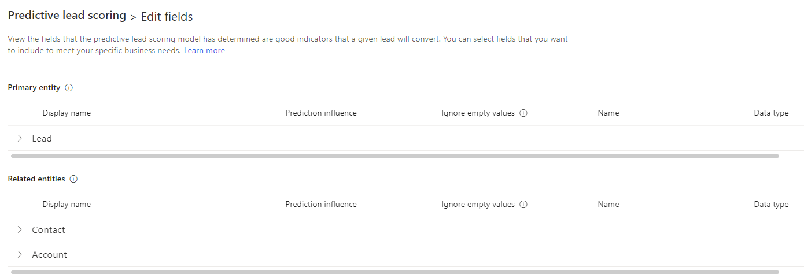
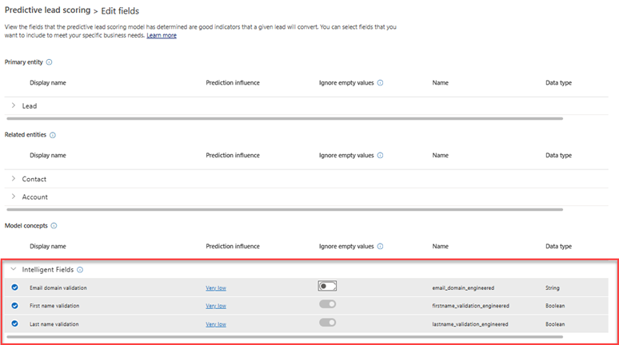

# Edit and retrain a lead scoring model

When the prediction accuracy of a model doesn't meet your expectations, you can edit the attributes used by the model and retrain it.  

## License and role requirements

| Requirement type | You must have |
|-----------------------|---------|
| **License** | Dynamics 365 Sales Premium or Dynamics 365 Sales Enterprise  More information: [Dynamics 365 Sales pricing](https://dynamics.microsoft.com/sales/pricing/) |
| **Security roles** | System Administrator    More information: [Predefined security roles for Sales](security-roles-for-sales.md)|

## Edit the model

1. Go to **Change area** in the lower-left corner of the Sales Hub app, and select **Sales Insights settings**.

1. On the site map under **Predictive models**, select **Lead scoring**. 
1. On the predictive lead scoring page, open the model and ensure that **Retrain automatically** is turned off.
1. Select **Edit model**.
1. On the **Edit model** page, you can,
    - Select an attribute to view its prediction influence and other insights about the attribute. For more information, see [View the influence of an attribute on the model](pls-attribute-influence.md).
   
    - Select attributes that you want the model to consider—including custom attributes—from the lead entity and its related entities (contact and account) to train the model.

   > [!NOTE]
   > To use intelligent fields, see, [Select intelligent fields](#select-intelligent-fields).

   > [!div class="mx-imgBorder"]
   > 

   > [!NOTE]
   > The scoring model doesn't support the following types of attributes:
   > - Attributes on custom entities
   > - Date and time&ndash;related attributes
   > - System-generated attributes such as leadscore, leadgrade, version number, entity image, exchange rate, and predictive score ID
1. (Optional) Scroll to the right of the attributes list and turn on **Ignore empty values**.
   By default, empty values in the attribute are included for training the model. If you notice that empty values are acting as detractors or are producing false positives, turn on **Ignore empty values**.

    :::image type="content" source="media/ignore-empty-values.png" alt-text="A screenshot of ignore empty values option in the attributes list.":::

   > [!NOTE]
   > - The **Ignore empty values** option is disabled for the following type of attributes:
   > - Attributes that are automatically validated for empty values (such as, firstname_validation_engineered).
   > - Attributes that affect the score based on whether the value exists or not (such as, zipcode or business phone).
   > - When you turn on **Ignore empty values** for an attribute, the scoring widget will indicate that the score is calculated after excluding blank values.

1. Select **Retrain model**.  

    The model is retrained by using the selected attributes, and a notification is displayed on the screen.

    After the model is trained, a popup message is displayed. 
    :::image type="content" source="media/pls-model-ready.png" alt-text="A screenshot of the popup message that appears after the model is trained":::

1. If you want the application to automatically retrain the model after every 15 days, select **Retrain automatically**. 

1. Perform one of the following actions: 
    - If you're ready to publish, select **Publish**. The model is applied to leads that match the criteria specified in the model configuration. Users can see the lead scoring in their views under the **Lead score** column and a widget in the lead form. More information: [Convert leads into opportunities](../sales/work-predictive-lead-scoring.md)
    
    - If you want to verify the model's accuracy, select **View Details** and then select the **Performance** tab. For more information, see [View the accuracy and performance of a predictive scoring model](scoring-model-accuracy.md).

    - If the accuracy of the retrained model aren't satisfactory, edit the attributes and retrain the model. If you want to go back to the previous version, [revert to that version](understand-pls-configuration-page.md#actions-you-can-perform-on-the-model).

### Select intelligent fields

Intelligent fields help the model to better understand records and distinguish between score improvers and harmers. For example, the model can now distinguish between business email and personal email by identifying and grouping email types through data that's available in the application and intelligence that has been added to the model. Some groups might include business domain email (such as abc@microsoft.com) or personal domain email. Through this identification, the model can generate detailed insights about how the groups of fields affect predictive scores.

[Edit the model](#manual-retraining) as described in the previous section to choose the intelligent fields that you want your model to use. The following image illustrates how you can select intelligent fields.

> [!div class="mx-imgBorder"]
> 

Select the link in the **Prediction influence** column to view insights about the field, such as its qualification rate and the most influential reasons—both positive and negative—for that rate. More information: [View the influence of an attribute on the model](pls-attribute-influence.md)

The following fields are supported: **Email domain validation (Email)**, **First name validation (First name)**, and **Last name validation (Last name)**. The model always gives preference to:

- Emails that are part of a business domain.
- First and last names that contain alphanumeric characters and not special characters.

By default, intelligent fields are considered while training a model by using out-of-the-box values. If the outcome of the intelligent fields is satisfactory, the model includes the fields to train; otherwise, the fields are ignored. However, even if the outcome is unsatisfactory, you can still choose to include the intelligent fields to train the model if necessary.

> [!NOTE]
> The fields that are displayed in intelligent fields won't be available in the lead entity or its related entities, contact and account.

## Retrain a model

Retrain a model when its prediction accuracy score doesn't meet your organization's standards, or the model is too old. Typically, retraining  increases the prediction accuracy score. The application uses the latest leads in your organization to train the model so that it can provide more accurate scores to your users.

> [!NOTE]
> For better prediction accuracy scoring, retrain a model after the data in your organization is refreshed.

You can retrain the model [automatically](#automatic-retraining) or [manually](#manual-retraining).

### Automatic retraining

Automatic retraining allows the application to retrain a model automatically after every 15 days. This allows the model to learn from latest data and improve its prediction accuracy. Depending on the model's accuracy, the application makes an informed decision whether to publish or ignore the retrained model.

To retrain a model automatically, go to the predictive lead scoring configuration page of the model and select **Retrain automatically**. By default, this option is enabled when a model is published. Here are the scenarios where the application automatically publishes the model:

- When the accuracy of the retrained model is equal to or greater than 95 percent of the accuracy of the active model.
- When the current model is more than three months old.

> [!NOTE]
> A retrained model might not be published if the accuracy of the model isn't maintained to the standards of the application. If this occurs, the existing user-published model will be retained.

### Manual retraining

You can retrain a model manually in the following cases:

- You want to edit the model for better accuracy and retrain it.
- You have turned off **Retrain automatically** to avoid automatic retraining.

In both cases, you have to [edit the model](#edit-the-model) to trigger manual retraining.  

[!INCLUDE[cant-find-option](../includes/cant-find-option.md)]