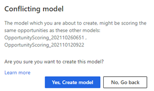
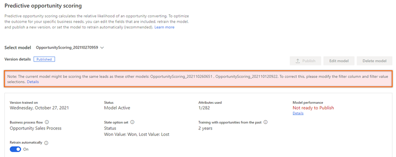

# Manage duplicate opportunity scoring models

When you create multiple models, it’s important to configure them so that they are not scoring the same opportunities. When you have duplicate models, it’s difficult to identify which model scored the opportunity. Duplicate models are automatically identified when you create or edit models. A conflict message is displayed when the configuration is a duplicate of existing models.  

## License and role requirements

| Requirement type | You must have |
|-----------------------|---------|
| **License** | Dynamics 365 Sales Premium or Dynamics 365 Sales Enterprise  More information: [Dynamics 365 Sales pricing](https://dynamics.microsoft.com/sales/pricing/) |
| **Security roles** | System Administrator    More information: [Predefined security roles for Sales](security-roles-for-sales.md)|

## Remove duplicate models

To remove the duplicate models, use one of the following methods depending on the action you’re performing:

- [Create model](#create-model)
- [Published model](#published-model)

### Create model

When you select **Get started**, a conflict message is displayed stating that the model you’re creating has conflicts with other models in the list. The following image shows an example of the message:

> [!div class="mx-imgBorder"]
> 

- Select **No, Go back** and change the filter column and values to ensure that the model is scoring unique opportunities. 
   -Or-
- Proceed to create a duplicate model, which might cause conflicts in identifying the opportunities that are being scored by this model.

### Published model

When you open a published model, a note displays above the version details section with the list of models that the current model is a duplicate of. The following image shows an example of the message:

> [!div class="mx-imgBorder"]
> 

Delete the duplicate model as described in the next section.

## Delete a model

You can delete a model when it's no longer required in your organization or it's a duplicate of an existing model. You can only have up to 10 models&mdash;both published and unpublished&mdash;simultaneously.

1. Go to the predictive opportunity scoring configuration page.

1. Select a model from the **Select model** list and ensure that **Retrain automatically** is turned off.
1. Select **Delete model**. 
1. In the confirmation message that appears, select **Delete**.

[!INCLUDE[cant-find-option](../includes/cant-find-option.md)]