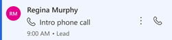
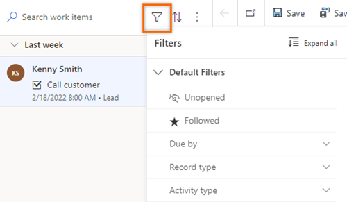
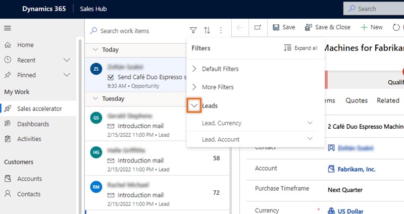
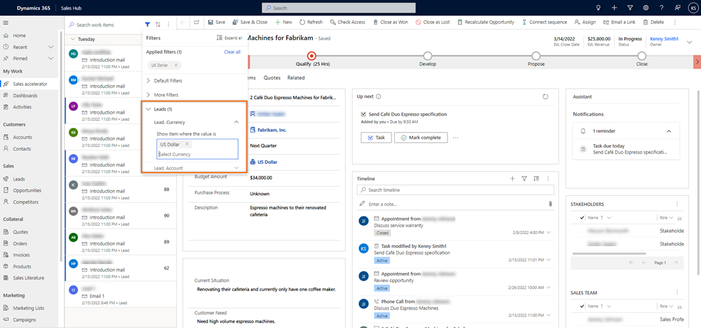
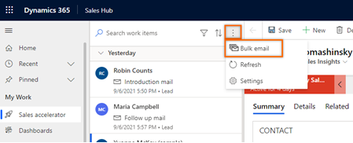
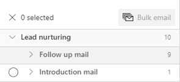
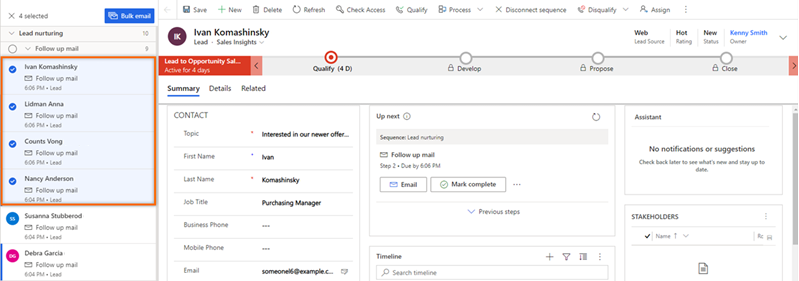
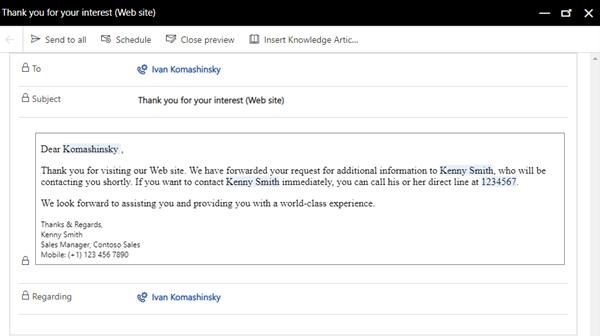
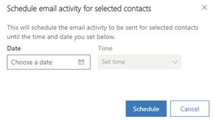

# Prioritize sales pipeline with work lists  

Use work lists in the sales accelerator to prioritize your sales pipeline and ensure that important records aren't left behind.

## License and role requirements
| Requirement type | You must have |  
|-----------------------|---------|
| **License** | Dynamics 365 Sales Premium  More information: [Dynamics 365 Sales pricing](https://dynamics.microsoft.com/sales/pricing/) |
| **Security roles** | Any primary sales role, such as salesperson or sales manager   More information: [Primary sales roles](security-roles-for-sales.md#primary-sales-roles)|

## How to prioritize your pipeline

During your workday as a seller, you need to juggle multiple tasks as you work on multiple records. As a result, it can be hard to plan and prioritize your customer-facing activities. The work list in the sales accelerator for Dynamics 365 Sales Insights helps you prioritize your time and effort to ensure that important records aren't left behind.

The sales accelerator work list gives you the following capabilities:

- [Manage and view records that include activities that are due in the last 30 days to be performed, sorted by priority, and removed after an activity has been completed.](#view-my-records-through-work-list)
- [Manage the work list by sorting, filtering, and grouping records.](#filter-records-in-work-list)
- [View relevant information about customers, such as personal details, past and future activities, and the related entities for each record.](understand-the-up-next-widget.md)
- Communicate with customers through phone and email. More information: [Connect with customers by using a record or the Up next widget](connect-with-customers.md)  
- [Add manual activities to records—in addition to those that have been defined in a sequence—if an ad-hoc activity is required.](understand-the-up-next-widget.md#add-manual-activities-to-records)  

> [!NOTE]
> The work list is configured by a sales manager who defines the sequence of activities for records by using the sequence designer. More information: [Create and manage sequences](create-manage-sequences.md)   

## Prerequisites  
  
Review the following prerequisites before you start using work lists:

- The sales accelerator feature is installed in your organization, and your role is assigned to access work lists. More information: [Configure the sales accelerator](enable-configure-sales-accelerator.md)    
- A softphone and an email server are configured for your security role.    
- Dynamics 365 Channel Integration Framework version 1 is installed, and a channel provider is configured for your Dynamics 365 organization. More information: [Integrate a sample softphone dialer with Dynamics 365 Sales](integrate-sample-softphone.md)   

> [!NOTE]
> Although [predictive lead scoring](configure-predictive-lead-scoring.md) and [predictive opportunity scoring](configure-predictive-opportunity-scoring.md) aren't required for work lists, the work list functionality described in this topic assumes that these features have been enabled and models generated for your organization. Contact your administrator to enable these features.

## View my records by using the work list  

The work list displays a list of records that are assigned to you or the security role you're associated with. The records display activities that are due for the current date&mdash;or pending from previous dates&mdash;that were created manually or through a sequence. This helps you to access all records that include activities in one place, instead of navigating across multiple forms in the application. A sales manager can configure and determine the entities to display to you in the work list. The top of the record in the work list will always be the next-best customer with the highest prediction score.

**To view the work list**

1. Sign in to the Dynamics 365 Sales Hub app, and go to **Change area**  > **Sales**.

2. From the site map, under **My Work**, select **Sales accelerator**.    
    The work list page opens, as shown in the following image.   
    > [!div class="mx-imgBorder"]
    >    

    | Number | Feature | Description |
    |--------|---------|-------------|
    | 1 | **Search, filter, sort, and group records** | You can search, filter, sort, and group the records that you want to view in the list to quickly identify the customers to contact, as [described later in this topic](#filter-records-in-work-list).  By using the lookup icon, you can search for a specific record by using the record name. Select **More options** (&vellip;) to [send bulk emails](#send-bulk-emails), [configure work list settings](#configure-personal-settings), and refresh the list, as described later in this topic. |
    | 2 | **Records list** | Displays a list of records that are assigned to you or to a security role that you're part of. The unread records appear in bold with a blue vertical bar on the left. You must perform and complete the activities on these records from the current date and from previous dates.  Each record displays the name of the record, primary contact name, next best action, priority scoring, and entity name. Hover over the record to view more options.   Select **More options** (&vellip;) to perform the following actions on the record:<ul><li>Mark as complete.</li><li>Skip the current activity.</li><li>Snooze the activity.</li><li>Change the state of the record to unread or read.</li><li>Follow or unfollow the record.</li><li>Skip wait time (this option is available for items that are in the wait state).</li></ul> Also, you can select the activity icon to perform the specified activity for the record.  More information: [Connect with customers by using a record or the Up next widget](connect-with-customers.md)   When you complete an activity on the record, select the refresh icon. The list will be refreshed, and the record will be removed from the list.  **Note** The list displays records for a month from the current date. The records that are older than 30 days are automatically removed and won't be displayed.|
    | 3 | **Up next widget** | Displays the next best action that you can perform on a record for the given date, as [described later in this topic](understand-the-up-next-widget.md).|

## Filter, sort, and more options     

### Filter

Use filters to prioritize the records in the work list so you can reach customers at the right time. The following image shows the list of options that are available to filter the work list.

> [!div class="mx-imgBorder"]    
>     
 
Filters are categorized into two types:    

- [Default filters](#default-filters)
- [Custom filters](#custom-filters)

#### Default filters

The following filters are available by default in the sales accelerator:

- **Unopened**: View records that haven't been opened or read.   
- **Followed**: View records that you're following.   
- **Due by**: Filter records according to the time that a task must be completed for a record. The following options are available:

  - **Today**: View records with pending tasks that haven't been completed today.   
  - **From tomorrow**: View records with pending tasks that are to be completed tomorrow.   
  - **Overdue**: View records with pending tasks that haven't been completed on time.   

- **Record type**: These filter options are the record types that the sales accelerator is configured for. You can select all options to view all records, or you can select an individual type to view only the records of that type.

  Select at least one option to display relevant records in the work list. If no records match your selected type, an empty list is displayed. By default, all filter options are selected.

- **Activity type**: These filter options are **Phone calls**, **Email messages**, **Tasks**, and **Meetings**. You can select all or any specific option to filter the records to display in the work list.

  Select at least one option to display relevant records in the work list. If no records match your selected activity type, an empty list is displayed. By default, all filter options are selected. For example, when you select the entity type as **Lead** and the activity type as **Call**, the work list displays only the lead records that include call activities.  

#### Custom filters

Custom filters are created specifically for you to view records that are important and relevant to you. You can contact your administrator to create a custom filter for you to use to filter records.

In the following example, your administrator has created a filter based on lead and currency. You want to view leads that have currency set to **US Dollar**, so you choose the filter and select **US Dollar** as the currency.

1.	From the filter options, expand **Leads**.  

    > [!div class="mx-imgBorder"]    
    >     
 
2.	Expand **Leads.Currency**, and then select **US Dollar**.

    > [!div class="mx-imgBorder"]    
    >     
 
The work items list is filtered to show only leads with the currency type of **US Dollar**.

### Sort

Select **Sort**  to organize records into groups and display them in the sort order you choose (ascending or descending).

### More options

Select **More options** (&vellip;) to perform the following actions:   

- Refresh the list.
- Send an email to multiple recipients at once, as [described later in this topic](#send-bulk-emails).
- Personalize your workspace. You can configure the following options:
    - **Availability**: Configure your work availability. More information: [Configure your work availability](personalize-sales-accelerator.md#configure-your-work-availability)
    - **Auto advance**: Choose what happens next after you complete an activity. More information: [Configure the auto advance steps](personalize-sales-accelerator.md#configure-the-auto-advance-steps)
    - **Steps and activities**: Create an activity automatically on the timeline that's linked to a step. More information: [Configure steps and activities](personalize-sales-accelerator.md#configure-steps-and-activities)
    - **Filters**: Hide or show filters from the available filter list. More information: [Show or hide filters](personalize-sales-accelerator.md#show-or-hide-filters)

## Send bulk email

The bulk email feature helps you to optimize your work by sending the same email to a list of leads simultaneously. The leads need to have the same email step from the same sequence attached to all their records.

For example, let's say 10 leads have a sequence step to send an introduction email, and this step is pending for today. By using the bulk email feature, you can select all or some of the 10 leads and send them the introduction email all at once.

**To send bulk email**

1.	On the work list page, select **More options** > **Bulk email**.

    > [!div class="mx-imgBorder"]
    > 

    The work list records in the queue are automatically grouped according to the sequence and then the action. For example, the **Lead nurturing** sequence has 10 leads, with nine on the **Follow up mail** step and one on the **Introduction mail** step. When you select the **Bulk email** option, the records are first grouped by the lead nurturing sequence and then by the **Follow up mail** and **Introduction mail** steps.

    As shown in the following image, the **Bulk email** option in the upper-right corner is unavailable until you select the leads, as described in the following step.

    > [!div class="mx-imgBorder"]
    > 
 
2.	Choose the leads to whom you want to send the bulk email.
    You can select all the leads at once by selecting the step name, or you can expand the step and then select the leads individually.
    In this example, we're sending a bulk email to the leads Ivan Komashinsky, Lidman Anna, Counts Vongple, and Nancy Anderson.

    > [!div class="mx-imgBorder"]
    > 
 
3.	On the command bar, select **Bulk email**.

    The email composer opens. If you've selected an email template for the step, the template opens in the composer.  

    > [!div class="mx-imgBorder"]
    > 

    >[!NOTE]
    >Each user in the recipient list must satisfy the following conditions on the entity form:  
    >- On the **Details** tab under **CONTACT METHOD**, **Email** is set to **Allow**. 
    >- On the **Summary** tab under **CONTACT**, the user has a valid email address.

4.	(Optional) To preview the email, select **Preview**.

    The preview opens and shows tags that contain information about the first recipient (in this example, Ivan Komashinsky). However, when the actual email is sent, each email will include relevant information from each lead in your recipient list.

    > [!div class="mx-imgBorder"]
    > 

5. (Optional) To schedule the email, select **Schedule** and then choose a date and time at which you want to send the email.  

    > [!div class="mx-imgBorder"]
    > 
 
6.	Select **Send to all**.

The email will be sent to all the recipients you specify. You can verify that the timelines for those entities are updated with the email. After you refresh the work list, all the records you just sent email to will move to the next step.

[!INCLUDE[cant-find-option](../includes/cant-find-option.md)]

### See also

[Create and manage sequences](create-manage-sequences.md)  
[Understand the Up next widget](understand-the-up-next-widget.md)  

[!INCLUDE[footer-include](../includes/footer-banner.md)]
