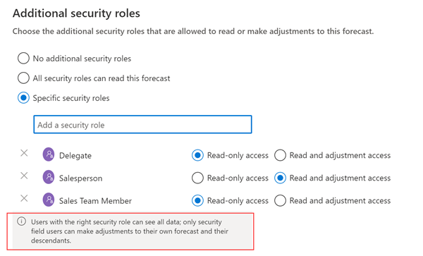

# Provide permissions to access and share a forecast  

## Requirements
|  | |
|-----------------------|---------|
| **License** | Dynamics 365 Sales Enterprise or Dynamics 365 Sales Premium  More information: [Dynamics 365 Sales pricing](https://dynamics.microsoft.com/sales/pricing/) |
| **Security roles** | System Administrator or Forecast Manager   See [Predefined security roles for Sales](security-roles-for-sales.md)|
|||

In the **Permissions** step of the forecast configuration, you can:

- Define team members who can view and adjust the forecast data at each level of the hierarchy.  

- Provide access to users who have specific security roles to view the forecast.  
- Enable forecast sharing to allow users to share their forecast records with other users. See [Enable or disable forecast sharing](#enable-or-disable-forecast-sharing).

## To set view and access permissions**

1.	In the **User security field** section, choose **User lookup field**. Choosing this field determines the owner of the forecast row. The following default system user value is selected based on the template:        
    -	For **Org chart forecast**, the value is selected as **User**.      
    -	For **Territory forecast**, the value is selected as **Manager**.    
    If you select a value other than the default, a column is created in the forecast grid.     
    For example, when you select **User lookup field** as **Manager** for a territory forecast, the forecast is visible only to the managers of the territories in the selected hierarchy. The managers can edit forecast data that directly belongs to them and to their reporting territories.

2.	In the **Additional security roles** section, select one of the following options to provide permissions to view the forecast to users who aren't part of the hierarchy.

    | Additional security roles option | Description |
    |----------------------------------|-------------|
    | No additional security roles | This option provides access only to the selected hierarchy users. When you select this option, users who have other security roles in the organization can't view the forecast. By default, this option is selected. |
    | All security roles (everyone can access the forecast) | This option provides read-only access to this forecast to all the security roles of users in your organization. |
	| Specific security roles | This option allows you to specify which security roles will receive either read-only access, or read-only and adjustment access within this forecast.|

    > [!div class="mx-imgBorder"]
    > 

    A message displays at the bottom of the page that helps you understand how the forecast security is applied based on your selections.

    > [!div class="mx-imgBorder"]
    > 
    
3.	Select **Next**.

## Enable or disable forecast sharing

Forecast sharing is disabled by default. As an administrator, enable the forecast sharing option for the forecasts that needs to be shared. Users can only share forecast records that they have access to.  

**To enable or disable forecast sharing**

1.  In the **Permissions** step and specify the permissions in the **Share forecast** section. Select one of the following options:

    - **None**: Indicates that forecast sharing is disabled and hence can't be shared with anyone. If you select this option while there are active sharing, the shared forecasts will no longer be available to the shared users.
    
    - **Read-only**: Indicates that the users in the forecast hierarchy can share the forecast with view permission.
    
    - **Read and adjust**: Indicates that the forecast can be shared with either the view only permission, or read and adjust permission. If you want to be able to share the forecast with different levels of access to different users, then select this setting.
    
5. Save the changes. 
   If you have selected **Read-only** or **Read and adjust**, all the forecast records in the forecast configuration are enabled for sharing. Sellers and managers can now share the records. See, [Share a forecast](share-forecasts.md). 

<table>
<tr><td>

> [!div class="nextstepaction"] 
> [Previous step: Define general properties and scheduling](define-general-properties-scheduling-forecast.md)
</td><td>

> [!div class="nextstepaction"] 
> [Next step: Choose layout and columns](choose-layout-and-columns-forecast.md)
</td></tr>
</table>

### See also

[Configure forecasts in your organization](configure-forecast.md)

[!INCLUDE[footer-include](../includes/footer-banner.md)]
