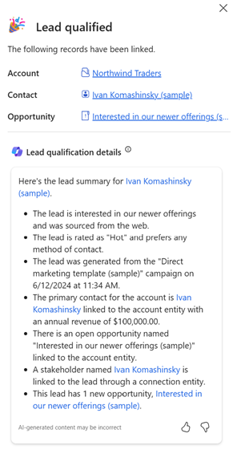

# Qualify and convert a lead to opportunity

After you identify the time frame, budget, and purchase process for a lead, qualify the lead to create the corresponding account, contact, and opportunity records. If a lead isn't likely to turn into an opportunity, disqualify the lead to keep a record of the sales process.

[!INCLUDE [trial-cta-note](../includes/trial-cta-note.md)] 

## License and role requirements

| Requirement type | You must have |
|-----------------------|---------|
| **License** | Dynamics 365 Sales Premium, Dynamics 365 Sales Enterprise, or Dynamics 365 Sales Professional  More information: [Dynamics 365 Sales pricing](https://dynamics.microsoft.com/sales/pricing/) |
| **Security roles** | Any primary sales role, such as salesperson or sales manager   More information: [Primary sales roles](security-roles-for-sales.md#primary-sales-roles)|

## Qualify a lead

1. From the site map, select **Leads**.

2. In the list of leads, open the lead you want to qualify. Want to qualify multiple leads at once? See [Qualify leads in bulk](#qualify-leads-in-bulk).

3. (Optional) In the **Qualify** section of the process bar, specify the following information:
    - If the lead is from an existing account or contact, select it in the **Existing Contact** and **Existing Account** fields. This step is optional because you can create or use an existing account and contact in the next step, depending on how your administrator has configured the lead qualification experience.
    - Specify the other details such as purchase time frame and estimated budget.

4. On the command bar, select **Qualify**.

    Depending on the lead qualification experience configured by your administrator, you experience one of the following flows: 
    - [New experience](#new-experience)
    - [Legacy experience](#legacy-experience) 

    The lead moves to the next stage in the business process. The lead is also removed from the **My Open Leads** view and gets added to the **Closed Leads** view.
  
   > [!NOTE]
   > If an opportunity isn't created when qualifying a lead, the business process flow doesn't progress to the next stage, although the lead status becomes qualified.

### New experience

As part of the [new lead qualification experience](define-lead-qualification-experience.md#difference-between-new-lead-qualification-experience-and-legacy-experience), your admin can customize several aspects of the lead qualification process.

#### Record creation

- If your administrator has turned on the new experience and enabled automatic creation of account, contact, and opportunity records, the records are created automatically. You see a **Processing** message while the records are being created. After the records are created, the opportunity record opens.

- If your admin has turned off automatic creation for all records, you'll see the **Qualify lead** side pane for creating contact, account, and opportunity records. For contact and account records, you can choose to create a new record, use an existing record, or skip creating the record. 
  > [!NOTE]
  > For the account record, the **Create new** option is only available when the **Company name** is filled in the lead record.

- If your admin has turned on automatic creation for a few and manual creation for others, you'll see the **Qualify lead** side pane. The pane displays records that will be created automatically and records that you need to create manually. For example, if the account and contact records are set to be created automatically, and the opportunity record is set to be created manually, the side pane displays the records as shown in the following screenshot:

   :::image type="content" source="media/qualify-lead-dialog-box-mix.png" alt-text="Screenshot of the Qualify lead side pane when record creation is set to automatic for contact and account, and manual for opportunity.":::

   In this example, account and contact records aren't editable. If you need to change the account or contact details, close the side pane, edit the details in the Lead form, and then select **Qualify**.

For information on how the fields in the lead record are mapped to other records, see [Field mappings to other entities](define-lead-qualification-experience.md#field-mappings-to-other-entities). If a similar account or contact already exists, the duplicate detection dialog box opens. You can choose to create a record or use the existing record. More information: [What happens when duplicates are found while qualifying leads?](faq-lead.md#what-happens-when-duplicates-are-found-while-qualifying-leads)

#### Multiple opportunities creation

If your admin has enabled multiple opportunities creation, you can create up to five opportunities for a lead. A default opportunity record is added to the Qualify lead side pane. 

**To create additional opportunities**

1. Select **+New Opportunity** on the Qualify lead side pane. If **+New Opportunity** is disabled, see [this FAQ](faq-lead.md#why-cant-i-edit-or-create-multiple-opportunities-for-a-lead-in-the-new-lead-qualification-experience) to understand why and the steps to enable it.

1. In the Opportunity Quick create form, enter the details for the opportunity. Would you like to see different fields in the opportunity form? Talk to your admin about [customizing the opportunity form](define-lead-qualification-experience.md#customize-opportunity-creation-experience-for-qualified-leads).

1. Save the opportunity record.

   The records aren't created until you select **Qualify**. If you close the Qualify lead side pane without qualifying the lead, no records are created.

#### Lead summary

If your admin has [enabled lead summarization](define-lead-qualification-experience.md#summarize-the-lead-after-its-qualified), you'll see an AI-generated summary of the lead after it's qualified. The summary includes key details from the lead record and is added to the timeline of the primary opportunity record and the lead record. 

Select **Finish** to open the primary opportunity record and select **X** at the top of the pane to go back to the lead record.

### Legacy experience

- If your admin has enabled automatic creation, account, contact, and opportunity records are automatically created when the lead is qualified.

- If your admin has disabled automatic creation, you're prompted to choose the records to create when the lead is qualified (account, contact, or opportunity).
    
  
     
**More information:** 
- [What happens when a lead is qualified?](faq-lead.md#what-happens-when-a-lead-is-qualified)
- [What happens when duplicates are found while qualifying leads?](faq-lead.md#what-happens-when-duplicates-are-found-while-qualifying-leads)
- [How do I handle lead qualification errors?](faq-lead.md#how-do-i-handle-lead-qualification-errors)
    

## Qualify leads in bulk

You can qualify multiple leads at once. To qualify multiple leads, open the **Leads** page in a read-only grid view and select the leads that you want to qualify. On the command bar, select **Qualify**.

If your admin has enabled automatic creation in the legacy experience, the records are created automatically. If your admin has disabled automatic creation or enabled the new experience, you see a dialog where you can select the records that you'd like to create upon lead qualification. 

## Disqualify a lead

When you know that a lead isn't going to turn into an opportunity, you can disqualify it and still have an audit trail for your sales process. You can reactivate the record, including any attachments and notes, without having to re-enter all the data if the lead contacts you in the future. Deleting the record also removes any attachments and notes.

> [!NOTE]
> You can disqualify a lead only if there's no opportunity associated with that lead.  

To disqualify, select the lead, and on the command bar, select  **Disqualify**.

## Troubleshoot issues and frequently asked questions with lead qualification

- For information on how to resolve the common errors that you may get while you qualify a lead, see the [troubleshooting guide](troubleshooting.md).  
- For frequently asked questions about lead qualification, see [Lead management FAQs](faq-lead.md).

## Typical next steps  

 [Create or edit an opportunity](create-edit-opportunity-sales.md)  
  
 [Learn about the sales process, nurturing sales from lead to order](nurture-sales-from-lead-order-sales.md) 

[!INCLUDE [cant-find-option](../includes/cant-find-option.md)]
  
## Related information  
[Define lead qualification experience](define-lead-qualification-experience.md)  
[Print quote, invoice, or other records](print-records.md)         
[Dynamics 365 Sales troubleshooting guide](troubleshooting.md)  
[Prioritize opportunities through predictive scores](work-predictive-lead-scoring.md)  
[Insights, powered by InsideView](../insights-insideview/insights-powered-by-insideview.md)  
[Lead management FAQs](faq-lead.md#faqs-about-lead-qualification-experience)  
[Troubleshoot issues with lead qualification issues](/troubleshoot/dynamics-365/sales/troubleshoot-lead-qualification-issues-for-salespeople)  

[!INCLUDE[footer-include](../includes/footer-banner.md)]
