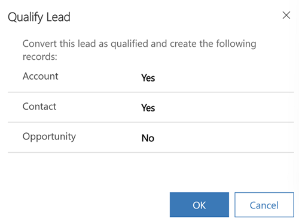

# Qualify and convert leads to opportunity

After you've identified the time frame, budget, and purchase process for a lead, qualify the lead to create the corresponding account, contact, and opportunity. 

[!INCLUDE [trial-cta-note](../includes/trial-cta-note.md)] 

## License and role requirements
| Requirement type | You must have |
|-----------------------|---------|
| **License** | Dynamics 365 Sales Premium, Dynamics 365 Sales Enterprise, or Dynamics 365 Sales Professional  More information: [Dynamics 365 Sales pricing](https://dynamics.microsoft.com/sales/pricing/) |
| **Security roles** | Any primary sales role, such as salesperson or sales manager   More information: [Primary sales roles](security-roles-for-sales.md#primary-sales-roles)|

## Qualify a lead

1. In the Sales Hub site map , select **Leads**.

2. In the list of leads, open the lead you want to qualify.

3. In the **Qualify** section of the process bar, specify the following information:
    - If the lead is from an existing account or contact, select them in the **Existing Contact** and **Existing Account** fields.
    - Specify the other details such as purchase timeframe and estimated budget.

     > [!TIP]
     > To qualify multiple leads, go back to the leads list page and select the leads that you want to qualify.
4. On the command bar, select **Qualify**.
    Depending on the lead qualification experience chosen by your administrator, you'll either see a prompt for creating the contact, lead, and opportunity records or you'll see a **Processing** message and the records will be automatically created. 
      
     
    **More information:** 
    - [What happens when a lead is qualified](#what-happens-when-a-lead-is-qualified)
    - [What happens when duplicates are found while qualifying leads?](#what-happens-when-duplicates-are-found-while-qualifying-leads)
    - [How do I handle lead qualification errors?](#how-do-i-handle-lead-qualification-errors)
    
The lead moves to the next stage in the business process. The lead is also removed from the **My Open Leads** view and gets added to the **Closed Leads** view.
  
> [!NOTE]
> If an opportunity isn't created when qualifying a lead, the business process flow doesn't progress to the next stage, although the lead status becomes qualified.

## Disqualify a lead

When you decide that a lead won't turn into an opportunity, you can disqualify it, and still have an audit trail for your sales process. You can reactivate the record, including any attachments and notes, without having to re-enter all the data if the lead contacts you in the future. Deleting the record also removes any attachments and notes.

> [!NOTE]
> You can disqualify a lead only if there's no opportunity associated with that lead.  

To disqualify, select the lead, and on the command bar, select  **Disqualify**.

For information on how to resolve the common errors that you may get while you qualify a lead, see the [troubleshooting guide](troubleshooting.md).

## FAQs about lead qualification

### What happens when a lead is qualified?

Your system administrator defines what happens to a lead when it's qualified:

-  If your system administrator has set **Create Account, Contact, and Opportunity records by default upon qualifying a lead** to **No**, you'll be prompted to choose what records to create when the lead is qualified (account, contact, or opportunity). 

-  If they've set **Create Account, Contact, and Opportunity records by default upon qualifying a lead** to **Yes**, an account, contact, and opportunity records are automatically created when the lead is qualified.

### Where can I find the qualified and disqualified leads?

Select **Leads** in the sitemap, and then select the **Closed Leads** view to find your qualified and disqualified leads. You can reactivate the leads if you want to qualify them again. 

### What happens when duplicates are found while qualifying leads?

When qualifying a lead, if a duplicate account or contact is detected while creating new records, a duplicate warning is shown to you. Depending on whether your system administrator has enabled the improved duplicate detection and merge experience, you'll see the options to resolve duplicates.

For information on enabling the improved duplicate detection and merge experience, see [Enable the improved duplicate detection and merge experience](/power-platform/admin/enable-improved-duplicate-detection).

### How do I handle lead qualification errors?

While qualifying a lead, one of the following errors occur due to duplicate leads:

- Lead record was not created or updated because a duplicate of the current record already exists. 
- Opportunity record was not created or updated because a duplicate of the current record already exists.

If the [duplicate detection rules](/power-platform/admin/set-up-duplicate-detection-rules-keep-data-clean) feature is enabled in your organization, the application won't allow qualification of leads if duplicates of that lead exist. To mitigate the issue, try the following resolutions:

- Remove the duplicates for the lead and qualify again. More information: [Merge duplicate rows](/power-apps/user/merge-duplicate-records) 
- Go to the leads grid view, select the lead and qualify.
- Unpublish the rule that is causing the error and qualify the lead again. Contact your administrator to unpublish the rules using the following steps.
    1. Go to **Advanced settings** > **Settings** > **System** > **Data Management** > **Duplicate Detection Rules**.
    1. Select the rule and then select **Unpublish**.
- If a rule is required only to create or update the lead, but not required for qualification, ensure that duplicate detection rules don’t run on qualified leads. Enable the **Exclude inactive matching records** option and qualify the lead. Contact your administrator to enable the option using the following steps. 
    1. Go to **Advanced settings** > **Settings** > **System** > **Data Management** > **Duplicate Detection Rules**.
    1. Open and unpublish the rule.
    1. Select the **Exclude inactive matching records** option.  
        
        :::image type="content" source="./media/duplicate-records-enable-exclude-inactive-matching-records.png" alt-text="A screenshot of enabling the Exclude inactive matching records option."::: 

    1. Publish the rule.

### Duplicate detection when improved duplicate detection and merge experience is disabled

When the improved duplicate detection experience is disabled, you'll see the **Duplicate warning** dialog box.

> [!div class="mx-imgBorder"] 
> 

In the **Account** and **Contact** fields, select the matching account and contact record and select **Continue**. To ignore the duplicate warning and create new records, leave the Account and Contact fields blank, and select **Continue**.

The **Account** and **Contact** lookup fields are filtered with matched results and shown along with additional information to precisely identify the record to which the lead should be linked. For example, when you select the **Contact** lookup search icon, you'll see only matched contact records.

### Duplicate detection when improved duplicate detection and merge experience is enabled

When the improved duplicate detection and merge experience is enabled, you'll see the **Account or Contact may already exist** dialog box.

> [!div class="mx-imgBorder"] 
> 

The **Matched accounts** and **Matched contacts** sections will show all the matching records (based on the duplicate detection rules) along with additional information to precisely identify the record to which the lead should be linked.

To associate the lead record to an existing matching record, select the record, and select **Continue**. To create a new account or contact record, select **Ignore and save** without selecting a matching record.

The lead is qualified. 

### What happens to notes and attachments when leads are qualified?

When salespeople work on a lead, they use notes to store key information on the things they've researched about the lead. This could be information like new contacts at the site, current value of the contract, vendor information and so on. When a lead is qualified, these notes are displayed in the Opportunity record so that the information isn't lost.

 
## Typical next steps  

  [Create or edit an opportunity](create-edit-opportunity-sales.md)  
  
  [Learn about the sales process, nurturing sales from lead to order](nurture-sales-from-lead-order-sales.md) 

[!INCLUDE [cant-find-option](../includes/cant-find-option.md)]
  
### See also  
[Define lead qualification experience](define-lead-qualification-experience.md)  
[Print quote, invoice, or other records](print-records.md)         
[Dynamics 365 Sales troubleshooting guide](troubleshooting.md)  
[Boost sales with Versium Predict](../versium-predict/versium-predict.md)  
[Get sales Insights, powered by InsideView](../insights-insideview/insights-powered-by-insideview.md)  
[Troubleshoot issues with lead qualification issues](/troubleshoot/dynamics-365/sales/troubleshoot-lead-qualification-issues-for-salespeople)

[!INCLUDE[footer-include](../includes/footer-banner.md)]
