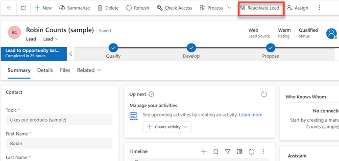

# Reopen leads in Dynamics 365 Sales

Great news! A lead that you thought wasn't interested has contacted you, and it looks like the person will buy after all. Assuming that you disqualified the lead (instead of deleting it), you'll be able to reopen it without reentering all the information you already gathered.  

## License and role requirements
| Requirement type | You must have |
|-----------------------|---------|
| **License** | Dynamics 365 Sales Premium, Dynamics 365 Sales Enterprise, or Dynamics 365 Sales Professional  More information: [Dynamics 365 Sales pricing](https://dynamics.microsoft.com/sales/pricing/) |
| **Security roles** | Any primary sales role, such as salesperson or sales manager   More information: [Primary sales roles](security-roles-for-sales.md#primary-sales-roles)|

## Reopen a lead
  
1.  On the list of leads, select the down arrow, and then select the **Closed Leads** view.  

   > [!div class="mx-imgBorder"]
   >   
  
2.  Select the lead you want to reopen, and then select **Reactivate Lead**.  

   > [!div class="mx-imgBorder"]  
   >   

[!INCLUDE [cant-find-option](../includes/cant-find-option.md)]
  
### See also 

 [Create or edit a lead](create-edit-lead-sales.md)   
 [What if you're no longer working a lead?](no-longer-working-lead-sales.md)

[!INCLUDE[footer-include](../includes/footer-banner.md)]
