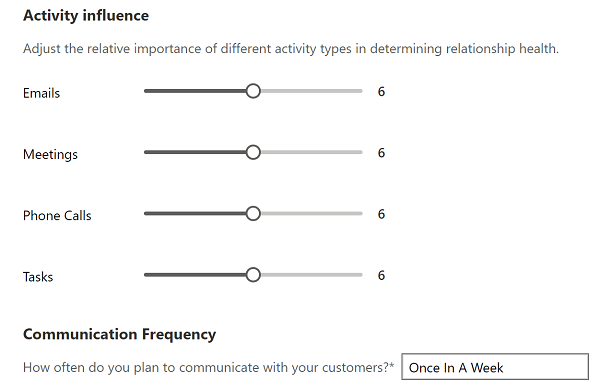

# Relationship analytics KPI calculations 

Relationship analytics values are derived from a careful analysis of the many related people, activities, companies, appointments, and emails stored on your [!INCLUDE[pn-dyn-365-sales](../includes/pn-dyn-365-sales.md)] and [!INCLUDE[pn_Microsoft_Exchange](../includes/pn-microsoft-exchange.md)] servers. Exchange data is only available for Sales Premium customers. 

More information: [View relationship analytics and KPIs](relationship-analytics.md)

## How relationship analytics KPIs are calculated?

The process for finding and calculating the scores is summarized in the following flow chart.  

  

The following sections describe the function of each block in the flow chart.  

### Step 1: Find contacts of interest for the record

Relationship analytics is concerned with activities performed by the *people* associated with a given record. The first step in finding the relevant activities is to find out which contacts to include in the analysis. Relationship analytics also provides time-spent values for you, your team, and your customer's team, so the identity of who did what is important throughout the process.  

This table shows how the system finds contacts that have an interest in each type of record. Later, the system will look for activities associated with each contact and decide which of those activities should be included in KPI calculations for that record.  

|  Records | Internal contacts  |  External contacts |
|----------|--------------------|--------------------|
|  Account  | -  Any [!INCLUDE[pn-dyn-365-sales](../includes/pn-dyn-365-sales.md)] user.|-  The **Primary Contact** for the account. -  All contacts in the account's **Contacts** list. |
| Opportunity | -  The **Owner** of the opportunity record. -  All users in the opportunity's **Sales Team** list. | -  The customer **Contact** listed for the opportunity. -  All contacts in the opportunity's **Stakeholders** list. -  The primary contact for the related **Account** record. |
|  Lead   | -  The **Owner** of the lead record. | -  Contact information in the lead's **Contact** section. -  All contacts in the lead's **Stakeholders** list. |
|  Contact  | -  Any [!INCLUDE[pn-dyn-365-sales](../includes/pn-dyn-365-sales.md)] user. | -  Contact information in the contact's **Contact** section.|

### Step 2: Link activities to the record

Once the system has identified contacts of interest, it looks for activities associated with each contact and then identifies which activities to include in the relationship analytics for the record you are looking at. It identifies relevant activities as follows:  

- **Regarding records.** Any activity that has its **Regarding** value set to the current record is explicitly assigned to it and will always be included in its relationship analytics, even if that activity isn't also associated with a contact of interest.  
- **Email messages.** Includes all metadata from messages where the email address (or a reference to the contact record) for a contact of interest is shown in the **To**, **Cc**, or **From** field.  
- **Appointments.** Includes all metadata from appointments where a contact of interest is shown in the **Required** or **Optional** fields.  
- **Phone calls.** Includes all calls where  a contact of interest is shown in the **From** or **To** fields.  

### Examples of how relevant activities are identified

Here are a few examples of how the rules outlined in the previous sections might be applied:  

- If you are assigned to a lead and register a phone call activity with one of the stakeholders for that lead, then that phone call will be counted in the KPIs for that lead. Other users who call that same stakeholder, but who are not assigned to the lead, will not have their calls counted in the KPIs for that lead.  
- If you are on the sales team for an opportunity and send an email regarding that opportunity to one of its stakeholders, then the metadata about that email will be counted in the KPIs for that account. An email from another user, who isn't on the team for that account, to that same stakeholder will not be counted for that opportunity.  
- If you attend a meeting with the primary contact for an account, then the metadata about that appointment will be counted in the KPIs for that account and for that contact. If that account is also associated with an opportunity, the appointment will only count for that opportunity if you are also **Assigned** to that opportunity (or are on its **Sales Team**) and if the appointment is set as **Regarding** that opportunity.  

### Step 3: Compute relationship analytics KPIs

After the system has found all the relevant activities, it's ready to calculate the KPIs and other analytics for each record. The following table summarizes the KPIs that are available.  

|Activity type|Initiated or completed by your team|Initiated or completed by the customer's team|  
|-------------|-----------------------------------------|---------------------------------------------------|  
|Emails|Total number   Total time spent   Time line (number per week)   Number of replies|Total number   Total time spent   Time line (number per week)   Number of replies   Interaction results for followed emails (opens, attachment views, and link views)|  
|Appointments|Total number   Total time spent by your team (if several team members were present at an appointment, then the duration is multiplied by the number of  team members  present)   Time line (number per week)|Total number   Total time spent (not multiplied by the number of customer contacts that were present)   Time line (number per week)|  
|Phone calls|Total number   Total time spent   Time line (number per week)|Total number   Total time spent   Time line (number per week)|  
|Overall (all activities)|Total time spent|Total time spent|  

> [!NOTE]
> Email interaction statistics are only provided for *followed emails*, which requires you to use the *email engagement* feature. For more information about how to create and send followed emails, see [Use email engagement to view message interactions](email-engagement.md).

For KPIs that report your team and your customer, the system finds durations by applying the rules outlined in the following table:  

|Activity type|Source of duration value|  
|-------------------|------------------------------|  
|Appointments|**Duration** field for the appointment record|  
|Calls|**Duration** field for the phone call record|  
|Emails|Estimated (2.5 minutes to read, 5 minutes to write)|  
|Other|**Duration** field for each record|  

> [!TIP]
> The time calculations for appointments are a bit special. The details are given in the previous tables, but here's an example to illustrate it.  <br/
> 
> If you hold an appointment where three members of your team (including you) meet with two members of your customer's team, and the appointment lasts for 30 minutes, then that appointment contributes to your time KPIs as follows:
> - **Time spent by my team**: *90 minutes* (30 minutes × 3 team members present)
> - **Time spent by the customer**: *30 minutes* (time isn't multiplied by customer participants)

### Step 4: Compute the relationship health and health trend

The overall relationship health score is calculated by collecting the relevant activities, and weighting the activity by type (which enables your admin to set some types of activities to count more than others). The result is normalized to produce a health score between 0 and 100, and the health characterized as *good* (for a score of 60-100), *fair* (40-59) or *poor* (0-39).  

**Note**: 

- Health scores are computed for leads if they are in an active state. This stops once they reach a qualified or disqualified state.
- Health scores are computed for opportunities if the opportunity is open and ignored if it’s won or lost.
- Health scores are computed for contacts irrespective of their state.  

Your administrator can choose which types of activities are most relevant for your business. By default, all types of activities count the same, but your admin can increase or decrease the contribution of each type by up to 50 percent. In addition, your admin can choose how often salespeople should contact a customer (such as once a week); this setting also affects the health score.  

  

In addition to the absolute health score, the system also reports the general trend (up, down, or neutral) based on the number and value of recent activities. The trend direction updates relatively slowly, so it might take a little while to indicate a recent increase or decrease  in activity.  