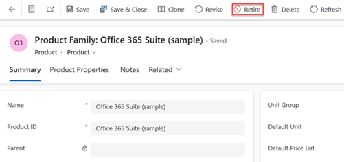
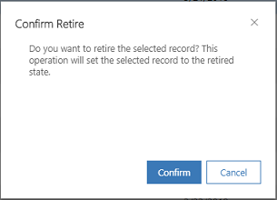

# Retire products  

If your organization doesn't sell a product, bundle, or family anymore, retire it so that the product record is no longer available to your sales agents. 

> [!NOTE]
> Product families are only supported for Sales Enterprise and Sales Premium. 

## License and role requirements
| Requirement type | You must have |  
|-----------------------|---------|
| **License** | Dynamics 365 Sales Premium, Dynamics 365 Sales Enterprise, or Dynamics 365 Sales Professional   More information: [Dynamics 365 Sales pricing](https://dynamics.microsoft.com/sales/pricing/) |
| **Security roles** | Sales Manager, Sales Professional Manager, or Vice President of Sales   More information: [Predefined security roles for Sales](security-roles-for-sales.md)|

## Retire a product

1. Depending on the sales app that you're using, do one of the following:
 
    -  If you're using the Sales Hub app, 
        1. Select **Change area**  at the lower-left corner of the site map, and then select **App Settings**. 
        1. In the **Product Catalog** area, select **Families and Products**. 
   - If you're using the Sales Professional app,
       - Select **Products** from the site map.  
  
3. Open an active product, bundle, or family that you want to retire, and on the command bar, select **Retire**.  

   > [!div class="mx-imgBorder"]
   > 

    > [!NOTE]
    > Retired product families cannot be reactivated. Unparent a product before retiring if you think you may need to reactivate it later.  

4. In the **Confirm Retire** dialog box, select **Confirm**.
 
   

## Reactivate a retired product

If you have retired a product inadvertently or want to restore a product that was retired earlier, open the product and select **Activate**.  

You can only reactivate a standalone product. If a product has a parent, you'll not see the **Activate** option. You cannot reactivate a product family either.

## Typical next steps  
  [Set up a product catalog: Walkthrough](set-up-product-catalog-walkthrough.md)  

[!INCLUDE [cant-find-option](../includes/cant-find-option.md)]

### See also  
 [Set up a product catalog: Walkthrough](set-up-product-catalog-walkthrough.md)

[!INCLUDE[footer-include](../includes/footer-banner.md)]
