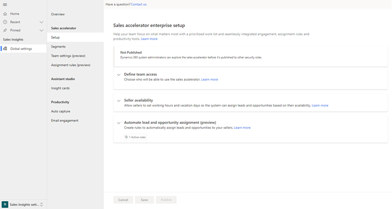
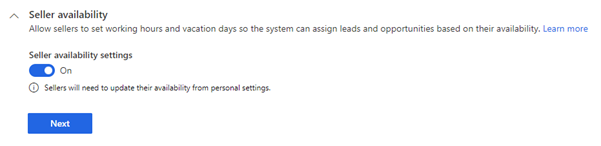
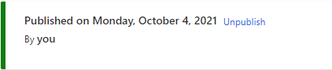

# Configure assignment rules in Sales Enterprise

Configure the sales accelerator for assignment rules to automatically assign leads and opportunities to sellers.

## License and role requirements

| &nbsp; | &nbsp; |  
|-----------------------|---------|
| **License** | Dynamics 365 Sales Premium or Dynamics 365 Sales Enterprise  More information: [Dynamics 365 Sales pricing](https://dynamics.microsoft.com/sales/pricing/) |
| **Security roles** | System Administrator   Go to [Predefined security roles for Sales](security-roles-for-sales.md)|
|||

## What are assignment rules

Use assignment rules in the sales accelerator to automatically assign new leads and opportunities to sellers or sales teams. This helps reduce the amount of time and effort required to manually assign records, prevent the loss of unassigned records, and balance assignments among sellers.

As an administrator, you can create rules that match lead or opportunity attributes (such as location and language) with the corresponding seller or team attributes (such as location and language). For example, when a lead is created and satisfies the conditions of a specific rule, the lead is automatically assigned to a seller.

> [!IMPORTANT]
> Use this procedure to configure assignment rules in the sales accelerator with the Sales Enterprise license. If you have the Sales Premium license, use [Configure the sales accelerator for Sales Premium](enable-configure-sales-accelerator.md). 

## Configure sales accelerator

1.	In the Sales Hub app, select the Change area icon in the lower-left corner of the page, and then select **Sales Insights settings**.   

2.	On the site map, under **Sales accelerator**, select **Setup**.    
	
    The sales accelerator configuration page opens.   

    > [!div class="mx-imgBorder"]
    > 
 
3.	In the **Define team access** section, select one of the following options to provide permissions to users to use the assignment rules feature, and then select **Next**.   
    
    | Security roles | Description |
    |----------------|-------------|
    | All security roles | Select this option to give access to assignment rules in the Sales Hub app to all the security roles in your organization. |
    | Specific security roles | Select this option to specify security roles to give access to assignment rules in the Sales Hub app to just a few users. Use the lookup box to add the security roles. |

    > [!div class="mx-imgBorder"]
    > 

4.	In the **Seller availability** section, turn on the **Seller availability** toggle to enable the option that allows sellers to configure their working hours and vacation days so that leads and opportunities are assigned based on their availability.

    > [!div class="mx-imgBorder"]
    > 
 
    More information: [Configure your work availability through personal settings](personalize-sales-accelerator.md#through-personal-settings)

5.	In the **Automate lead and opportunity assignment (preview)** section, turn on the toggle to enable preview for the assignment rules feature.   

    More information: [Manage assignment rules for routing](create-manage-assignment-rules.md)

6.	Save and publish the configuration.   
    
    A status message is displayed at the top of the page with details such as the time and user who published the configurations.

    > [!div class="mx-imgBorder"]
    > 
 
The sales accelerator is configured to manage assignment rules in your organization for the selected security roles.  

[!INCLUDE[cant-find-option](../includes/cant-find-option.md)]

### See also

[Manage assignment rules for routing](create-manage-assignment-rules.md)  
[Configure your work availability through personal settings](personalize-sales-accelerator.md#through-personal-settings)

[!INCLUDE[footer-include](../includes/footer-banner.md)]
