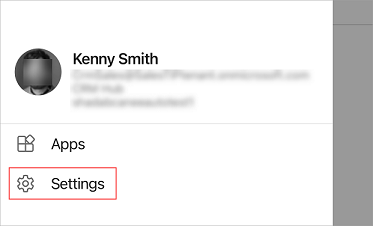
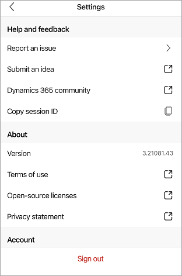

# Dynamics 365 Sales mobile app settings 

The **Settings** panel provides a consolidated view for relevant information about the app, helpful links to submit ideas, report issues, share feedback, and a sign-out option.

The settings are divided into the following categories:
- [Help and feedback](#help-and-feedback)
- [About](#about)
- [Account](#account)

## License and role requirements

| Requirement type | You must have |
|-----------------------|---------|
| **License** | Dynamics 365 Sales Premium, Dynamics 365 Sales Enterprise, Dynamics 365 Sales Professional, or Microsoft Relationship Sales  More information: [Dynamics 365 Sales pricing](https://dynamics.microsoft.com/sales/pricing/) |
| **Security roles** | Any primary sales role, such as salesperson or sales manager   More information: [Primary sales roles](../security-roles-for-sales.md#primary-sales-roles)|

## Open the Settings panel

1. Tap your profile picture at the upper left of the screen.

2. Tap **Settings**.

    

    The **Settings** panel is displayed.

    

## Help and feedback

This section contains links to actions such as submitting an idea and reporting an issue with the app.

- **Report an issue**: Report issues with the mobile app.
    > [!NOTE]
    > - By including your email address, you agree that Microsoft can send you an email if we have questions about your feedback.
    > - You should not include any confidential or personal information in your comment.
    > - By pressing submit, your feedback will be used to improve Microsoft products and services. Your IT admin will be able to collect this data.

- **Submit an idea**: Submit ideas for the mobile app from the [Dynamics 365 Sales idea submission page](https://go.microsoft.com/fwlink/p/?LinkID=2161876).

- **Dynamics 365 Community**: Go to the [Dynamics 365 Sales community forum](https://go.microsoft.com/fwlink/p/?LinkID=2161919) to get help from experts and peers, discover blogs, webinars, videos, and events, and more.

- **Copy session ID**: Copy the session ID to your clipboard. The session ID is helpful for troubleshooting. When you are asked to provide it, tap  to copy the session ID and then share it with the required person.

## About

This section contains links to actions such as viewing the version of the mobile app and various legal documents.

- **Version**: Displays the current version of the Dynamics 365 Sales mobile app.

- **Terms of use**: View the [terms and conditions, license terms, and legal information](https://go.microsoft.com/fwlink/p/?LinkID=698507).

- **Open-source licenses**: View the [open-source licenses and third-party notices](https://go.microsoft.com/fwlink/p/?LinkID=2127442).

- **Privacy statement**: View the [Microsoft Privacy Statement](https://go.microsoft.com/fwlink/p/?LinkID=698505).

## Account

This section contains a link to sign out from the mobile app.

- **Sign out**: Sign out from the app.

### See also

[Use the Dynamics 365 Sales mobile app](use-sales-mobile-app.md)    
[Learn the basics](learn-basics-mobile-app.md)

