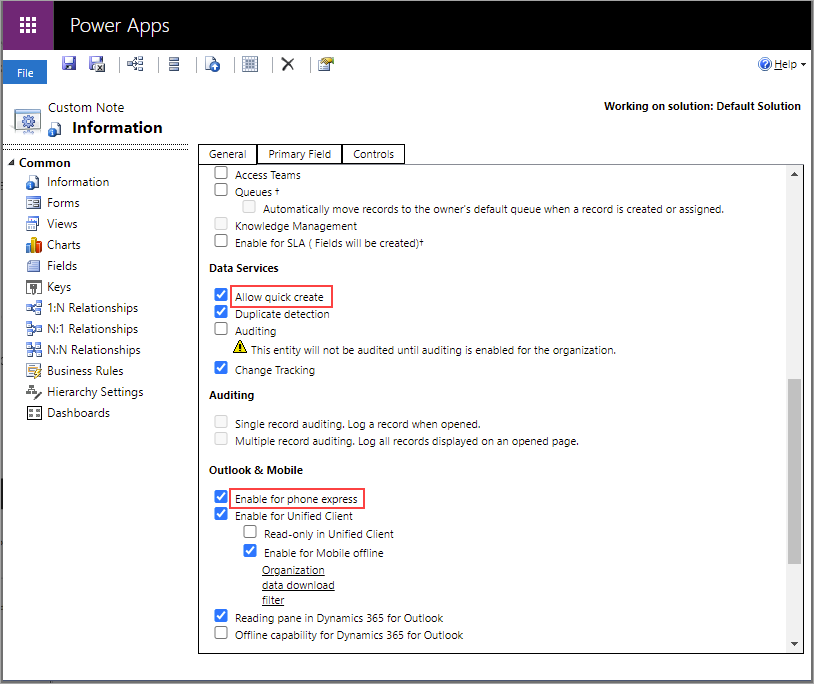

# Configure tables for quick creation of records and activities 

The Dynamics 365 Sales mobile app supports quick creation of records and activities. As an administrator, you can control which records and activities are available for quick creation and which fields are available in the quick creation form.

## License and role requirements

| Requirement type | You must have |
|-----------------------|---------|
| **License** | Dynamics 365 Sales Premium, Dynamics 365 Sales Enterprise, Dynamics 365 Sales Professional, or Microsoft Relationship Sales  More information: [Dynamics 365 Sales pricing](https://dynamics.microsoft.com/sales/pricing/) |
| **Security roles** | System administrator    More information: [Predefined security roles for Sales](../security-roles-for-sales.md)|

## Enable a table or an activity for quick creation

A table or activity should have the following properties to be available in the quick creation list:

- Enabled for quick creation and visible in the mobile app
- Has a quick view form

### Enabled for quick creation and visible in the mobile app

For a table or an activity to be available for quick creation and visible in the mobile app, ensure that the following properties are selected in the table or activity metadata:

- Allow quick create
- Enable for phone express

When you select the checkboxes, the following metadata properties are set:

- IsQuickCreateEnabled is set to true
- IsVisibleInMobile is set to true

### Has a quick view form

Quick creation is enabled only for a table or activity that has a quick view form. More information: [Create a quick view form](/powerapps/maker/model-driven-apps/create-edit-quick-view-forms)

## Control which fields are displayed in the quick creation form

Fields are obtained as an aggregation of the following:

- Fields from the table's or activity's main quick view form
- Fields that are ApplicationRequired (see [RequiredLevel](/dynamics365/customer-engagement/web-api/attributerequiredlevel?view=dynamics-ce-odata-9&preserve-view=true))

### Supported field types

Currently, quick creation supports the following field types:
- String
- DateTime
- Money
- Integer
- Picklist
- Lookup
- Customer
- Memo
- Generic Text

### See also

[Use the Dynamics 365 Sales mobile app](use-sales-mobile-app.md)    
[Learn the basics](learn-basics-mobile-app.md)

