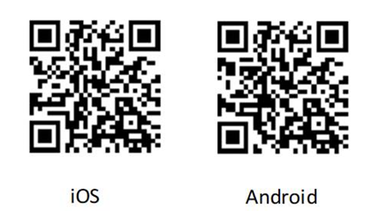
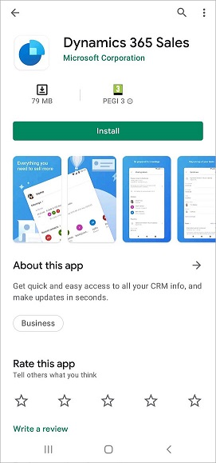

# Install the app on iOS and Android 

The Dynamics 365 Sales mobile app is supported on both iOS and Android. If you are reading this document on a computer, use the camera on your mobile device to scan the relevant QR code to install the mobile app on your device.

If you are reading this document on your mobile device, you can install the app as mentioned in the following sections.

## Install the app on iOS

1. On your iOS device, go to the Apple App Store, and search for **Dynamics 365 Sales**.

    Alternately, [tap here](https://go.microsoft.com/fwlink/?linkid=2161888) to open the app on App Store.

2. Tap **Get** to install the app.

    

## Install the app on Android

1. On your Android device, go to the Google Play Store, and search for **Dynamics 365 Sales**.

    Alternately, [tap here](https://go.microsoft.com/fwlink/?linkid=2161889) to open the app on Play Store.

2. Tap **Install** to install the app.

    

## Related information

[Configure mobile apps with Microsoft Intune](configure-app-intune.md) 
[Set up the Microsoft Authenticator app as your verification method](https://support.microsoft.com/en-us/account-billing/set-up-the-microsoft-authenticator-app-as-your-verification-method-33452159-6af9-438f-8f82-63ce94cf3d29)

[!INCLUDE[footer-include](../../includes/footer-banner.md)]
