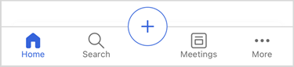
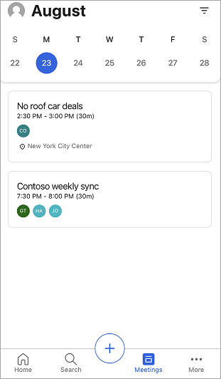

# Learn the basics

Know the basic functions and the information displayed on the home screen of the Dynamics 365 Sales mobile app.

## License and role requirements

| Requirement type | You must have |
|-----------------------|---------|
| **License** |  Dynamics 365 Sales Premium, Dynamics 365 Sales Enterprise, Dynamics 365 Sales Professional, or Microsoft Relationship Sales  More information: [Dynamics 365 Sales pricing](https://dynamics.microsoft.com/sales/pricing/) |
| **Security roles** | Any primary sales role, such as salesperson or sales manager   More information: [Primary sales roles](../security-roles-for-sales.md#primary-sales-roles)|

## Overview

When you open the Dynamics 365 Sales mobile app on your mobile device, you’ll see the home page. This home page provides high-level information on the meetings and insight cards that are specific to you. Typically, the home page displays the following kinds of information:

1. [Meetings](#meetings)
2. [Recent contacts](#recent-contacts)
3. [Recent records](#recent-records)
4. [Recent notes](#recent-notes)
5. [Reminders and insights](#reminders-and-insights)
6. [Navigation bar](#navigation-bar)

## Meetings

The **Up next** section of the home page shows important information about the last meeting you were in and the next one coming up. When you tap a meeting, the meeting details page opens. More information: [View meeting details](view-agenda.md#view-meeting-details)

> [!NOTE]
> The **Up next** section only includes meetings that have at least one participant who's outside of your organization's domain.

## Recent contacts

The **Recent contacts** section of the home page shows a few contacts you have recently accessed through the web or mobile app. You can tap a contact to views its details or tap  **Recent contacts** to open an extended list of recent contacts. More information: [Manage contacts](create-contact.md)

## Recent records

The **Recent records** section of the home page shows a few records you recently accessed through the web or mobile app, such as an account or opportunity. You can tap a record to views its details or tap **Recent records** to view an extended list. More information: [Manage records](open-record.md).

## Recent notes

The **Recent notes** section of the home page shows a few notes you recently created or updated through the web or mobile app. You can tap a note to views its details or tap **Recent notes** to view an extended list. You can also open the record to which a note is added by tapping its name on the note card. More information: [Manage notes](view-edit-add-note.md).

## Reminders and insights

The **Reminders** and **Insights** sections on the home page show action cards from the relationship assistant. The cards show up to three reminders and three insights. If your administrator has created custom cards, they can be shown here, too.

Insight cards help keep you up to date with your work in Dynamics 365 Sales, letting you know when you need to follow up on an email, attend a meeting, and much more. The cards are generated by the assistant based on data stored in Dynamics 365 Sales and your Exchange inbox and calendar. More information: [Insight cards reference](/dynamics365/ai/sales/action-cards-reference)

> [!NOTE]
> Not all types of insights and reminders cards are displayed in this section. More information: [Notes and reminders](open-record.md#notes-and-reminders)

When you tap **Reminders** or **Insights**, an extended list appears. Tap a reminder or an insight to see details about it. Tap **Open** in the card to open the reminder or the insight card.

Tap  on the card to take further action on a reminder, such as to dismiss and snooze.

## Navigation bar

You can use the navigation bar at the bottom of the screen to navigate through the app.

The navigation bar includes the following options:

- [Home](#home)   
- [Search](#search)   
- [Add option](#add-option)     
- [Meetings](#meetings)
- [More options](#more-options)

### Home

Tap **Home** from anywhere in the app to go to the home page.   

### Search

Tap the **Search** icon and enter text in the search box to find related information quickly. When you start typing, suggested records are displayed that include the text. Enter the complete words for better results. More information: [Search records](search-records.md)

### Add option

To add notes, contacts, and records, tap . More information: [Manage records](open-record.md), [Manage notes](view-edit-add-note.md) and [Manage contacts](create-contact.md)

### Meetings

Tap the **Meetings** icon. The calendar selection view is opened with a list of meetings that are scheduled for the current date. By default, information for the current date is displayed. You can swipe left or right to choose a date for which you want to view scheduled meetings.

   

To learn more, go to [View meetings](view-agenda.md).        

### More options

To navigate to other areas of the app, tap the **More** icon to view the site map or menu of the Sales Hub app or any other custom app module you are using. The following screen is a site map sample:

    

The **Recent** option, listed at the top of the site map, displays the records that you have accessed recently through the Sales mobile app. Tap the **Pinned** option to display any pinned records.

Select the bidirectional arrows  in the upper-right corner to switch to other menus such as App settings and Sales Insights settings.

> [!NOTE]
> If you've added icons for a custom table, they are not displayed on the sitemap when the app is viewed on an Android device. Instead, the default icons are displayed. Icons for custom tables are not supported on Android.

## Mobile app settings

The **Settings** panel provides more information about the app, helpful links to submit ideas, report issues, and share feedback, and a sign-out option.

To open the **Settings** panel, tap your profile picture at the upper left of the screen, and then tap **Settings**.

More information: [Dynamics 365 Sales mobile app settings](app-settings.md)

### See also

[View meetings](view-agenda.md)    
[Open a record](open-record.md)

[!INCLUDE[footer-include](../../includes/footer-banner.md)]
