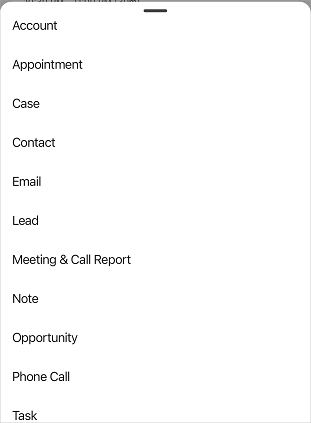
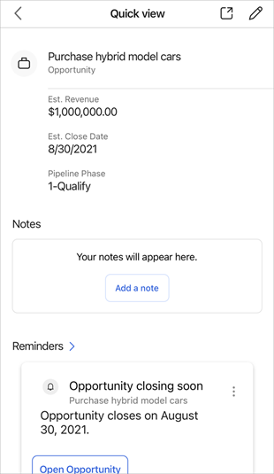
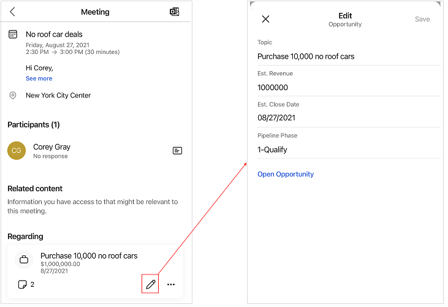

# Manage records

Records can be accessed from the home page or the Meetings page.

- On the home page, go to the **Recent records** section.
- On the Meetings page, go to the **Regarding** section.

You can [view details](#view-details), [create new records](#create-records-and-activities), and [edit records](#edit-records) on the home and Meetings pages. Additionally, you can [change a regarding record](view-agenda.md#change-regarding-record) and [add a regarding record](view-agenda.md#add-regarding-record) on the Meetings page.

## License and role requirements

| Requirement type | You must have |
|-----------------------|---------|
| **License** | Dynamics 365 Sales Premium, Dynamics 365 Sales Enterprise, Dynamics 365 Sales Professional, or Microsoft Relationship Sales  More information: [Dynamics 365 Sales pricing](https://dynamics.microsoft.com/sales/pricing/) |
| **Security roles** | Any primary sales role, such as salesperson or sales manager   More information: [Primary sales roles](../security-roles-for-sales.md#primary-sales-roles)|

## View details

> [!NOTE]
> - The fields that you see on the compact form are defined in the quick view form of the table.
> - The lightweight view doesn't include all attributes of the table.
> - This is a lightweight form that contains any attributes defined in the first form on quick view form set order. More information: [Set the form order](/powerapps/maker/model-driven-apps/control-access-forms#set-the-form-order)

You can view the details of records in the following ways: 

**On the home page**    

The home page displays a list of records that you have recently accessed. These records include opportunities, leads, contacts, quotes, accounts, and notes. When you tap a record, the record details are displayed partially at the bottom half of the screen. Scroll up for a quick view or tap  to display complete record details in a lightweight form. This form provides the basic details, including related [notes and reminders](#notes-and-reminders).

**On the Meeting page**     

The Meeting details page displays the regarding record that is related to the meeting. Tap the record, and then scroll up for a quick view or tap  to display complete record details in a lightweight form. The details include basic information about the record, related [notes, and reminders](#notes-and-reminders). 

> [!NOTE]
> To learn more about notes, go to [Manage notes](view-edit-add-note.md).

## Create records and activities

Follow these steps to quickly create records and activities in the Dynamics 365 Sales mobile app.

1.  On the navigation bar at the bottom of the screen, tap  .

2.  Select a table type from the list.

    

3.	In the **Create new (table)** form, fill in the details, and then tap **Save**.

> [!NOTE]
> To understand which table types are supported for quick creation of records and activities, go to [Configure tables for quick creation](configure-quick-create.md).

## Edit records

Follow these steps to edit records in the Dynamics 365 Sales mobile app.

- To edit records on the home page, open the record. In the upper-right corner of the quick view form, tap . Edit the details in the **Edit** form and tap **Save**. 

    To open the record in the Sales Hub app, tap .

    
    
- To quickly edit the basic information about the regarding record on the **Meeting** page, tap  on the record card. Edit the details in the **Edit** form and tap **Save**. 

        

    To edit the whole record, tap **Open Opportunity**. The record opens in the Sales Hub app for editing.   

## Notes and reminders

**Notes**

Notes displayed in the Notes section are related to the regarding record that is associated with the meeting. You can add, edit, and delete notes. More information: [Manage notes](view-edit-add-note.md)

**Reminders**

You can see the reminders through insight cards based on the regarding record that is associated with the meeting. By tapping  on the card, you can take actions such as dismiss and snooze the card. The cards are retrieved from your Dynamics 365 Sales organization for the selected regarding record.

The following reminder insight cards are supported:    

<table>
<tr>
<td>{activity} due today</td><td>Buying intent detected in email</td><td>Close date coming soon</td>
</tr>
<tr>
<td>Competitor mentioned</td><td>Email opened</td><td>Email reminder</td>
</tr>
<tr>
<td>File requested</td><td>Issue detected</td><td>Meeting requested</td>
</tr>
<tr>
<td>Missed (opportunity) closed date</td><td>Missed email</td><td>No activity with {record type}</td>
</tr>
<tr>
<td>Opportunity at risk (phrase detection)</td><td>Opportunity at risk (sentiment detection)</td><td>Suggested stakeholder</td>
</tr> 
<tr>
<td></td><td></td><td></td>
</tr>
</table>   

To learn more about insight cards, go to [Insight cards reference](/dynamics365/ai/sales/action-cards-reference).  

### See also

[Learn the basics](learn-basics-mobile-app.md)   
[View meetings](view-agenda.md)

[!INCLUDE[footer-include](../../includes/footer-banner.md)]
