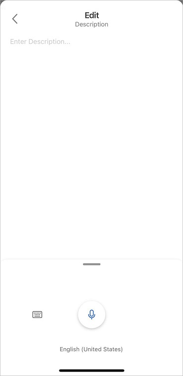

# Use dictation in the mobile app

The Dynamics 365 Sales mobile app allows you to dictate text in a compliant and secure way. You can use dictation for the following:

- Entering text content of a note
- Entering details in a field of type **Multiple Lines of Text**. For information about the field data types, see [Types of fields and field data](/dynamics365/customerengagement/on-premises/customize/types-of-fields?view=op-9-1)

> [!NOTE]
> This feature leverages the Microsoft Speech service. More information: [Speech service](/azure/cognitive-services/speech-service/)

## Use dictation to add text content of a note

1. In the **Note** form, tap  on the bottom command bar.

    

    > [!NOTE]
    > If you are using the dictation capability for the first time in Dynamics 365 mobile app, you are prompted to allow the app to access your phone's microphone. Go to **Settings**, and give the app the access to your phone's microphone.

2. Tap the microphone button to start listening.

    

3. When the microphone button turns blue and the **Listening...** caption appear, start speaking.

    

4. Once you finish speaking and the text is written on the screen, tap the microphone button to stop listening. 

    

## Use dictation in a Multiple Lines of Text field

1. Open the quick view form of a record that has a Multiple Lines of Text field. For example, opportunity has a **Description** field.

2. Edit the record and tap the field of type Multiple Lines of Text. For example, **Description**.

3. Tap  at the bottom of the form.

    

4. Tap the microphone button to start listening.

    

5. When the microphone button turns blue and the **Listening...** caption appear, start speaking.

6. Once you finish speaking and the text is written on the screen, tap the microphone button to stop listening. 

### See also

[Manage notes](view-edit-add-note.md)
[Manage records](open-record.md)

