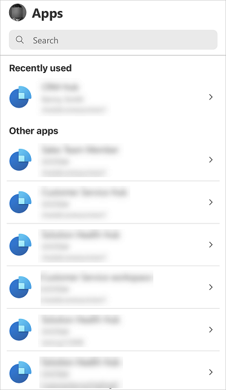
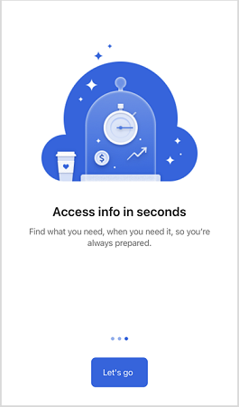
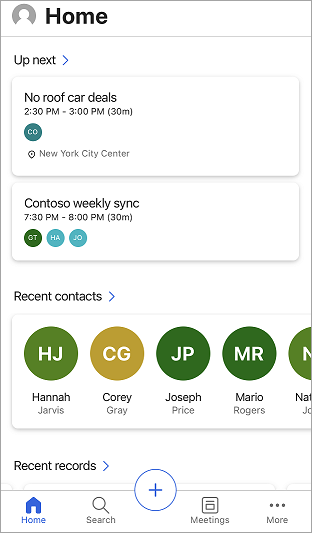

# Use the Dynamics 365 Sales mobile app 

Use the Dynamics 365 Sales mobile app to plan your day by seeing what it has in store such as upcoming meetings and insights. You can also take post-meeting actions such as adding notes, creating contacts, and updating data in relevant records.

## License and role requirements

| Requirement type | You must have |
|-----------------------|---------|
| **License** | Dynamics 365 Sales Premium, Dynamics 365 Sales Enterprise, Dynamics 365 Sales Professional, or Microsoft Relationship Sales  More information: [Dynamics 365 Sales pricing](https://dynamics.microsoft.com/sales/pricing/) |
| **Security roles** | Any primary sales role, such as salesperson or sales manager   More information: [Primary sales roles](../security-roles-for-sales.md#primary-sales-roles)|

## Sign in and sign out from the app

You can sign in to the Dynamics 365 Sales mobile app by using the work email address you use for Dynamics 365. If you need help with your sign-in information, contact your Dynamics 365 administrator.

### Sign in to the app

1. On your mobile device, search for **Dynamics 365 Sales**, and then open the app.

2. On the welcome screen, tap **Sign in**.

    

3. Enter your email and password.

4. From the list of apps, tap the app you want to use.

    

### Sign out from the app

1. Tap your profile picture at the top left of the screen.

2. Tap **Settings**.

    

3. Under the **Account** section, tap **Sign out**.

    

## View non-production apps

By default, only the production apps are displayed for you to choose from. If you want to view non-production apps, that is apps from your trial or sandbox environment, you must enable the **Show non-production apps** setting.

### If no app module is currently in use

There are two ways in which you can view non-production apps.

**Option 1**

- Tap :::image type="icon" source="media/filter-icon.png" border="false" ::: at the upper right of the screen, and then tap **Show non-production apps**.
    
    :::image type="content" source="media/non-prod-apps-filter.png" alt-text="Show non-production apps."::: 

**Option 2**

1. Tap your profile picture at the upper left of the screen. 

2. Turn on the **Show non-production apps** toggle.

    

3. In the confirmation message, tap **Confirm**.

4. Go to the **Apps** screen, pull down the screen to refresh and wait for at least a few minutes.

### If you've selected the app module to use

There are two ways in which you can view non-production apps.

**Option 1**

1. Tap your profile picture at the upper left of the screen, and then tap **Apps**.

    :::image type="content" source="media/sm-select-apps.png" alt-text="Tap apps.":::

2. Tap :::image type="icon" source="media/filter-icon.png" border="false" ::: at the upper right of the screen, and then tap **Show non-production apps**.

    :::image type="content" source="media/non-prod-apps-filter1.png" alt-text="Tap Show non-production apps.":::

**Option 2**

1. Sign out from the app.

2. Sign in to the app.

3. Tap your profile picture at the upper left of the screen.

4. Turn on the **Show non-production apps** toggle.

    

5. In the confirmation message, tap **Confirm**.

6. Go to the **Apps** screen, pull down the screen to refresh and wait for at least a few minutes.

> [!NOTE]
> If you close the app, the **Show non-production apps** toggle is turned off and the non-production apps are removed from the list when you reopen the app. To view the non-production apps again, turn on the **Show non-production apps** toggle.

## First run experience

When you sign in and select the app for the first time, you'll see the display cards. Review the display cards on the app and on the last card, select **Let's go** to move to the home page.

The home page is displayed as shown in the following example screen:

> [!div class="mx-imgBorder"]
>  

### See also

[Learn the basics](learn-basics-mobile-app.md)

[!INCLUDE[footer-include](../../includes/footer-banner.md)]
