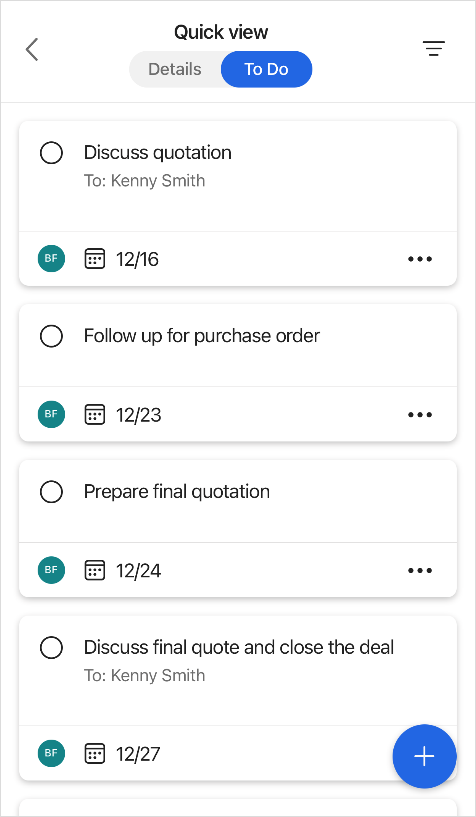
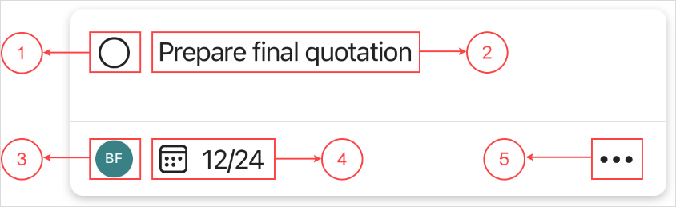
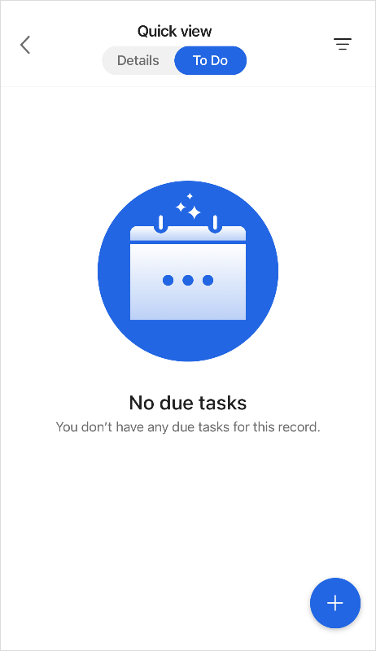
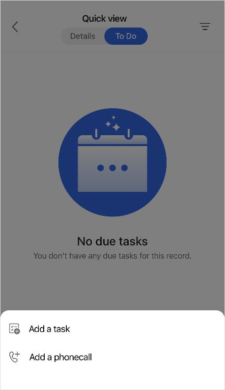
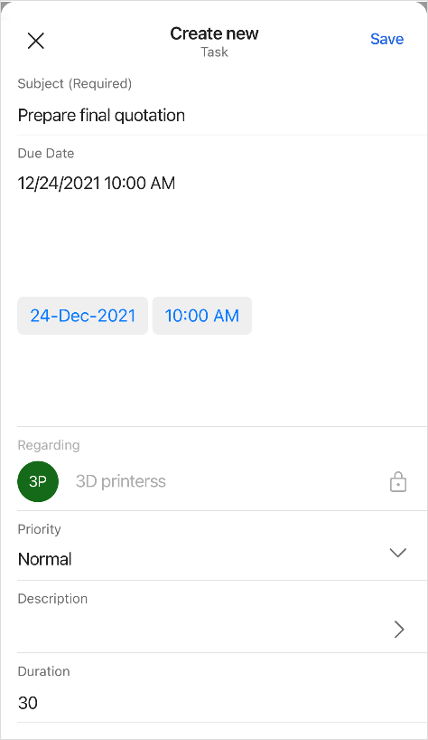
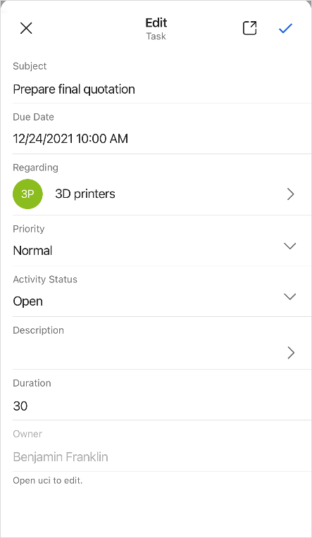
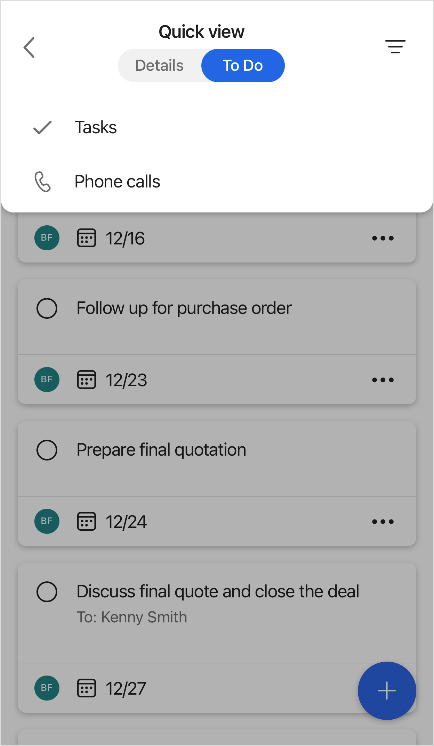
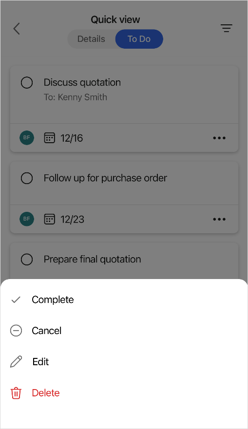

# View activities of a record or contact

You can view upcoming and overdue activities related to a record or contact in the Dynamics 365 Sales mobile app. You can filter activities based on activity type and take various actions on them.

> [!NOTE]
> The mobile app supports only task and phone call activities. To view all associated activity types, use the Sales Hub app.

## License and role requirements

| Requirement type | You must have |
|-----------------------|---------|
| **License** | Dynamics 365 Sales Professional, Dynamics 365 Sales Enterprise, Dynamics 365 Sales Premium, or Microsoft Relationship Sales  More information: [Dynamics 365 Sales pricing](https://dynamics.microsoft.com/sales/pricing/) |
| **Security Role** | Any primary sales role, such as salesperson or sales manager   More information: [Primary sales roles](../security-roles-for-sales.md#primary-sales-roles)|
|  |  |

## View activities

You can view upcoming and overdue task and phone call activities created for a record or contact. The list of activities is displayed on the **To Do** tab and is sorted based on the due date of the activities.
<!--markdownlint-disable MD036-->
**To view activities**

1.  Open a [record](open-record.md#view-details) or [contact](create-contact.md#view-details) to view its details in a quick view form.

2.  Tap **To Do** at the top of the form.

A list of activities is displayed.

## Anatomy of an activity

| **Number** | **Description**                                            |
|------------|------------------------------------------------------------|
| 1          | Select the option button to mark the activity as complete. |
| 2          | The name of the activity.                                      |
| 3          | The owner of the activity.                                     |
| 4          | The due date for the activity.                                 |
| 5          | More actions for the activity.                             |

## Add an activity

You can add an activity from the quick view form of a record or from the home page. When you add an activity from the quick view form of a record, the activity is automatically associated with the record. When you add an activity from the home page, you must manually associate the activity with a record.

**To add an activity from the quick view form**

1.  Open a [record](open-record.md#view-details) or [contact](create-contact.md#view-details) to view its details in a quick view form.

2.  Tap **To Do** at the top of the form.

    

3.  Tap at the lower-right corner of the form, and then tap one of the following options:

    -  Add a task

    -  Add a phone call

    

4.  In the **Create new** form, enter the details, and then tap **Save** at the upper-right corner of the form.

    

The activity is created and displayed on the **To Do** tab.

**To add an activity from the home page**

1.  On the navigation bar at the bottom of the screen, tap , and then tap **Phone Call** or **Task**.

2.  In the **Create new** form, enter the details.

3. In the **Regarding** field, select the name of the record to which this activity belongs, and then tap **Save** at the upper-right corner of the form.

> [!NOTE]
> The **Regarding** field is not a required field, but selecting a value in the **Regarding** field helps in associating the activity with a record.

## Open or edit an activity

1.  Open a [record](open-record.md#view-details) or [contact](create-contact.md#view-details) to view its details in a quick view form.

2.  Tap **To Do** at the top of the form.

3.  Tap an activity to open it.

4.  In the **Edit** form, make changes as you want, and then tap  at the upper-right corner of the form.

    Alternately, you can tap  on an activity card, and then tap **Edit**. Make changes as you want, and then tap  at the upper-right corner of the form.

    

## Filter activities

You can filter the list of activities to view only one type of activity at a time.

1.  Open a [record](open-record.md#view-details) or [contact](create-contact.md#view-details) to view its details in a quick view form.

2.  Tap **To Do** at the top of the form.

3.  Tap  at the upper-right corner of the form, and then tap one of the following options:

    -   Tasks

    -   Phone calls

    

    The list is filtered based on the selected activity type.

    

4.  To remove the filter, tap  on the **Filtered by** bar.

## Mark an activity as complete

After you call someone or complete a task, you can mark the activity as complete. To mark an activity as complete, tap the option button on the activity card. Alternately, tap  on the activity card, and then tap **Complete**.

## Cancel an activity

If an activity is no longer relevant but you want to keep a record of it, you can mark the activity as canceled. To mark an activity as canceled, tap  on the activity card, and then tap **Cancel**. Canceling an activity removes it from the **To Do** view.

## Delete an activity

If you created an activity by mistake, or the activity is no longer required, you can delete it. To delete an activity, tap  on the activity card, and then tap **Delete**.

## Reassign an activity

You can reassign an activity to a team or another user from Unified Interface. 

1. [Open or edit an activity](#open-or-edit-an-activity), and then tap  at the upper-right corner of the form.

2. In Unified Interface, tap **More** at the lower-right corner of the form, and then tap **Assign**.

3. In the **Assign to Team or User** window, tap the **Assign to** field, and then select **User or team**.

4. In the **User or team** field, browse and select the user you want to assign the activity to.

### See also

[Manage records](open-record.md)  
[Manage contacts](create-contact.md)  
