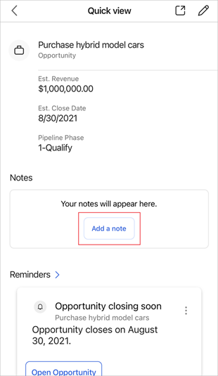
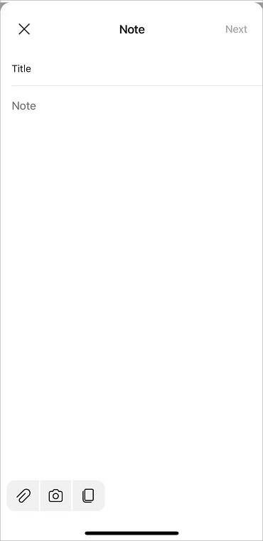
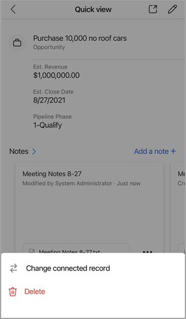
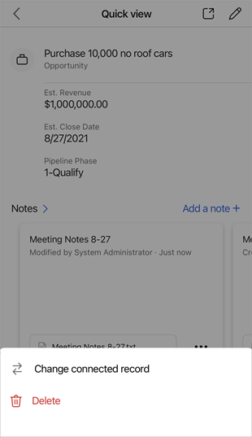
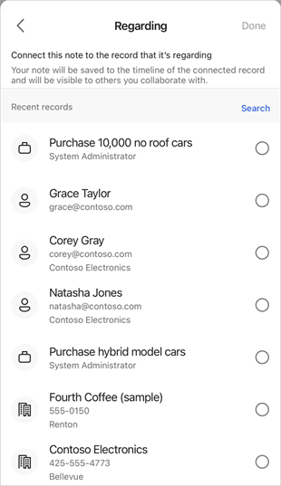

# Manage notes 

You can see the notes associated with a record in the **Notes** section of the record details.

> [!NOTE]
> You can associate annotations with only those custom entities that are created with the [CreateEntityRequest.HasNotes Property](/dotnet/api/microsoft.xrm.sdk.messages.createentityrequest.hasnotes?view=dynamics-general-ce-9#Microsoft_Xrm_Sdk_Messages_CreateEntityRequest_HasNotes&preserve-view=true)

## License and role requirements

| Requirement type | You must have |
|-----------------------|---------|
| **License** | Dynamics 365 Sales Premium, Dynamics 365 Sales Enterprise, Dynamics 365 Sales Professional, or Microsoft Relationship Sales  More information: [Dynamics 365 Sales pricing](https://dynamics.microsoft.com/sales/pricing/) |
| **Security roles** | Any primary sales role, such as salesperson or sales manager   More information: [Primary sales roles](../security-roles-for-sales.md#primary-sales-roles)|

## What actions can performed?

You can perform the following actions in the **Notes** section.

| To do this              | Do this                |
|-------------------------|------------------------|
| Open a list of notes.       | Tap **Notes**. |
| See an image associated with a note. | Tap the image name.    |
| Open or edit a note  | Tap the note.       |
| Take more actions, like change the connected record or delete a note.  | Tap .  |
| Create a note.     | Tap **Add a note**.     |

## Add a note

1.  Perform one of the following actions:

    -   When viewing details of a record that has no notes added to it yet, tap **Add a note**.

        

    -   When viewing details of a record that has already had notes added to it, tap **Add a note**.

        

    -   When viewing a list of notes, tap  at the upper-right corner of the **Notes** page.

        

    -   On the navigation bar at the bottom of the screen, tap , and then tap **Note**.

        

2.  In the **Note** form, enter a title and the text of your note.

    

    You can perform the following actions from the bottom command bar while adding text to your note.

    |Icon|Description|
    |----|-----------|
    ||Attach a file or an image stored on your mobile device.|
    ||Take a photo from your mobile camera and attach it to the note.|
    ||Copy the note's content.|
    

    > [!NOTE]
    > If you're adding the note by using the navigation bar at the bottom of the screen, you must connect the note to the record that it's regarding. Tap **Next**, and then select the record you want to associate the note with. More information about annotation: [annotation EntityType](/dynamics365/customer-engagement/web-api/annotation?view=dynamics-ce-odata-9&preserve-view=true)

5. Tap **Save**.

## Open or edit a note

You can open a note by tapping the note card. When you open a note, you can make changes to the note as you want, and then tap **Save**.

## Delete a note

You can delete a note when it is no longer needed.

- In the note card, tap , and then tap **Delete**.

    

## Change connected record

You can change the record to which a note is added when it is no longer relevant to the current record.

1. In the note card, tap , and then tap **Change connected record**.

    

2. On the **Regarding** page, either select a recent record or tap **Search** to look for the record you want.

    

3. After selecting a record, tap **Done**.

    

The note will be removed from the current record and attached to the selected record.

### See also

[Learn the basics](learn-basics-mobile-app.md)    
[View meetings](view-agenda.md)

[!INCLUDE[footer-include](../../includes/footer-banner.md)]
