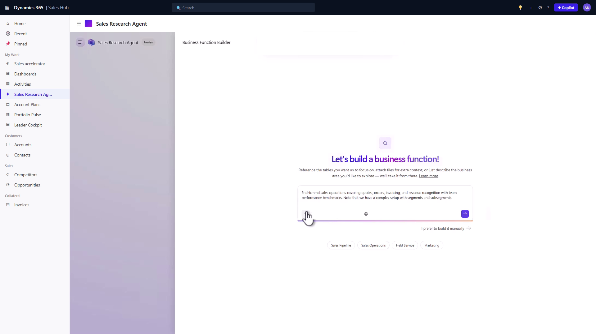
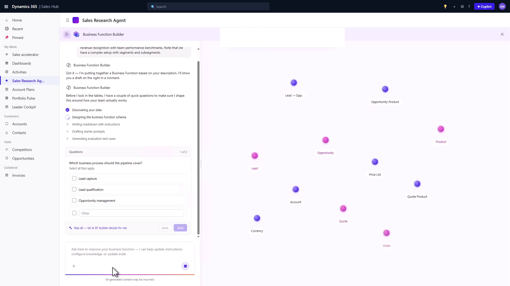
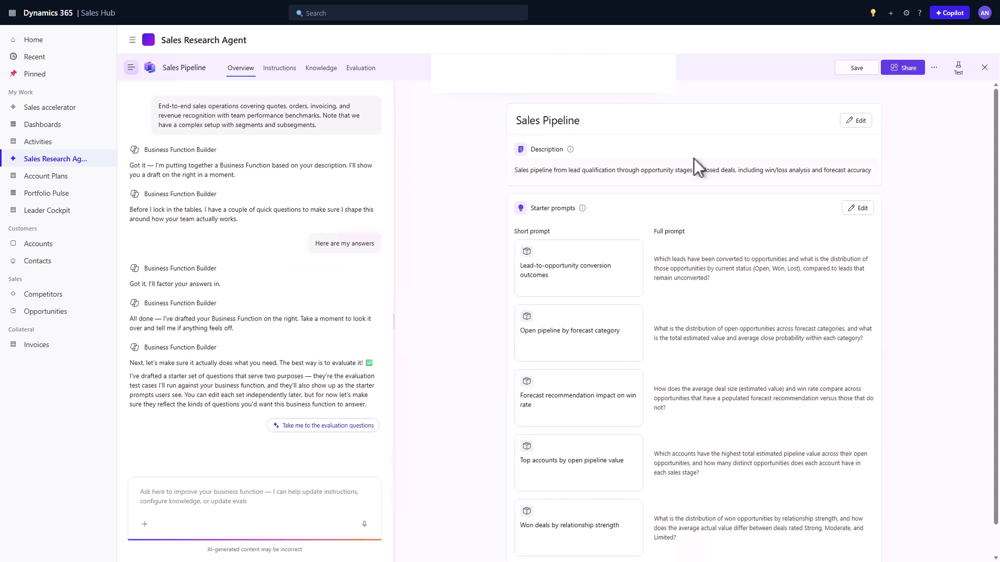
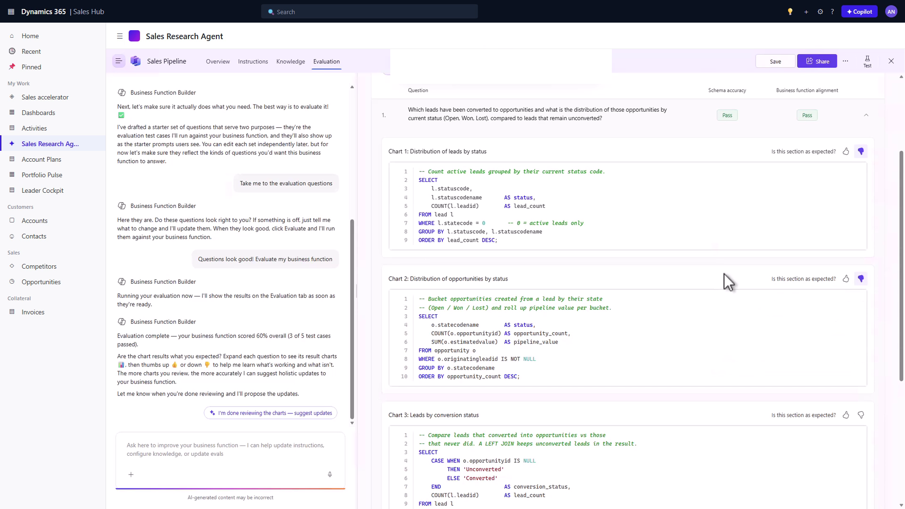

# Create business functions with Business Function Builder (preview)

[!INCLUDE [preview-banner](~/../shared-content/shared/preview-includes/preview-banner.md)]

Business functions enable Sales Research Agent to understand your organization's unique business context, data structure, and requirements. By using Business Function Builder, you can create custom business functions tailored to your specific sales processes and workflows without needing coding expertise. This guided experience helps you define the purpose, scope, and intelligence your organization needs to drive better sales outcomes.

[!INCLUDE [preview-banner](~/../shared-content/shared/preview-includes/preview-note-d365.md)]

## Prerequisites

Before you start, make sure that:

- [Sales Research Agent is enabled](configure-sales-research-agent.md) for your Dynamics 365 Sales environment.
- Your admin [granted you access to Sales Research Agent](configure-sales-research-agent.md#grant-access-to-the-sales-research-agent) in Sales Hub.
- You have access to the Dynamics 365 Sales environment that contains the data you want the business function to use.
- You understand the use case you want to support, such as account planning or pipeline review.

## Open Business Function Builder

1. In Sales Hub, open Sales Research Agent.
1. Select **Manage business functions**.
1. On the **Business functions** page, select the option to build a business function.

The builder opens the guided experience, which walks you through composing, discovering data, and reviewing the generated result. You don't need to fill in any business function fields first. You describe what you want, and the builder generates the draft.

## Step 1: Describe the business function

Describe what you want the business function to help users do. For example, describe the business area, the audience, the data that matters, and the outcomes users expect.

Provide intent in either of these ways:

- Type a description in natural language. For example, "I want to help my account executives analyze their top 20 accounts to identify upsell and cross-sell opportunities. Focus on account revenue, product adoption, support tickets, and interaction history over the last 12 months."

- Select a suggested scenario and then update the prompt to fit your organization.

> [!NOTE]
> Don't submit an empty prompt. Provide intent, such as a description or referenced tables, so the builder has something to work from.

### Add reference content

Reference content can help the builder understand how your organization works. Examples include sales playbooks, methodology documents, KPI definitions, implementation notes, onboarding guides, or process documentation.

Use the supported file types shown in the upload experience.

## Step 2: Review discovered tables

After you describe the business function, the builder analyzes your environment and proposes the tables that appear most relevant to the use case.

The tables the builder finds first are the *anchor tables*. Anchor tables aren't the only tables the business function uses. The builder uses them as grounding and then expands from there to find related tables, columns, and relationships as needed.

Review the proposed anchor tables and make changes as needed:

- Keep tables that are central to the use case.
- Add important custom tables the builder missed.
- Remove tables that your organization doesn't use.
- Review table and column descriptions if the agent appears to misunderstand the schema.

> [!TIP]
> Custom tables and fields work best when they have clear descriptions. If descriptions are missing or ambiguous, add natural-language data instructions in the business function.

## Step 3: Answer clarification questions

The builder might ask clarification questions when it needs your judgment. Some questions provide answer choices. Others might use free text when the answer doesn't fit a predefined option.

Answer the questions based on how your organization uses the data. For example, clarify which tables represent activities, engagement history, forecast categories, custom stages, or account hierarchy.

## Step 4: Generate and review the draft

When the scope and clarification answers are ready, generate the draft business function.

Review the generated content carefully. The draft can include:

- Display name
- Role description
- Business context
- Data instructions
- Glossary terms
- Table and column hints

Edit any generated content that doesn't match your organization. Pay special attention to:

- Custom tables and activity tables.
- Stage, status, and forecast definitions.
- Metrics and formulas.

## Step 5: Review and save the business function

The builder generates the draft, so review the draft and commit it:

1. Review the generated content, including role, business context, data instructions, glossary, and table and column hints.
1. Review the full business function form, including advanced settings such as table, column, and data-source configuration.
1. Apply the generated content to the business function.
1. Save the business function.

The saved business function becomes available in Sales Research Agent, subject to your environment and permissions.

## Validate the business function

Before sharing a business function broadly, validate that it produces useful results.

To validate with built-in evaluation:

1. Open the business function.
1. Open the evaluation experience.
1. Review the generated test questions.
1. Add, edit, or remove questions as needed.
1. Run the evaluation.
1. Review pass rates, failed questions, and suggested improvements.
1. Refine the business function and run the evaluation again.

Evaluation can help identify whether the agent used the right schema, followed the business function instructions, and generated an answer aligned to the use case.

## Related information

- [Business Function Builder overview](sales-research-agent-business-function-builder.md)
- [Share business functions in Business Function Builder](sales-research-agent-business-function-builder-share.md)
- [Troubleshoot Business Function Builder](sales-research-agent-business-function-builder-troubleshoot.md)
- [Sales Research Agent overview](sales-research-agent.md)
- [Analyze your sales performance using the Sales Research Agent](use-sales-research-agent.md)
- [Connect the Sales Research Agent to a different data source](sales-research-agent-connect-data.md)
- [Provide context to enhance the Sales Research Agent](sales-research-agent-provide-context.md)
