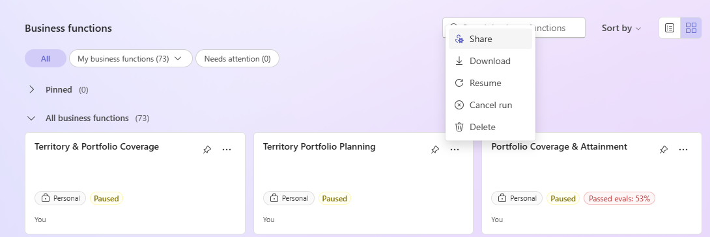

# Share business functions (preview)

[!INCLUDE [preview-banner](~/../shared-content/shared/preview-includes/preview-banner.md)]

After you create and validate a business function, you can share it so other users in your organization can use the same context and instructions. They don't need to recreate the function themselves.

You share a business function from the **Business functions** list, and you can share it with a team, a security role, or a business unit.

[!INCLUDE [preview-banner](~/../shared-content/shared/preview-includes/preview-note-d365.md)]

## Share the function

1. In Sales Research Agent, select **Manage business functions**.
1. On the **Business functions** page, find the business function you want to share.
1. Select **More commands** (**...**) on the business function, and then select **Share**.
1. Choose the audience you want to share with: a team, a security role, or a business unit.
1. Save the sharing configuration.

## Manage shared business functions

- Update the business function when business rules, schema, or starter prompts change.
- Revalidate the business function after major changes.
- Remove sharing when the function is no longer ready for broad use.

## Related information

- [Business Function Builder overview](sales-research-agent-business-function-builder.md)
- [Create and share business functions with Business Function Builder](sales-research-agent-business-function-builder-create.md)
- [Troubleshoot Business Function Builder](sales-research-agent-business-function-builder-troubleshoot.md)
- [Sales Research Agent overview](sales-research-agent.md)
- [Analyze your sales performance using the Sales Research Agent](use-sales-research-agent.md)
