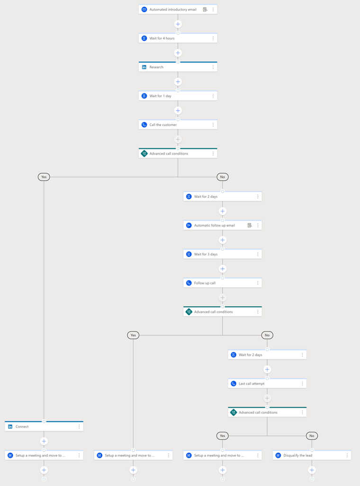
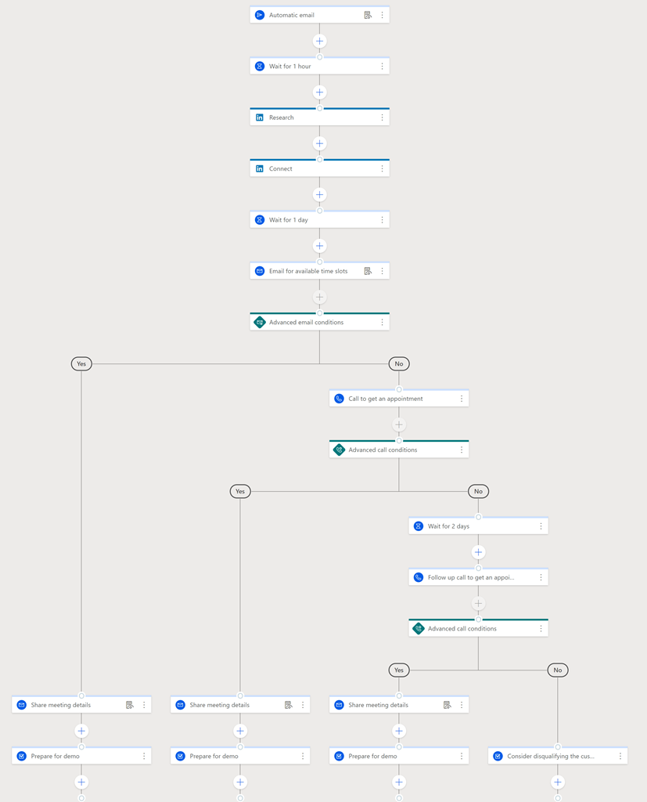
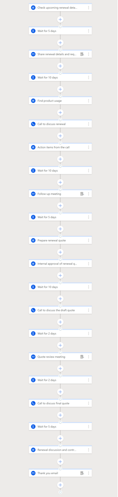

# Sequence templates

Create sequence using sequence templates in Dynamics 365 Sales.

## License and role requirements
| Requirement type | You must have |
|-----------------------|---------|
| **License** | Dynamics 365 Sales Premium or Dynamics 365 Sales Enterprise More information: [Dynamics 365 Sales pricing](https://dynamics.microsoft.com/sales/pricing/) |
| **Security roles** | System Administrator, Sequence manager, or Sales Manager    More information: [Predefined security roles for Sales](security-roles-for-sales.md)|

## Using sequence templates

With sequence templates, you can get started by quickly setting up sequences. Sequence templates provide a set of activities to guide sellers with what’s coming next in the up next widget to achieve a task, such as getting introduced to a lead and winning a deal.

In the application, sequence templates are available for common scenarios, such as an incoming lead on a website. Also, you can customize the template by adding and removing steps as per organizational requirements. The following templates are available to use and configure sequences for your organization:

-	[Follow up when contacts don't show up](#follow-up-when-contacts-dont-show-up) 
-	[High volume outbound prospecting](#high-volume-outbound-prospecting) 
-	[Invite to an upcoming event](#invite-to-an-upcoming-event) 
-	[Meeting for product demo requests](#meeting-for-product-demo-requests)
-	[Upcoming account renewal](#upcoming-account-renewal) 
-	[Webinar follow up](#webinar-follow-up) 

## Follow up when contacts don't show up 

The **Follow up when contacts don't show up** sequence template is a **Contact** record type that helps to follow up with customers when they don't show up for a meeting.    

By default, the template contains seven steps and five days to complete the sequence.   

>[!NOTE]
>Wait time steps are not included in the total number of steps for the template.

The template consists of the following process:

1.	Send an email to the customer about the missed meeting and request another meeting. If the customer replies, make a phone call, and take it further by sharing the missed meeting details. 
2.	If the customer doesn’t reply to the email, make a phone call. If the customer answers the call, discuss, and take it father by sharing the missed meeting details.
3.	If the customer doesn’t answer the call, wait for two days, and send an email for a placeholder meeting. If the customer replies to the email, make a phone call, and take it further by sharing the missed meeting details.
4.	If the customer doesn’t reply to the email, contact other customers in the company.

The following flow diagram illustrates the steps included in the template:

>[!div class="mx-imgBorder"]
> 

## High volume outbound prospecting 

The **High volume outbound prospecting** sequence template is a **Lead** record type that allows to meet prospects and understand their needs and requirements.

By default, the template contains seven steps and nine days to complete the sequence. 

>[!NOTE]
>Wait time steps are not included in the total number of steps for the template.

The template consists of the following process:

1.	Send an automated introductory email to the lead with the seller’s information and then research about the lead’s company and details on LinkedIn to understand the lead.
2.	Make a phone call to the lead. If the lead answers the phone call, discuss, and connect with the lead through LinkedIn. Schedule a meeting with the lead to take the deal to the next stage.
3.	If the lead doesn’t answer the phone call, an automated follow-up email is sent and after three days, make a phone call to the lead. If the lead answers the phone call, discuss, and schedule a meeting with the lead to take the deal to the next stage.
4.	If the lead doesn’t answer the phone call, wait for two days, and make the final phone call. If the lead answers the phone call, discuss, and schedule a meeting with the lead to take the deal to the next stage.
5.	If the lead doesn’t answer the phone call, disqualify the lead.

The following flow diagram illustrates the steps included in the template:

>[!div class="mx-imgBorder"]
> 

## Invite to an upcoming event 

The **Invite to an upcoming event** sequence template is a **Contact** record type that helps to build relationships and drive attendance to an upcoming event, such as an on-line webinar or an offline conference.

By default, the template contains six steps and five days to complete the sequence. 

>[!NOTE]
>Wait time steps are not included in the total number of steps for the template.  

The template consists of the following process:   

1.	Send a personalized email inviting the customer to the event. If the customer replies to the email, send a confirmation email with details about the event.
2.	If the customer doesn’t reply to the email, send a follow-up email. make a phone call. If the customer replies to the email, send a confirmation email with details about the event.
3.	If the customer doesn’t reply to the email, make a phone call. If the customer answers the call, discuss, and take it father by sharing the missed meeting details.
4.	If the customer doesn’t answer the call, mark the customer for future events.  

The following flow diagram illustrates the steps included in the template:

>[!div class="mx-imgBorder"]
> 

## Meeting for product demo requests   

The **Meeting for product demo requests** sequence template is an **Opportunity** record type that helps to get a meeting with users who have requested for a product demo.

By default, the template contains nine steps and five days to complete the sequence. 

>[!NOTE]
>Wait time steps are not included in the total number of steps for the template.

The template consists of the following process:

1.	Send an email to the customer thanking for showing interest in the product. Research and connect with the customer through LinkedIn. 
2.	Wait for a day and then send an email to the customer requesting a time slot to demo. If the customer replies to the email, set up a meeting and demo the product.
3.	If the customer doesn’t reply, make a phone call. If the customer answers the phone call, set up a meeting and demo the product.
4.	If the customer doesn’t answer the phone call, wait for two days, and make a follow-up phone call. If the customer answers the phone call, set up a meeting and demo the product.
5.	If not, disqualify the customer.

The following flow diagram illustrates the steps included in the template:

>[!div class="mx-imgBorder"]
> 

## Upcoming account renewal 

The **Upcoming account renewal** sequence template is an Account record type that reminds account executives about upcoming renewal and recommend steps. 

By default, the template contains 13 steps and 50 days to complete the sequence. 

>[!NOTE]
>Wait time steps are not included in the total number of steps for the template.

The template consists of the following process:

1.	Verify the account and renewal details, and then send an email to the customer about the upcoming renewal and request to schedule a meeting to discuss it.
2.	Check product and features used by the account and research on add-ons that can be proposed. Make a phone call to the customer to answer the questions and pitch the add-ons. 
3.	Note action items from the previous call and work on them. Send an email to schedule a follow-up meeting to answer the questions and resolve any doubts that customer has.
4.	Prepare a renewal quote and discuss with the sales team for approval. 
5.	Make a phone call to the customer and discuss the approved renewal quotation. Email the quotation to the customer for review and make a call to finalize the quotation.
6.	Discuss and sign the renewal contract. 
7.	Send an email to thank the customer for signing the renewal contract.

The following flow diagram illustrates the steps included in the template:

>[!div class="mx-imgBorder"]
> 

## Webinar follow up 

The **Webinar follow up** sequence template is a Lead record type that allows to set up a meeting with the customers who have recently attended a webinar or an event. 

By default, the template contains 10 steps and seven days to complete the sequence. 

>[!NOTE]
>Wait time steps are not included in the total number of steps for the template.

The template consists of the following process:

1.	Send an automated email thanking customers who attended the webinar and ask to schedule a meeting to discuss next steps and answer any questions. If customers reply to the email, send a confirmation email, qualify the lead, and proceed to demo the product.
2.	If customers don’t reply to the email, send a follow-up email. If customers reply to the email, send a confirmation email, qualify the lead, and proceed to demo the product.
3.	If customers don’t reply to the follow-up email, make a phone call for next steps. If the customer answers the call, send a confirmation email, qualify the lead, and proceed to demo the product.
4.	If the customer doesn’t answer the call, wait for two days, and send a final follow-up email for a meeting. If the customer replies to the email, send a confirmation email, qualify the lead, and proceed to demo the product.
5.	If not, disqualify the lead. 

The following flow diagram illustrates the steps included in the template:

>[!div class="mx-imgBorder"]
> 

[!INCLUDE [cant-find-option](../includes/cant-find-option.md)]

### See also

[Create and activate a sequence](create-and-activate-a-sequence.md)   
[Manage sequences](create-manage-sequences.md)

