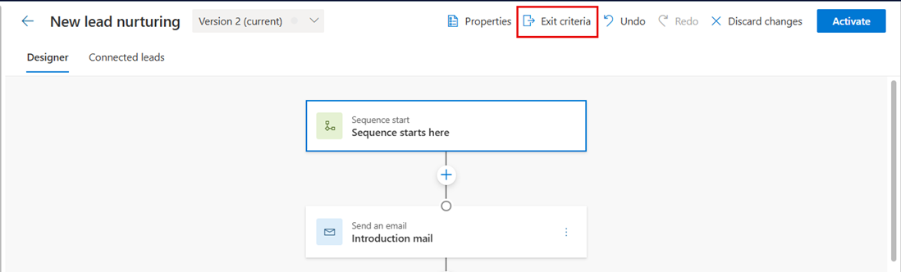
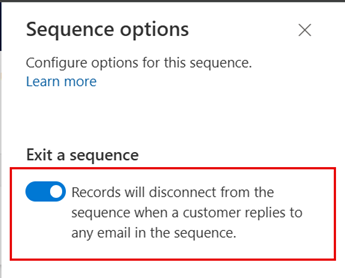

# Exit a sequence during the flow

By enabling the option to exit a sequence, you disconnect the sequence from its records when the criteria is met. For example, if the flow includes an email reply from the customer, the record will be disconnected from the sequence.

## License and role requirements
| Requirement type | You must have |
|-----------------------|---------|
| **License** | Dynamics 365 Sales Enterprise, Dynamics 365 Sales Premium, and [Microsoft Relationship Sales](https://dynamics.microsoft.com/en-in/sales/relationship-sales/)  More information: [Dynamics 365 Sales pricing](https://dynamics.microsoft.com/sales/pricing/) |
| **Security roles** | System Administrator or Sequence Manager    More information: [Predefined security roles for Sales](security-roles-for-sales.md)|

## Prerequisites

Review the following requirements before you configure the exit criteria:

- At least one email activity step is created in the sequence. 
- The sequence must be in inactive or revision state.
- [Configure the email engagement feature](configure-email-engagement.md) in your organization before you start using this option for the email activity.

## Configure the exit sequence criteria

1.	Open the sequence and then on the designer page, select **Exit criteria**.

    > [!div class="mx-imgBorder"]
    > 

2.	On the **Sequence Options** pane, turn on the **Exit a sequence** toggle to exit a sequence when a customer replies to any email in the sequence.  

    > [!div class="mx-imgBorder"]
    > 

3.	Select **Save**.

[!INCLUDE[cant-find-option](../includes/cant-find-option.md)]

### See also

[Create and activate a sequence](create-and-activate-a-sequence.md)      
[Add steps to sequence](steps-sequence.md)  
[Add condition steps to sequences](adaptive-sequence.md)   
[Add command steps to sequences](command-sequence.md)     
[Add LinkedIn activities to sequence](linkedin-activities-sequence.md)
