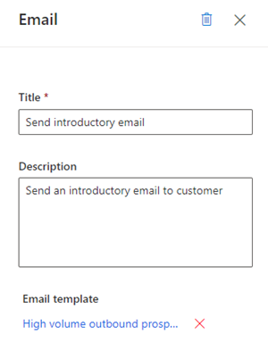
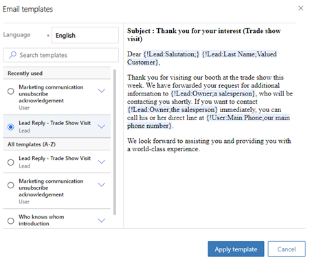
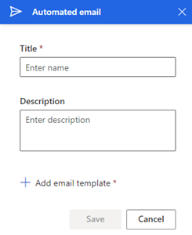
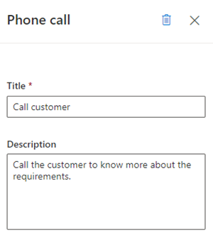
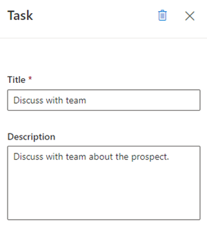
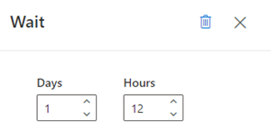

# Add steps to sequence

Add steps to define activities for sequences in the sales accelerator to display in the work list and Up next widget.

## License and role requirements
| Requirement type | You must have |
|-----------------------|---------|
| **License** | Dynamics 365 Sales Enterprise, Dynamics 365 Sales Premium, and [Microsoft Relationship Sales](https://dynamics.microsoft.com/en-in/sales/relationship-sales/)  More information: [Dynamics 365 Sales pricing](https://dynamics.microsoft.com/sales/pricing/) |
| **Security roles** | System Administrator or Sequence Manager    More information: [Predefined security roles for Sales](security-roles-for-sales.md)|

## Types of steps

When creating a sequence, you can add the following types of activities as steps:  
- [A/B test](#ab-test)
- [Email activity](#email-activity)
- [Automated email activity](#automated-email-activity)
- [Send a text message](#send-a-text-message)
- [Send an automated text message](#send-an-automated-text-message)
- [Phone call activity](#phone-call-activity)
- [Task activity](#task-activity)
- [Set wait time](#set-wait-time)

## A/B test

The A/B tests help you to examine your trigger-based sequence path, allowing you to gain insights into how best to reach your customers.  
Using A/B tests, you can measure which channel or content messaging strategy leads to higher success. Each test compares a control group of users (version A) against a variant (version B). The control group receives a default experience. The variant group receives a different experience or message. By comparing the results of the groups, you can determine which one is the most effective.  
The sequence usually runs the entire test automatically. The test starts by sending versions A and B to a small part of your audience as they funnel through the sequence. The sequence then analyzes the interaction results and chooses a winner based on your selected criteria (click through, open rate, or sequence goal). The sequence then sends the winning version to the rest of your audience automatically.  

To create and add A/B test:

1. In the sequence designer page, select the **Add** (**+**) icon under a step.  
1. On the **Add an action or other element** dialog box, under the **Steps** tab, select **Test which variation performs better**.  
1. In the **Select which type of action to test** step, select **Create test**.
1.	In the **A/B test side** pane, configure the attributes as described.

    | Attribute name | Description |
    |----------------|-------------| 
    | Display name | Enter a name for the test. This name is displayed in the A/B test panel and in the sequence analytics when you're looking at which tests are running. Once the sequence is active and assigned, you can't rename your test. |
    | Version A and Version B | Configure each version with the name and template that you want to include. You can do this through a dropdown list by either selecting the child tiles in the designer, or by selecting the side panel. For more information on configuring email step, see [Automated email activity](#automated-email-activity). | 
    | Audience | Choose the audience distribution you would like. The slider is automatically on 50-50, but you can set the slider to your desired distribution. The minimum a version can receive is 10 percent, and the maximum is 90 percent. Remember that, traditionally, version A is your control group and version B is your variant. |
    | Winning metric | You can set the winning condition for your test by choosing a winning metric: The version with the most journey goal events hit, the most clicks, or the most opens. | 
    | This test ends | You can also choose between ending the test automatically or at a specific date and time. For best results, we recommend letting the test determine a winner automatically when the results reach statistical significance. Once a clear winner is determined, the system sends the winning version to the rest of your audience. The losing version is discarded. |
    | Default version | Choose a default version in case the test doesn't end successfully. In cases where a winner hasn't been determined by the deadline specified through the date and time, the default version is automatically sent. | 

1. Close the A/B test pane.  
    The A/B test is added to the sequence.

### Track A/B test

After you have activated and connected the sequence, you can open it to track the lifecycle of your tests.
-	**Draft**: These tests haven't run yet, so you can still edit the settings.
-	**In progress**: These tests are currently being run. The settings are locked, and you can’t make significant changes.
-	**Stopped**: Theses tests are stopped, and the marketer can choose which version to send.
-	**Ended**: These tests were completed by finding a statistically significant winner or by timing out when scheduled to end at a set date and time. Ended tests can't be reused.

### Understand the results

There are three possible A/B test result outcomes:
-	**Test concluded with a clear winner**: The test concluded that one version is performing better than the other. The winning version has a “winner” badge and is distributed to any new customers that funnel through the sequence.
-	**Test was not conclusive**: The test concluded that recipients are as likely to engage with version A as with version B. In this case, the default version is sent to any new customers that funnel through the sequence.
-	**The test was stopped**: This means that you or one of your coworkers stopped the test before it could conclude. In this case, the version specified by you, or your coworker is sent to any new customers that funnel through the sequence.

## Email activity  
Creates an email activity for sellers to communicate with customers. When this activity is shown to the seller, an envelope icon is displayed on the record. When a seller selects the icon, an email composer opens with a template, if one was selected. If no template was selected, an empty email composer opens.  

To add the email activity step:

1. In the sequence designer page, select the **Add** (**+**) icon under a step.

2. On the **Add an action or other element** dialog box, under the **Steps** tab, select **Send an email**. 
    
3. On the **Email** activity pane, enter the following information to configure the email activity

   1. A name and description for the activity. The information you enter here is displayed to sellers.   
   2. (Optional) If templates are available for your organization, select **Add email template**.
       On the **Email templates** dialog box, select the template you want to assign for this step and then select **Apply template**. To know more about email templates, see the step to [add email template](#automated-email) in the **Automated email** section.  
    
    > [!div class="mx-imgBorder"]
    >     
    
4. Close the email pane.   
    The email activity is added to the sequence.

Now, you can define conditions for an email activity to determine the branch that the sequence moves to as the next step. More information: [Define conditions for email activity](adaptive-sequence.md#define-conditions-for-email-activity)      

## Automated email activity   

Creates an automated email activity for sellers to communicate with customers. When this activity is shown to the seller, a send icon  is displayed on the record. The email is automatically sent to the customer based on the selected template.     
>[!TIP]
>Add a **Set wait time** activity before the **Automated email** activity. Adding wait time provides a time gap between the previous step and sending the automated email. If the time gap isn't configured, the automated email will be sent immediately after the previous activity is completed, which won't give sellers the time they might need to take action on the automated email activity.    

>[!NOTE]
>- Verify that required email templates are created in your organization. More information: [Create templates for email](/power-platform/admin/create-templates-email?context=/dynamics365/context/sales-context)   
>- Configure [the email engagement feature](configure-email-engagement.md) in your organization before you start using the automated email step.

To add the automated email activity step:

1. In the sequence designer page, select the **Add** (**+**) icon under a step.

2. On the **Add an action or other element** dialog box, under the **Steps** tab, select **Send an automated email**. 

3. On the **Automated email** activity pane, enter the following information to configure the automated email activity:
    
    -	A name and description for the activity. The information you enter here is displayed to sellers.
    -	An email template that you want to assign for this step. 
        1. Select **Add email template**. 
        2. In the **Email templates** dialog, select the language and then choose a template. When a template is chosen, you can see the preview.     
            > [!div class="mx-imgBorder"]
            >      
            
        3. Select **Apply template**.   
            The template is selected for the step.   
                
    > [!div class="mx-imgBorder"]
    >    

4. Close the automated email pane.   
    The automated email activity is added to the sequence.

Now, you can define conditions for automated email activity to determine the branch that sequence moves to next step. More information: [Define conditions for email activity](adaptive-sequence.md#define-conditions-for-email-activity).   

## Send a text message

Creates a text message (SMS) activity for sellers to communicate with customers. When this activity is shown to the seller, a message icon is displayed on the record in the **Up next** widget. When a seller selects the icon, the text composer opens with a template, if one was selected. If no template was selected, an empty text composer opens.

To add the text message activity step:

1.	In the sequence designer page, select the **Add** (+) icon under a step.

2.	On the **Add an action or other element** dialog box, under the **Steps** tab, select **Send a text message**.

3.	On the **Text message** pane, enter the following information to configure the text message activity:

    -	A name and description for the activity. The information you enter here will be on the step in the **Up next** widget.

    -	(Optional) Add an SMS template.  

        1.	Select **Add a text message template**.

        2.	In the **Text message templates** dialog box, select the template you want to use for this step.

        3.	Select **Select template**. 
        
        If no templates are available, you can add a template by selecting **Create new template** and then selecting it to be used in the step.
       
        To know more about SMS templates, see [Personalize text messages through templates](create-text-message-templates.md).

4.	Close the text message pane.

The text message activity is added to the sequence.

## Send an automated text message

Creates an automated text message (SMS) activity for sellers to communicate with customers. When this activity is shown to the seller, a send icon is displayed on the record in the **Up next** widget. The SMS is automatically sent to the customer based on the selected template.

>[!NOTE]
>-	Add a **Set wait time** activity before the automated text message activity. Adding wait time provides a time gap between the previous step and sending the automated SMS. If the time gap isn't configured, the automated SMS will be sent immediately after the previous activity is completed, which won't give sellers the time they might need to act on the automated SMS activity.
>-	Verify that required SMS templates are created in your organization. More information: [Personalize text messages through templates](create-text-message-templates.md)

To add the automated text message activity step:

1.	In the sequence designer page, select the **Add** (+) icon under a step.

2.	In the **Add an action or other element** dialog box, under the **Steps** tab, select **Send an automated text message**.

3.	In the **Text message** pane, enter the following information to configure the automated text message activity:

    -	A name and description for the activity. The information you enter here will be displayed on the step in the Up next widget.

    -	Add an SMS template. 

        1.	Select **Add a text message template**. 

        2.	In the **SMS templates** dialog box, select the template you want to use for this step.

        3.	Select **Select template**. 

        If no templates are available, you can add a template by selecting **Create new template** and then selecting it to be used in the step.
        
        To know more about SMS templates, see [Personalize text messages through templates](create-text-message-templates.md).

4.	Close the text message pane.

The text message activity is added to the sequence.

## Phone call activity   

Creates a phone call activity for sellers to communicate with customers. When this activity is shown to the seller, a phone icon is displayed on the record. When sellers select the icon, a softphone appears on the app to dial the customer.   
 
To add the phone call activity step:

1. In the sequence designer page, select the **Add** (**+**) icon under a step.

2. On the **Add an action or other element** dialog box, under the **Steps** tab, select **Make a phone call**. 

3. On the **Phone call** activity pane, enter a name and description for the phone call activity. The information you enter here will be displayed to sellers.
    
    > [!div class="mx-imgBorder"]
    >   
    
4. Close the phone call pane.   
    The phone call activity is added to the sequence.

Now, you can define conditions for phone call activity to determine the branch that sequence moves to next step. More information: [Define conditions for phone call activity](adaptive-sequence.md#define-conditions-for-phone-call-activity).      

## Task activity  

Creates a custom activity that you define&mdash;such as scheduling a meeting with the customer&mdash;that isn't specified in the activity selector.   

To add the custom activity step:

1. In the sequence designer page, select the **Add** (**+**) icon under a step.

2. On the **Add an action or other element** dialog box, under the **Steps** tab, select **Complete a task**. 

3. On the **Task** activity pane, enter a name and description for the custom activity. The information you enter here will be displayed to sellers.
    
    > [!div class="mx-imgBorder"]
    >   
    
4. Close the task pane.   
    The custom activity is added to the sequence.

## Set wait time  

Specifies the interval between activities&mdash;that is, after an activity is completed and before the next activity occurs&mdash;during which sellers need to wait. A sequence can't end with this activity.     
When this activity is shown to sellers on a record, they don't need to perform any action; they simply need to wait until the wait time expires before they perform the next activity.   

To add the wait time step:

1. In the sequence designer page, select the **Add** (**+**) icon under a step.

2. On the **Add an action or other element** dialog box, under the **Steps** tab, select **Set wait time**. 

3. On the **Wait** activity pane, choose the duration in days and hours that you want sellers to wait before they perform the next activity. The maximum wait time is 30 days.
    
    > [!div class="mx-imgBorder"]
    >      
    
4. Close the task pane.   
    The wait time is added to the sequence.

[!INCLUDE[cant-find-option](../includes/cant-find-option.md)]

### See also

[Create and activate a sequence](create-and-activate-a-sequence.md)      
[Add condition steps to sequences](adaptive-sequence.md)    
[Add command steps to sequences](command-sequence.md)   
[Add LinkedIn activities to sequence](linkedin-activities-sequence.md)
