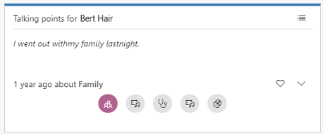

# Know conversation starters for your customers  

> [!IMPORTANT]
> Talking points will be deprecated from August 2022. After the feature is deprecated, you’ll stop getting talking point suggestions on the contact and lead pages. You can use LinkedIn Sales Navigator to get suggestions based on your contact's LinkedIn activities. For more information on what you get with the integration, see [View and work with LinkedIn Sales Navigator controls on forms](../linkedin/view-sales-navigator-forms.md). Contact your administrator if LinkedIn Sales Navigator is not integrated in your environment. 

Use talking points to automatically identify conversation starters of your customers before you interact with them.

## License and role requirements

| Requirement type | You must have |  
|-----------------------|---------|
| **License** | Dynamics 365 Sales Premium  More information: [Dynamics 365 Sales pricing](https://dynamics.microsoft.com/sales/pricing/) |
| **Security roles** | Any primary sales role, such as salesperson or sales manager   More information: [Primary sales roles](security-roles-for-sales.md#primary-sales-roles)|

## What are talking points?

As a sales representative, you interact with many customers and it can be difficult to remember details about each, such as:
-  Latest entertainment event they attended.
-  Favorite sports or games they watch.
-  Vacations they had taken.

In [!INCLUDE[pn-dyn-365-sales](../includes/pn-dyn-365-sales.md)], **Talking points** provides a mechanism to automatically identify such conversation starters from your emails. The conservation starters include topics that are related to sports, vacation, family, and entertainment. These insights are available on the contact page. 

> [!NOTE]
> - The system administrator configures which categories of talking points should be displayed in your organization. 
> - To view talking points, ensure that your mailbox is configured and approved in Dynamics 365 Sales, and Server-side sync is enabled. More information: [Set up server-side synchronization of email, appointments, contacts, and tasks](/power-platform/admin/set-up-server-side-synchronization-of-email-appointments-contacts-and-tasks).  

> [!div class="mx-imgBorder"]
> 

> [!NOTE]
> If you do not see **Talking points** in the summary of the contact page, contact your administrator to enable it. [!INCLUDE[proc_more_information](../includes/proc-more-information.md)] [Configure Talking points](configure-talking-points.md).

Let's say for example a customer sent you an email about a recent vacation in which he enjoyed skiing. Dynamics 365 Sales analyzes the email and automatically categorizes it to sports. This text will appear in the talking points tile in the sports category.  

> [!div class="mx-imgBorder"]
>  

Select each topic icon on the talking points to navigate. This helps you to start a conversation with your customer and you can choose your customer’s area of interest. Select the  icon to view the complete message of a topic. If you want to view all the topics in the Talking points tile as a list, select the list icon.  

> [!div class="mx-imgBorder"]
>  

Talking points will display only the latest communication for each topic on the tile. For example, you received an email about a baseball game yesterday and you received another email today about football. The sports topic in the talking points will be updated with the mail you received about football. 

### See also

[Configure talking points](configure-talking-points.md)  
[Talking points FAQs](faqs-sales-insights.md#talking-points)

[!INCLUDE[footer-include](../includes/footer-banner.md)]
