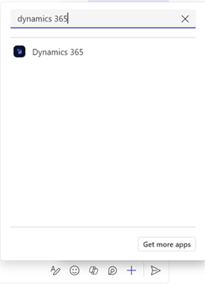
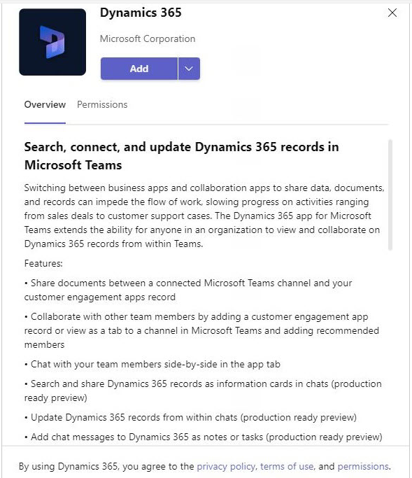
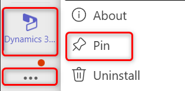
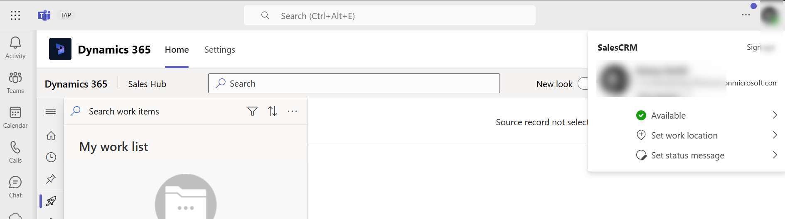
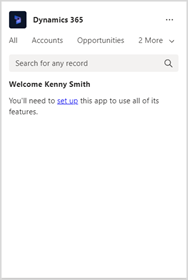
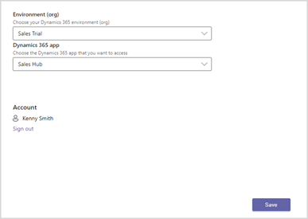

# Access the Dynamics 365 app through messaging extensions (production-ready preview)

[!INCLUDE [cc-beta-prerelease-disclaimer](../../includes/cc-beta-prerelease-disclaimer.md)]

If you've already added the Dynamics 365 app to Microsoft Teams, proceed with the [Access the Dynamics 365 app](#access-the-dynamics-365-app) section. If you haven't added the app to Microsoft Teams, proceed with the [Add the Dynamics 365 app](#add-the-dynamics-365-app) section.

## License and role requirements

| Requirement type | You must have |
|-----------------------|---------|
| **License** | <ul><li>Dynamics 365 Sales Premium, Dynamics 365 Sales Enterprise, Dynamics 365 Sales Professional, Dynamics 365 Team Members, or any Dynamics 365 customer engagement app license</li> <li>Microsoft Teams license</li></ul>   More information: <ul><li>[Dynamics 365 Sales pricing](https://dynamics.microsoft.com/sales/pricing/)</li><li>[Microsoft Teams pricing](https://www.microsoft.com/microsoft-teams/compare-microsoft-teams-options?activetab=pivot:primaryr2&rtc=1)</li><li>[Dynamics 365 Team Members](/dynamics365/get-started/team-members-license)</li><li>[Dynamics 365 Licensing Guide](https://go.microsoft.com/fwlink/?LinkId=866544&clcid=0x409)</li></ul> |
| **Security roles** | <ul><li>Any primary sales role, such as salesperson, or sales manager</li><li>Any role that has access to a Dynamics 365 record</li></ul>    More information: [Primary sales roles](../security-roles-for-sales.md#primary-sales-roles)|

## Add the Dynamics 365 app

1.  Open a channel in Teams and select **New conversation**.

    Alternately, open any chat conversation with a person or group.

2.  Select **Messaging extensions** (**…**) on the command bar, search for **Dynamics 365**, and select it.

    

3.  Select **Add** in the Dynamics 365 window.

    

    The app is added to the channel or a chat conversation in Teams.

> [!NOTE]
> Once you install the app for one channel or chat, it's available for use in all other channels and chats.

## Access the Dynamics 365 app

After the Dynamics 365 app is added to a channel, it's available through messaging extensions in Teams.

1.  In Teams, open the channel to which you added the Dynamics 365 app and select **New conversation**.

    Alternately, open the chat conversation with a person or group to which you added the Dynamics 365 app.

2.  Select the Dynamics 365 icon () on the command bar.  
  
    If you don't find the Dynamics 365 icon () on the command bar, select the **Messaging extensions (...)** icon on the command bar, search for the **Dynamics 365** app, right-click and then select **Pin**.

    
    
    The Dynamics 365 app icon is pinned to the command bar.
    
    

## Set up the Dynamics 365 app

1.  [Access the Dynamics 365 app](#access-the-dynamics-365-app).

2.  In the **Dynamics 365** window, select **sign in**.

    

3.  After you sign in to the app, select **set up**.

    > [!NOTE]
    > You'll see this step only if you are using the Dynamics 365 app in Teams for the first time. Otherwise, you'll be taken to the next step to select an environment and an app.

    

4.  In the browser window that opens, provide the following information:

    - **Environment (org)**: Select an environment that you want to connect to.

    - **Dynamics 365 app**: Select an app that you want to share records from.

    

5.  Select **Save**.

After you've set up the app, you can change the settings later as required. More information: [Edit settings of the Dynamics 365 app](edit-d365-app.md)

### See also

[Share and update Dynamics 365 records within Microsoft Teams conversations](share-d365-record-overview.md)   
[Edit settings of the Dynamics 365 app](edit-d365-app.md)    
[Share feedback](share-feedback-d365-app.md)    
[Share Dynamics 365 records within Microsoft Teams conversations](share-dynamics-records-in-teams.md)   
[View and update record details](view-update-dynamics-records.md)   
[Add chat messages to Dynamics 365 as notes or tasks](add-chat-d365.md)   
