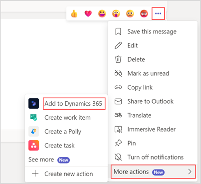
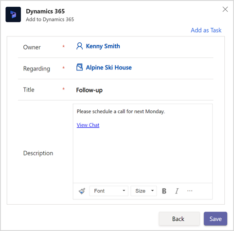
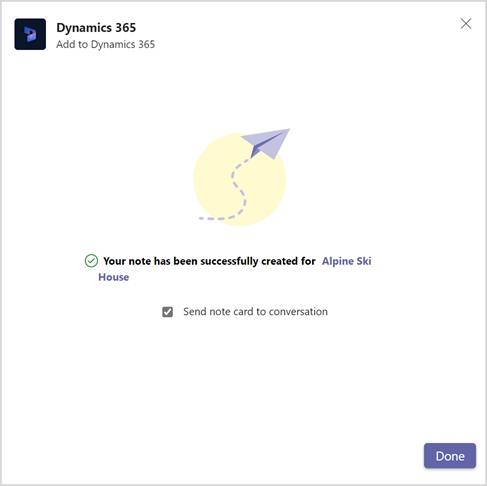
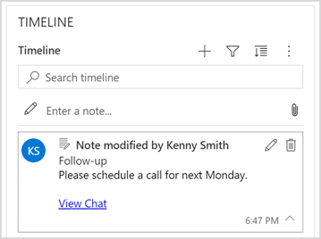

# Add chat messages to Dynamics 365 as notes or tasks (production-ready preview)

[!INCLUDE [cc-beta-prerelease-disclaimer](../../includes/cc-beta-prerelease-disclaimer.md)]

While you're in a conversation about a particular record, you might discuss certain action items, or important points that you want to capture in Dynamics 365. The app makes it easy for you to add such messages as notes or tasks to the corresponding record.

## License and role requirements

| Requirement type | You must have |
|-----------------------|---------|
| **License** | <ul><li>Dynamics 365 Sales Premium, Dynamics 365 Sales Enterprise, Dynamics 365 Sales Professional, Dynamics 365 Team Members, or any Dynamics 365 customer engagement app license</li> <li>Microsoft Teams license</li></ul>   More information: <ul><li>[Dynamics 365 Sales pricing](https://dynamics.microsoft.com/sales/pricing/)</li><li>[Microsoft Teams pricing](https://www.microsoft.com/microsoft-teams/compare-microsoft-teams-options?activetab=pivot:primaryr2&rtc=1)</li><li>[Dynamics 365 Team Members](/dynamics365/get-started/team-members-license)</li><li>[Dynamics 365 Licensing Guide](https://go.microsoft.com/fwlink/?LinkId=866544&clcid=0x409)</li></ul> |
| **Security roles** | <ul><li>Any primary sales role, such as salesperson, or sales manager</li><li>Any role that has access to a Dynamics 365 record</li></ul>    More information: [Primary sales roles](../security-roles-for-sales.md#primary-sales-roles)|

## Add a chat message to a Dynamics 365 record

1.  Hover over the message that you want to add as a note or task, and then select **More options** (**…**).

2.  In the context menu, select **More actions** &gt; **Add to Dynamics 365**.

    

3.  In the **Regarding** field, select the record to which you want to add the message as a note or task.

4.  In the **Title** field, enter a title for the note or task.

    

    By default, the message is added as a note. If you want to add the message as a task, select **Add as Task** in the upper-right corner of the window. The values from the **Regarding** and **Title** fields are populated in the task accordingly.

    > [!NOTE]
    > The message is added to the description field of the note or task. Rich text format is not supported for tasks. So, if you try to add rich text messages, you'll only see the chat URL in the description for tasks. You can manually copy and paste the chat message in such cases.

5.  Select **Save**.

    The note or task is added to the timeline of the record.

    By default, the note or task card is sent to the conversation. If you don't want to send the note or task card to the conversation, clear **Send note card to conversation** or **Send task card to conversation**.

6.  Select **Done**.

    

    The note or task is added to the record's timeline. A **View Chat** link is added to the note or task. Selecting the **View Chat** link opens the conversation in Teams.

    

### See also

[Share and update Dynamics 365 records within Microsoft Teams conversations](share-d365-record-overview.md)   
[Access the Dynamics 365 app through messaging extensions](access-d365-app.md)   
[Edit settings of the Dynamics 365 app](edit-d365-app.md)    
[Share feedback](share-feedback-d365-app.md)    
[Share Dynamics 365 records within Microsoft Teams conversations](share-dynamics-records-in-teams.md)   
[View and update record details](view-update-dynamics-records.md)   
