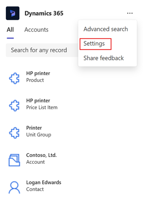
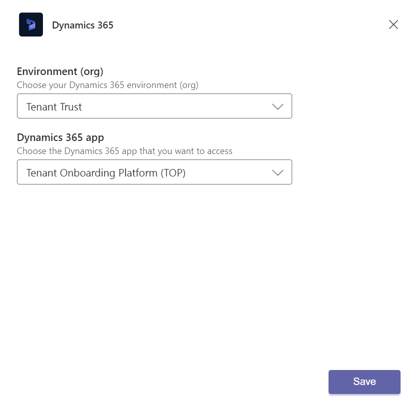

# Edit settings of the Dynamics 365 app (production-ready preview)

[!INCLUDE [cc-beta-prerelease-disclaimer](../../includes/cc-beta-prerelease-disclaimer.md)]

1.  [Access the Dynamics 365 app](access-d365-app.md#access-the-dynamics-365-app).

2.  Select **Action Commands** (**…**) in the upper-right corner, and then select **Settings**.

    

3.  In the **Settings** window, select the following information:

    - **Environment (org)**: Environment that you want to connect to.

    - **Dynamics 365 app**: App that you want to share records from.

    

4.  Select **Save**.

### See also

[Share and update Dynamics 365 records within Microsoft Teams conversations](share-d365-record-overview.md)   
[Access the Dynamics 365 app through messaging extensions](access-d365-app.md)   
[Share feedback](share-feedback-d365-app.md)    
[Share Dynamics 365 records within Microsoft Teams conversations](share-dynamics-records-in-teams.md)   
[View and update record details](view-update-dynamics-records.md)   
[Add chat messages to Dynamics 365 as notes or tasks](add-chat-d365.md)   
