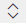

# Configure the ability to use suggested contacts

Configure the ability to use suggested contacts when starting a Teams chat.

## License and role requirements

| Requirement type | You must have |
|-----------------------|---------|
| **License** | <ul><li>Dynamics 365 Sales Premium, Dynamics 365 Sales Enterprise, Dynamics 365 Sales Professional, or any Dynamics 365 customer engagement app license</li> <li>Microsoft Teams license</li></ul>   More information: <ul><li>[Dynamics 365 Sales pricing](https://dynamics.microsoft.com/sales/pricing/)</li><li>[Microsoft Teams pricing](https://www.microsoft.com/microsoft-teams/compare-microsoft-teams-options?activetab=pivot:primaryr2&rtc=1)</li><li>[Dynamics 365 Licensing Guide](https://go.microsoft.com/fwlink/?LinkId=866544&clcid=0x409)</li></ul> |
| **Security roles** | System Administrator   More information: [Predefined security roles for Sales](../security-roles-for-sales.md)|

## Turn on the suggested contacts capability for a record type

As an administrator, you can enable the suggested contacts to be displayed when a seller starts a new connected chat. It helps the sellers to quickly find the right coworkers to collaborate with.

> [!NOTE]
> For the case record type, there are two types of contact suggestions: AI and rules-based. Other record types enabled for connected chats may only have rules-based suggestions.

1. In the Sales Hub app, select **Change area**  in the lower-left corner, and then select **App Settings**.

2. Under **General Settings**, select **Chat and collaborate**.

3. Under **Connect chats to Dynamics 365 records**, select the record type (for example, Lead).

4. In the settings panel, turn on the **Rules-based suggested contacts** toggle.

    :::image type="content" source="media/lead-configure-suggest-contact.png" alt-text="Settings page to turn on or off the suggested contacts feature.":::

5. In the **Update rules for suggesting contacts** section, reorder or disable the rules for suggesting contacts. Users will see the suggestions in the order you choose.

    - To reorder the rules, hover over a rule, and then select the up or down arrow to move the rules up or down respectively.
    - To disable a rule, hover over a rule, and then select :::image type="icon" source="media/suggested-contacts-rule-disable.png" border="false":::. When the rule is disabled, :::image type="icon" source="media/suggested-contacts-rule-disabled.png" border="false"::: is displayed when you hover over the disabled rule.

    :::image type="content" source="media/suggested-contacts-rules.png" alt-text="Reorder or disable the rules for suggested contacts.":::

6. Select **Save**.

### See also

[Enable or disable Microsoft Teams chat in Sales Hub](enable-teams-chat.md)   
[Use Microsoft Teams chat in Sales Hub](using-teams-chat-in-dynamics.md)
