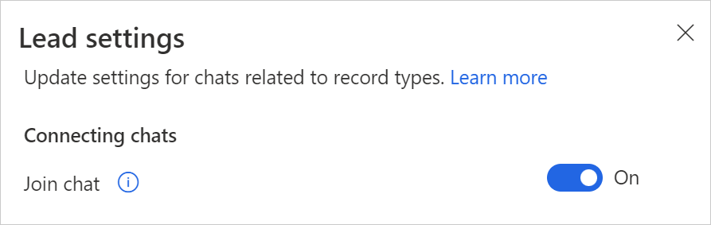

# Configure the ability for users to join chats (preview)

[!INCLUDE [cc-beta-prerelease-disclaimer](../../includes/cc-beta-prerelease-disclaimer.md)]

[!INCLUDE [preview-disclaimer](../../includes/preview-disclaimer.md)]

As an administrator, you can enable users to view and easily join chats that are linked to records they have write access to, even if they weren't originally part of those chats. You can configure the ability for users to join linked chats at a record-type level. This functionality can help you tailor the user experience for your business processes.

> [!NOTE]
> The join chat feature only works for linked chats, and it's on by default only for the case record type. For other record types, you must enable it.

The ability for users to join existing chats is especially useful for the following scenarios:

- **Opportunity or lead transfers**: If a new seller has onboarded to an opportunity or a lead that was previously handled by another seller, they can join existing linked chats to better understand the context and continue to collaborate with their relevant colleagues.
- **Sales manager scenario**: A subject-matter expert can read and participate in the relevant conversations.

**To turn on the join chat capability for a record type**:

1. In the Sales Hub app, select **Change area**  in the lower-left corner, and then select **App Settings**.

2. Under **General Settings**, select **Chat and collaborate**.

3. Under **Link chats to Dynamics 365 records**, select the record type (for example, Lead).

4. In the settings panel, turn on the **Join chat** toggle.

   > [!div class="mx-imgBorder"] 
   > 

4. Select **Save**.

### See also

[Enable or disable Microsoft Teams chat in Sales Hub](enable-teams-chat.md)   
[Join an existing linked chat](join-chat.md)
