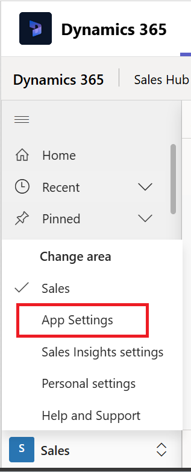
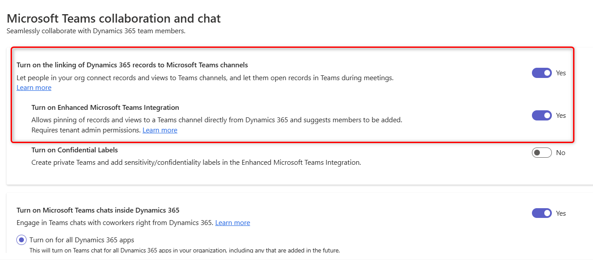
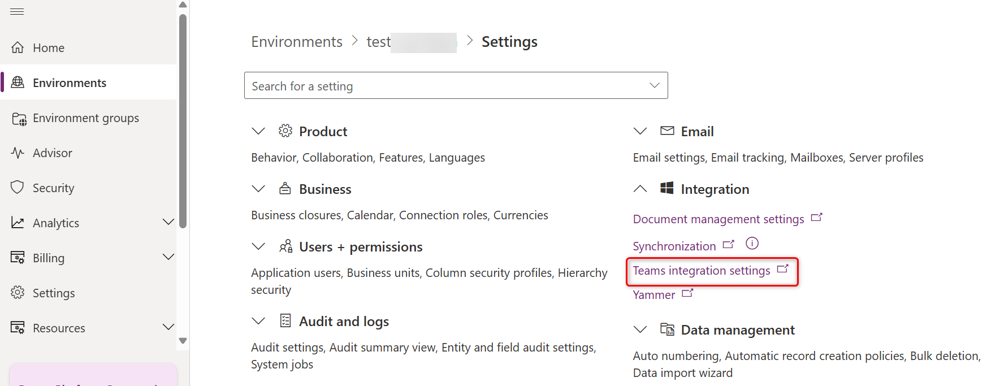

# Enable linking of Dynamics 365 records to Microsoft Teams channels 

By default, the linking of Dynamics 365 records to Teams channels is disabled for customer engagement apps in Dynamics 365:

- Dynamics 365 Sales
- Dynamics 365 Customer Service
- Dynamics 365 Field Service
- Dynamics 365 Marketing
- Dynamics 365 Project Service Automation

> [!NOTE]
> - When the feature is enabled, the collaboration feature is [enabled only for a selected set of system entities](./teams-collaboration.md#record-types-that-support-microsoft-teams-integration). If you want to enable Microsoft Teams integration for additional entities or custom entities, you can only do it programmatically using the **msdyn_SetTeamsDocumentStatus** Web API action. More information: [Enable or disable Microsoft Teams Integration using code](../../customerengagement/on-premises/developer/integration-dev/teams-integration-using-code.md).
   > - If you run into any issues during configuration, see [Troubleshoot configuration issues with Teams integration](../../teams-integration/teams-troubleshoot.md#troubleshoot-configuration-issues-with-microsoft-teams-integration).

## License and role requirements

| Requirement type | You must have |
|-----------------------|---------|
| **License** | <ul><li>Dynamics 365 Sales Premium, Dynamics 365 Sales Enterprise, Dynamics 365 Sales Professional, or any Dynamics 365 customer engagement app license</li> <li>Microsoft Teams license</li></ul>   More information: <ul><li>[Dynamics 365 Sales pricing](https://dynamics.microsoft.com/sales/pricing/)</li><li>[Microsoft Teams pricing](https://www.microsoft.com/microsoft-teams/compare-microsoft-teams-options?activetab=pivot:primaryr2&rtc=1)</li><li>[Dynamics 365 Licensing Guide](https://go.microsoft.com/fwlink/?LinkId=866544&clcid=0x409)</li></ul> |
| **Security roles** | System Administrator   More information: [Predefined security roles for Sales](../security-roles-for-sales.md)|

## Prerequisites

Microsoft Teams integration uses SharePoint integration at the backend. Make sure to meet the following prerequisites:

- If SharePoint integration isn't configured, OneDrive integration must be disabled too. If this requirement is not met, you'll receive error code **800503ca** when you try to enable Teams integration with customer engagement apps in Dynamics 365.

- If SharePoint integration isn't configured, there shouldn't be any active SharePoint site in your organization. (Deactivated SharePoint sites shouldn't cause a problem.) If this isn't met, you'll receive error code **800503ca** when you try to enable Teams integration with customer engagement apps in Dynamics 365. 

- If SharePoint integration isn't configured, there shouldn't be any SharePoint document locations created with an absolute URL in your organization. Make sure to delete the locations with absolute URL. If this isn't met, you will get error code **800503ca** when you try to enable Teams integration with customer engagement apps in Dynamics 365.

- If you're currently configured to use SharePoint on-premises for document management, you need to set up document management for a customer engagement app to use SharePoint Online. For more information, see [Set up apps in Dynamics 365 to use SharePoint Online](/power-platform/admin/set-up-dynamics-365-online-to-use-sharepoint-online).

- If SharePoint Online admin has enabled control access from unmanaged devices (conditional access policy) to allow/block SharePoint sites from unmanaged devices, then the same restrictions will be applied for Microsoft Teams integration because Microsoft Teams uses SharePoint sites for document management. These restrictions might block users when they try to access a connected team channel file library on a customer engagement app page. For more information, see [Control access from unmanaged devices](/sharepoint/control-access-from-unmanaged-devices). 

- Enable SharePoint document management for the Dynamics 365 entities that you want to pin in Teams. For more information, see [Enable SharePoint document management for specific entities](/power-platform/admin/enable-sharepoint-document-management-specific-entities).

If you get an error while configuring Microsoft Teams integration from Dynamics 365, it might be because one or more of the above prerequisites aren't met. For more information, see [Troubleshoot Microsoft Teams integration](../../teams-integration/teams-troubleshoot.md#troubleshoot-configuration-issues-with-microsoft-teams-integration).

## Enable record linking in Sales Hub

1. In the Sales Hub app, at the lower-left corner, select **Change area** > **App Settings**.

   > [!div class="mx-imgBorder"]
   >   

2. Under **General Settings**, select **Chat and collaborate**.

    The **Microsoft Team collaboration and chat** page opens.

3. To enable the [Basic Collaboration Experience](teams-collaboration.md), select **Turn on the linking of Dynamics 365 records to Microsoft Teams channels**. When Basic Microsoft Teams integration is enabled, the **Collaborate** button appears on customer engagement app records so you can see the connected team channel or set up a new connection in Microsoft Teams. In addition, in the **Documents** tab on the record page, the connected team channel file library will appear. 

4. To enable the [Enhanced Collaboration Experience](teams-collaboration-enhanced-experience.md), select **Turn on Enhanced Microsoft Teams Integration**. To turn on this option, you need Microsoft 365 tenant admin permissions. When Enhanced Microsoft Teams integration is enabled, the **Collaborate** button appears on the record and view page in customer engagement apps. You can set up a connection with any Microsoft Teams collaboration channel within an app.

    

5. On the consent dialog, select **Accept**.  
       
    > [!IMPORTANT]
    > When you give your consent on behalf of your organization, the app gets full access to all Teams groups and associated content that the users have access to. Though the app has full access, it does not read or write to any of that data. The app just reads the teams/channels list or creates teams/channels for collaborating on Dynamics 365 data.
    
    > [!NOTE]
    > If you don't select **Accept**, then when a user tries to pin an entity record or view to Microsoft Teams and shares the tab with another user, they'll receive the following error message: _"The admin has not consented to use user sync feature, you can add them manually."_ If you receive this error message, see [Error when you pin a record or view to Teams channel](../../teams-integration/teams-troubleshoot.md#error-when-you-pin-a-record-or-view-of-any-app-to-a-team-channel-if-your-user-role-permission-isnt-configured-correctly-by-your-customer-engagement-apps-system-admin).  
          
6. Save the changes.

    You should now be able to the see the **Collaborate** button when you open a record.

## Enable record linking in a custom app

1. Sign in to [Power Apps](https://make.powerapps.com).  

1. Select the **Settings** icon at the top-right corner, and then select **Advanced Settings**. 

1. Go to **Settings** > **Administration** > **System Settings** > **General** tab.

1. Under **Microsoft Teams Integration**, select **Chat + collaboration** settings.

    

    The **Microsoft Team collaboration and chat** page opens.

1. To enable the [Basic Collaboration Experience](teams-collaboration.md), select **Turn on the linking of Dynamics 365 records to Microsoft Teams channels**. When Basic Microsoft Teams integration is enabled, the **Collaborate** button appears on customer engagement app records so you can see the connected team channel or set up a new connection in Microsoft Teams. In addition, in the **Documents** tab on the record page, the connected team channel file library will appear.

      
1. To enable the [Enhanced Collaboration Experience](teams-collaboration-enhanced-experience.md), select **Turn on Enhanced Microsoft Teams Integration**. To turn on this option, you need Microsoft 365 tenant admin permissions. When Enhanced Microsoft Teams integration is enabled, the **Collaborate** button appears on the record and view page in customer engagement apps. You can set up a connection with any Microsoft Teams collaboration channel within an app.

    

1. On the consent dialog, select **Accept**.  

    > [!IMPORTANT]
    > When you give your consent on behalf of your organization, the app gets full access to all Teams groups and associated content that the users have access to. Though the app has full access, it does not read or write to any of that data. The app just reads the teams/channels list or creates teams/channels for collaborating on Dynamics 365 data.
    
    > [!NOTE]
    > If you don't select **Accept**, then when a user tries to pin an entity record or view to Microsoft Teams and shares the tab with another user, they'll receive the following error message: _"The admin has not consented to use user sync feature, you can add them manually."_ If you receive this error message, see [Error when you pin a record or view to teams channel](../../teams-integration/teams-troubleshoot.md#error-when-you-pin-a-record-or-view-of-any-app-to-a-team-channel-if-your-user-role-permission-isnt-configured-correctly-by-your-customer-engagement-apps-system-admin).  
          
6. Save the changes.

    You should now be able to the see the **Collaborate** button when you open a record.
   
### Frequently asked questions

**1. Does the tenant admin need to do anything to set up Microsoft Teams Integration?**

The tenant admin must provide consent for the enterprise application to be created in Azure AD and add delegate permissions for Teams. This happens automatically when the Enhanced Collaboration Experience is enabled in the system settings of your customer engagement app.

**2. The documentation refers to _Microsoft 365 tenant admin permissions_. What does this mean?**

Microsoft 365 tenant admin permissions means the directory admin or a tenant admin.
   
**3. Is the activation for Dynamics 365 for all environments or per environment?**

Consent is given to all instances within a tenant, but the admin needs to manually enable functionality for each instance.

**4. What active directory privileges are given to the customer engagement apps?**

  - **Delegated permissions:** Group.ReadWrite.All and User.Read.All
  - **Dynamics 365 Microsoft Teams Collaboration Integration (Enterprise application), permissions:** Group.ReadWrite.All and User.Read.All

**5. Is it enough to have only Microsoft Teams admin privileges to activate this Microsoft Teams Integration?**

Enabling Microsoft Teams integration has nothing to with Teams admin privileges. You need to have tenant admin permission to enable Microsoft Teams integration. 

**6. Which Service Principle (App ID) will receive this permission?**

The App used for this integration, which is the customer engagement app and Microsoft Teams integration.

**7. What happens when the consent is provided?**

Apart from consent, a flag is set internally in your customer engagement app that indicates the feature is enabled. The flag is also used to control user interface behavior such as showing a user the **Collaborate** command.

### See also  

[Difference between the Basic and Enhanced Collaboration Experience with Microsoft Teams](teams-basic-vs-enhanced-collaboration.md)   
[Basic Collaboration Experience](teams-collaboration.md)   
[Enhanced Collaboration Experience](teams-collaboration-enhanced-experience.md)   

[!INCLUDE[footer-include](../../includes/footer-banner.md)]
