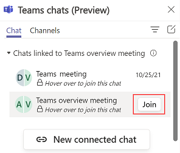

# Join an existing connected chat

View and easily join chats that are connected to a record you have write access to.

## License and role requirements

| Requirement type | You must have |
|-----------------------|---------|
| **License** | <ul><li>Dynamics 365 Sales Premium, Dynamics 365 Sales Enterprise, Dynamics 365 Sales Professional, Dynamics 365 Team Members, or any Dynamics 365 customer engagement app license</li> <li>Microsoft Teams license</li></ul>   More information: <ul><li>[Dynamics 365 Sales pricing](https://dynamics.microsoft.com/sales/pricing/)</li><li>[Microsoft Teams pricing](https://www.microsoft.com/microsoft-teams/compare-microsoft-teams-options?activetab=pivot:primaryr2&rtc=1)</li><li>[Dynamics 365 Team Members](/dynamics365/get-started/team-members-license)</li><li>[Dynamics 365 Licensing Guide](https://go.microsoft.com/fwlink/?LinkId=866544&clcid=0x409)</li></ul> |
| **Security roles** | <ul><li>Any primary sales role, such as salesperson, or sales manager</li><li>Any role that has access to a Dynamics 365 record</li></ul>    More information: [Primary sales roles](../security-roles-for-sales.md#primary-sales-roles)|

## Join a connected chat

As a seller, you can view and easily join chats that are connected to a record you have write access to, even if you weren't originally a participant in the chat. For example, if you've onboarded to a lead that was previously handled by another seller, you can join the chat to better understand the context, and then continue to collaborate with your relevant colleagues.

> [!NOTE]
> You can only join connected chats. To do so, you must have write access to the record and your admin must turn on the Join Chat capability for the record type in which you want to join any existing connected chat.

1. Open the record for which you want to join the chat.

2. In the **Teams chats** pane, go to any of the connected chats you want to join. A lock icon is displayed with text that says, "Hover over to join this chat". When you hover over the lock icon, if you have write access to the associated record, a **Join** button will be displayed.

    > [!NOTE]
    > Let's assume you have only Read access to the set of Accounts which your team is working on. Your administrator has enabled the Join chat functionality for the Accounts record type.
    >
    > If you don't see the text that allows you to hover and join a chat, there are three possible causes:  - Your administrator hasn't enabled the Join chat capability for the record type.  - You have read-only access to the record.  - Both previous scenarios apply.
    >     
    > In these cases, you will still see a list of conversations with the message "The chat is locked". In this case, you can ask a member of the chat to manually add you, or you can ask your administrator to turn on the Join chat capabilities for that record type. 

3. Select **Join**.

    

    The Teams pop-up chat will show that you've been added to the chat, and you'll have access to the entire chat history. Other chat members will also receive the system message that you've been added to the chat.

### See also

[Configure the ability for users to join chats](enable-join-chat.md)

