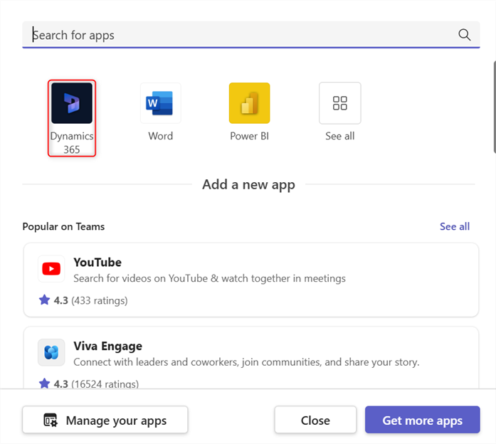
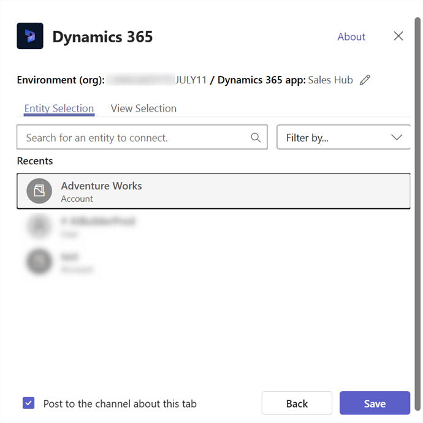
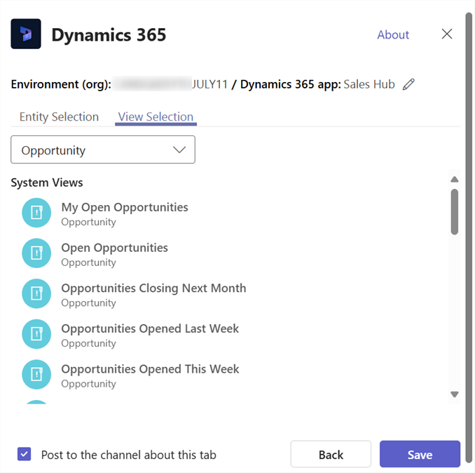
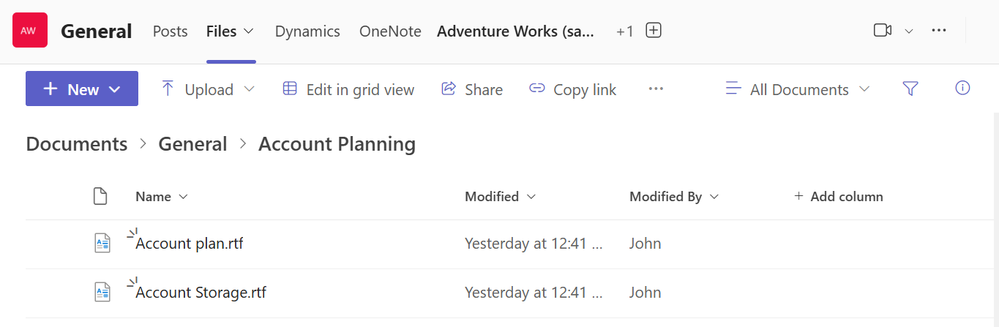

# Basic Collaboration Experience with the Dynamics 365 app for Microsoft Teams

Collaborate with team members using the Dynamics 365 app for Microsoft Teams.

## License and role requirements

| Requirement type | You must have |
|-----------------------|---------|
| **License** | <ul><li>Dynamics 365 Sales Premium, Dynamics 365 Sales Enterprise, Dynamics 365 Sales Professional, Dynamics 365 Team Members, or any Dynamics 365 customer engagement app license</li> <li>Microsoft Teams license</li></ul>   More information: <ul><li>[Dynamics 365 Sales pricing](https://dynamics.microsoft.com/sales/pricing/)</li><li>[Microsoft Teams pricing](https://www.microsoft.com/microsoft-teams/compare-microsoft-teams-options?activetab=pivot:primaryr2&rtc=1)</li><li>[Dynamics 365 Team Members](/dynamics365/get-started/team-members-license)</li><li>[Dynamics 365 Licensing Guide](https://go.microsoft.com/fwlink/?LinkId=866544&clcid=0x409)</li></ul> |
| **Security roles** | <ul><li>Any primary sales role, such as salesperson, or sales manager</li><li>Any role that has access to a Dynamics 365 record</li></ul>    More information: [Primary sales roles](../security-roles-for-sales.md#primary-sales-roles)|

## Collaboration experience in Microsoft Teams

Once installed, the Dynamics 365 app for Microsoft Teams enables collaborating with other team members by adding a customer engagement app in Dynamics 365 (Dynamics 365 Sales, Dynamics 365 Customer Service, Dynamics 365 Field Service, Dynamics 365 Marketing, or Dynamics 365 Project Service Automation) tab to a channel in Microsoft Teams.

### Connect an app record or view to a team channel

From a team channel, you can connect a customer engagement app (such as Dynamics 365 Sales or Dynamics 365 Customer Service) record or view to collaborate on any entity, such as customer accounts, opportunities, and more.

1. Open a team channel, and select the **Add** button ().

   > [!div class="mx-imgBorder"]
   > 

2. Select the **Dynamics 365** icon to pin an app record to a channel.

   > [!div class="mx-imgBorder"]
   > 

3. Select **Entity Selection**, or **View Selection**.

  - **Entity Selection**
     1. Search for an entity to connect. You can pick a recently viewed record or use search to find records. You can use **Filter by** to narrow the search to an entity type.

        > [!div class="mx-imgBorder"] 
        > 

     2. If you are the owner of the team, you will see an option to add other members to the team who either owns the record, or it has been shared with them. When you are done, select **Save**. 
        > [!NOTE] 
        > The Enhanced Collaboration Experience needs to be enabled to add members to the team. For more information, see [Enable linking of Dynamics 365 records to Teams channels](enable-record-linking.md).
     
     Once you complete the above steps, you'll see a notification of a successful connection and the app record will load in the new added tab. You can interact with the record as if you were using the app. Those with **Write** permissions can edit the record. Changes will be synchronized with the customer engagement app in Dynamics 365.

      > [!div class="mx-imgBorder"] 
      > 
   

     
**Two connection states**

**Successful** or **Failed** are only two connection states possible when connecting customer engagement apps in Dynamics 365 and Microsoft Teams.

The successful connection state indicates that the connection was successfully saved in Dynamics 365 apps so that the link to the connected Microsoft Teams channel appears on the Dynamics 365 apps page and the files used on this channel also appear on the **Documents** tab in Dynamics 365 apps.

A failed connection state indicates that the connection was not successfully sent to the customer engagement app. Microsoft Teams users can still use the pinned tab in the channel, but the relationship between the pinned record or view with the team channel is not stored in your customer engagement app. For more information, see [Troubleshooting](../../teams-integration/teams-troubleshoot.md). 

 - **View Selection**
     1. Select an entity to see the list of active views that are available for the entity in the app and then select **Save**.
  
        > [!div class="mx-imgBorder"] 
        > 
   
        > [!div class="mx-imgBorder"] 
        > 
   
      Once you complete the above steps, you'll see the app entity view in the new added tab.

      > [!div class="mx-imgBorder"] 
      > 
     
     
    > [!NOTE]
    > - If you select a personal view (**My Views**) instead of **System Views**, it’s recommended that you share the view with other users in Microsoft Teams before you add the view to the Microsoft Teams channel. Otherwise, other team members will not hae access to the view content.
   
    > [!div class="mx-imgBorder"] 
    > 

4. If you have multiple environments or app modules, you can change the environment and app module by selecting **Edit** () to specify which environment or app module to use in Microsoft Teams.
 
   > [!div class="mx-imgBorder"] 
   > 

Select **Remember this preference** to set the environment and app selections to be the default personal dashboard that appears when you select **My Dashboard**.

To access these setting again, select the **Settings** tab.

Once the app tab is set up in Microsoft Teams collaboration channel, you can start working with your team members on the pinned app customer information and share files directly from Microsoft Teams.

### Have a conversation
You can chat with your team members side-by-side with the app tab. From the app tab pinned in a Microsoft Teams channel, select the **Show tab conversation** button to open the conversation tab.

> [!div class="mx-imgBorder"] 
> 

### Open an app record or view 

It's easy to navigate to the pinned app record or view page from Microsoft Teams. From the app record tab pinned in a Microsoft Teams channel, select the **Go to website** button to open the record or view page in Dynamics 365 apps.

> [!div class="mx-imgBorder"] 
> 

### View and associate files

Select the **Files** tab in the connected team channel to associate files with an app record. Files added here will appear in apps in Dynamics 365 under **Documents** for the linked record. Likewise, when you add a document to an app record, that document will appear in Microsoft Teams under the **Files** tab.

   > [!div class="mx-imgBorder"] 
   > 
   
   
#### If you see this message: Shared files exist in multiple locations. Select "Document Location" to see files in other locations.

> [!div class="mx-imgBorder"] 
> 

When there is more than one Microsoft Teams channel connected to an app record, each of the channels appears as a separate document location in the customer engagement app. You can switch to a different location by selecting **Document Location** to specify the location of the file.

> [!div class="mx-imgBorder"] 
> 

To view a consolidated file list across all document locations including all connected team channel file libraries, from **Document Location** select **All Locations**.

> [!div class="mx-imgBorder"] 
> 

> [!div class="mx-imgBorder"] 
> 

## Collaboration experience in an app

In a customer engagement app in Dynamics 365 (such as Dynamics 365 Sales and Dynamics 365 Customer Service), you can see the connected Microsoft Teams channel and files from the Microsoft Teams channel.

For more information on which entities support the collaborate option, see [Record types that support Microsoft Teams integration](teams-collaboration.md#record-types-that-support-microsoft-teams-integration).

On an app record page, select **Collaborate** to display a list of all the connected team channels. Then, select a team channel to go to the relevant channel conversation in Microsoft Teams.

> [!div class="mx-imgBorder"] 
> 

In addition, document management in customer engagement apps in Dynamics 365 is integrated with Microsoft Teams. You can see the connected channel file library in the app and directly upload files; uploaded files will appear in the connected team channel file library under the **Files** tab in Microsoft Teams. Files uploaded in the Microsoft Teams connected channel will appear in the **Documents** tab in your app.

> [!div class="mx-imgBorder"] 
> 

## Record types that support Microsoft Teams integration

Currently, only the following record types support Microsoft Teams collaboration capabilities. The **Collaborate** button and file share feature will only work with the record types listed below.

> [!NOTE]
   > The list below shows the logical name of an entity (not the display name).
 
- Account
-	Agreement
-	Annotation
-  Appointment
-	Businessunit
-	Campaign
-	Case
-	Category
-	Competitor
-	Contact
-	Email
-	Expense
-	Fulfillment Preference
- Inventory Adjustment
-	Inventory Transfer
-	Invoice
-	Kbarticle
-	Knowledge Article
-	Lead
-	Opportunity
-	Opportunityproduct
-	Order
-	Product
-	Project
-	Purchase Order
-	Purchase Order Receipt
-	Quote
-	Resource Request
-	RMA
-	RMA Receipt
-	RTV
-	Sales Literature
-	Task
-	Team
-	Work Order

If not enabled, users can still connect customer engagement app records to Microsoft Teams, but the connected Microsoft Teams channel and the file library do not appear in customer engagement app.

When the feature is enabled, the collaboration feature is enabled only for a selected set of system entities. If you want to enable Microsoft Teams integration for additional entities or custom entities, you can only do it programmatically using the **msdyn_SetTeamsDocumentStatus** Web API action. More information: [Enable or disable Microsoft Teams Integration using code](../../customerengagement/on-premises/developer/integration-dev/teams-integration-using-code.md)

[!INCLUDE[footer-include](../../includes/footer-banner.md)]
