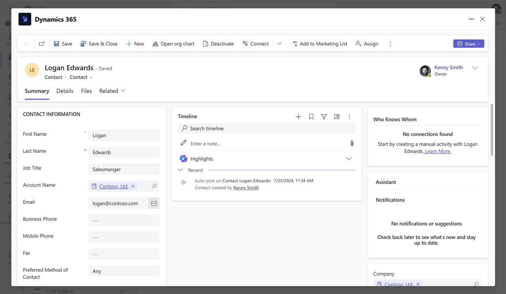
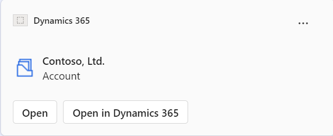
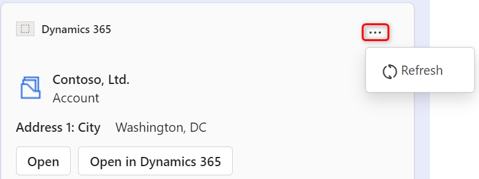

# View and update record details (production-ready preview)

[!INCLUDE [cc-beta-prerelease-disclaimer](../../includes/cc-beta-prerelease-disclaimer.md)]

After you receive a card in a Teams chat, you can view its details and update them as required.

## License and role requirements

| Requirement type | You must have |
|-----------------------|---------|
| **License** | <ul><li>Dynamics 365 Sales Premium, Dynamics 365 Sales Enterprise, Dynamics 365 Sales Professional, Dynamics 365 Team Members, or any Dynamics 365 customer engagement app license</li> <li>Microsoft Teams license</li></ul>   More information: <ul><li>[Dynamics 365 Sales pricing](https://dynamics.microsoft.com/sales/pricing/)</li><li>[Microsoft Teams pricing](https://www.microsoft.com/microsoft-teams/compare-microsoft-teams-options?activetab=pivot:primaryr2&rtc=1)</li><li>[Dynamics 365 Team Members](/dynamics365/get-started/team-members-license)</li><li>[Dynamics 365 Licensing Guide](https://go.microsoft.com/fwlink/?LinkId=866544&clcid=0x409)</li></ul> |
| **Security roles** | <ul><li>Any primary sales role, such as salesperson, or sales manager</li><li>Any role that has access to a Dynamics 365 record</li></ul>    More information: [Primary sales roles](../security-roles-for-sales.md#primary-sales-roles)|

## How to view and update record details 

1.  In a record card whose details you want to update, select one of the following:

    - **View details**: The record is opened in a new window inside Teams.
    
        

    -  **Open in Dynamics 365**: The record is opened in the customer engagement app.

        > [!NOTE]
        > The recipients can view and update the record if they have the necessary permissions in Dynamics 365. Otherwise, they'll see a permission error.

        

2.  Update the details as required and save the changes.

3.  To see the updated changes in the card, hover over the card, select **More options** (**…**), and then select **Refresh**.

    

### See also

[Share and update Dynamics 365 records within Microsoft Teams conversations](share-d365-record-overview.md)   
[Access the Dynamics 365 app through messaging extensions](access-d365-app.md)   
[Edit settings of the Dynamics 365 app](edit-d365-app.md)    
[Share feedback](share-feedback-d365-app.md)    
[Share Dynamics 365 records within Microsoft Teams conversations](share-dynamics-records-in-teams.md)   
[Add chat messages to Dynamics 365 as notes or tasks](add-chat-d365.md)   
