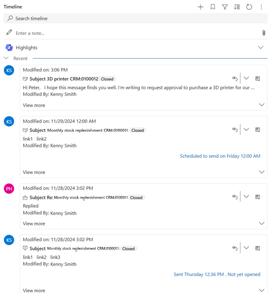
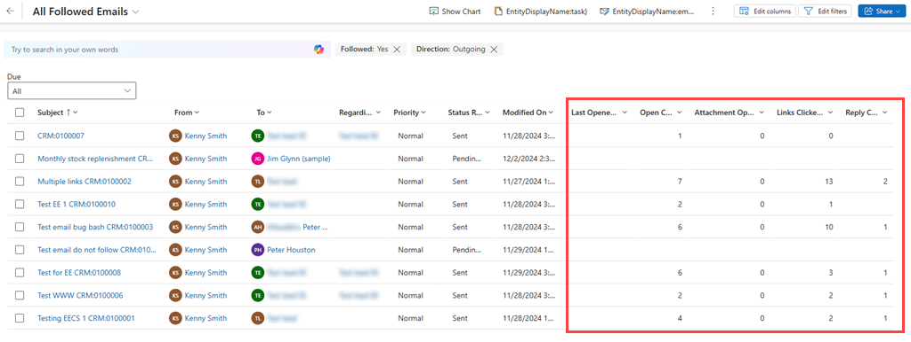
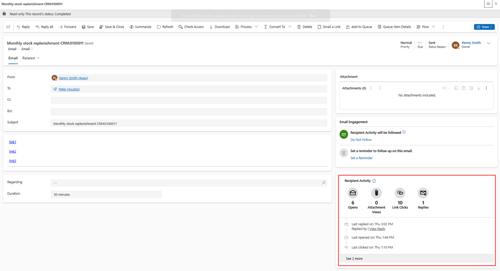
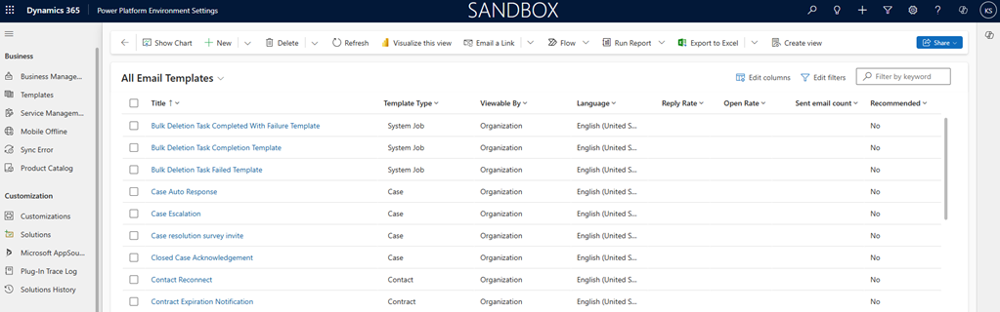

# Understand email interaction history
<!-- EDITOR'S NOTE: I combined this file with email-engagement.md. When I read that article, I expected to find instructions for viewing email interaction history, which is the title of the article, but the content I expected there is in this article. Please delete and redirect this one. Thanks! -->

Use email engagement to view the message interaction history such as, alerts, clicked a link, opened an attachment, or sent a reply on your emails.

## Get interaction history for email 

Usually when you send an email, you'll never know if it was opened or read unless the recipient chooses to write back to you. That's because the email system was created to simulate traditional mail, and wasn't designed with response tracking in mind. Dynamics 365 Sales uses special techniques to work around this limitation and provide the following message-following features:  
  
- **Find out when your message was opened**: When you send a followed email message from Dynamics 365 Sales, the system automatically generates a uniquely named, transparent, one-pixel GIF and adds it as a linked image to the message. This invisible GIF, and all the other images that you add to the message, are stored in Dynamics 365 and are first loaded from the server when somebody opens the message (and chooses to download its images). When a unique GIF is requested, Dynamics 365 Sales registers that the associated message was opened, and notes the device type. We recommend that you always include other images in your message because that will help motivate recipients to download the images (you won't know they open it if images aren't loaded).  
  
- **Find out when each link was clicked**: When you send a followed email message from Dynamics 365 Sales, the system automatically replaces each of its hyperlinks with a unique redirect link that points to Dynamics 365. Each redirect link includes an ID that uniquely identifies both the message that contains it and the URL of the original link target. When Dynamics 365 receives the link request, it logs the click and then redirects the click to its original address so that the recipient still gets the correct information with little or no delay.  
  
- **Find out when each attachment was opened**: When you add a followed attachment, the file isn't attached directly as with a standard email. Instead, it gets stored on the [!INCLUDE[pn_onedrive_for_business](../includes/pn-onedrive-for-business.md)] share used by Dynamics 365 and added as a link to the message. As with followed links, when a recipient clicks to download the attachment, Dynamics 365 notes the click and the time. You can mix both followed and unfollowed attachments in a single email, which can be important if you're sending sensitive files that you don't want to save on [!INCLUDE[pn_onedrive_for_business](../includes/pn-onedrive-for-business.md)]. Many of your recipients may actually prefer to receive attachments as links rather than files because that means that  your messages take up much less room in their inbox.  
  
Using this information, Dynamics 365 Sales shows you the full interaction history for any message, and calculates key performance indicators (KPIs). 

> [!NOTE]
> The actions that are performed on email are stored in Microsoft Azure Storage. This storage is unique for each organization. If an organization is restored to another organization, the history of the actions that are performed on email of previous organization will not be displayed in the restored organization.

> [!IMPORTANT]
> You should treat all email interaction data as approximations. The system can only register an email-open event if the recipient also downloads the message's images (including the invisible GIF), so the actual number of opens could be larger than the number recorded in Dynamics 365 Sales. Similarly, if images are cached (which is typical for web-based email clients), then additional opens may not get reported to Dynamics 365 Sales.  
> 
> It  can therefore be a good idea to include visible images in your followed email messages (such as a company logo or illustration) to encourage recipients to download the images. 

## View email engagement history  

The current status, interaction statistics, and KPIs for followed email messages are available throughout Dynamics 365 Sales, where they're gathered and displayed for each record where they're relevant. The following sections highlight the various places where you can see this information in Dynamics 365 Sales.  
  
   
### Email history in the Activities column  

After you've saved or sent a message, you can find it listed  in the **Activities** list for its **Regarding** record or, in some cases, another related record. Usually you find the message listed in the same record that you were viewing when you wrote it.  
  
  
  
Followed messages show their current interaction status (such as "scheduled to send", "not yet opened", or "Last opened yesterday") right on their tile in the **Activities** list. Use the buttons in the upper-right corner of an email tile to expand its content and interaction history right in the list, or to open the full message page.  
  
### Email KPIs in the emails list  

You can view a list of all  emails that you (and possibly others) have sent from Dynamics 365 Sales by doing the following:  
  
1.  Go to **Sales** > **Activities**.  
  
2.  You now see the list of activities that you chose the last time you were here. To view a list of followed emails, open the drop-down list at the top of the page, and then choose **Email** > **All Followed Emails** (or some other email view that you find useful).  
  
3.  You now see a list of emails of the type you selected. If the list includes followed emails, then you can read and sort by columns for open, attachment views, link clicks, and reply counts. You can also open the full details for any message by selecting its **Subject** in the list.  
  
      
  
   
### Message details  

Open the details page for a delivered message by selecting its subject in an **Activities** or **Emails** list. This brings you to a read-only view of your complete message, with the **Email Engagement** section on the right side of the page that shows the message interaction history and key performance indicators (KPIs).  
  
  
  
The KPIs, shown at the top of the time line, show the total opens, attachment views, clicks, and replies that have been recorded for the message. The time line shows a symbol for each interaction event (newest on top) and includes a few details about each of them.  
  
   
### Template results and recommendations in the template list  

You can see email template results and recommendations for all of the templates defined in your system by doing the following:  
  
1.  Go to **Settings** > **Business** > **Templates**, and then choose **Email Templates**.  
  
2.  You now see the list of templates, which includes columns that show the **Reply Rate**, **Open Rate**, and**Sent Email Count** results for each template (where available), plus their **Recommended** status.  
  
      

### See also

[Enable email engagement](configure-email-engagement.md)   
[View message interactions with email engagement](email-engagement.md)  
[Create and send email message](create-send-email-message.md)  
[Configure privacy and preferences](configure-individuals-privacy-preferences.md)
