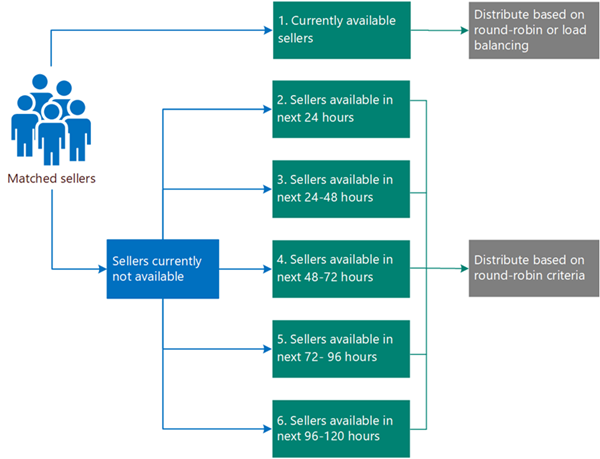

# Understand lead distributions in assignment rules

In Dynamics 365 Sales, assignment rules define how leads are automatically distributed to sellers. When a lead is created and meets certain conditions that are defined in assignment rules, the lead is automatically assigned to the right seller. The automated process saves time and optimizes the workload across your sales team.

The following factors help to determine how leads are assigned:

- How many active leads are already assigned to sellers
- When a seller was last assigned a lead

## License and role requirements
| Requirement type | You must have |
|-----------------------|---------|
| **License** | Dynamics 365 Sales Premium or Dynamics 365 Sales Enterprise   More information: [Dynamics 365 Sales pricing](https://dynamics.microsoft.com/sales/pricing/) |
| **Security roles** | System Administrator or Sequence Manager    More information: [Predefined security roles for Sales](security-roles-for-sales.md)|

## Basic lead distribution

There are two types of basic algorithms for lead distribution: 

- [Round robin](#round-robin)
- [Load balancing](#load-balancing) 

### Round robin

In a round-robin-based assignment, the system looks at all the matched sellers of the lead and assigns it to the one who was assigned a lead least recently. This includes lead assignments from other sources, such as manual assignment or via an add-in.

Let's take an example to understand round-robin distribution criteria.

A lead comes into the system, and an application identifies the following potential sellers who can work on the lead, based on the selection criteria defined in the assignment rules.

| Seller | Last assigned a lead |
|--------|----------------------|
| Seller 1 | 12 July 2021 11:00 |
| Seller 2 | 12 July 2021 10:00 |
| Seller 3 | 12 July 2021 12:00 |

The algorithm looks at the sellers' last assigned lead times and identifies that Seller 2 was assigned a lead least recently; thus, the lead is assigned to Seller 2. In this example, the routing takes place on 12 July 2021 at 13:30, so the algorithm updates Seller 2's last-assigned lead time to this value.

Now, taking this process through one more cycle, another lead comes into the system. But only Seller 2 and Seller 3 have the required attributes to work on the lead. So, the algorithm again looks at the following table and observes how the last assigned lead time has been updated for Seller 2.

| Seller | Last assigned a lead |
|--------|----------------------|
| Seller 2 | 12 July 2021 13:30 |
| Seller 3 | 12 July 2021 12:00 |

The algorithm finds that Seller 3 was assigned a lead least recently; thus, it assigns the lead to Seller 3 and updates Seller 3's last assigned lead time to the time of routing.

### Load balancing

In a load-balancing-based assignment, the system looks at all the matched sellers of the lead and assigns it to the seller who has maximum available capacity. This method helps to ensure that all salespeople are equally busy and minimizes uneven workloads.

Let's take an example to understand load-balancing distribution criteria.

A lead comes into the system, and an application identifies the following potential sellers who can work on the lead, based on the selection criteria defined in the assignment rules.

| Seller | Available capacity |
|--------|--------------------|
| Seller 1 | 10 |
| Seller 2 | 12 |
| Seller 3 | 15 |

Because Seller 3 has the maximum available capacity of all eligible sellers, the lead is assigned to Seller 3, whose available capacity is updated.

| Seller | Available capacity |
|--------|--------------------|
| Seller 1 | 10 |
| Seller 2 | 12 |
| Seller 3 | 14 |

Now, to understand this better, consider the following series of events and assume that Sellers 1, 2, and 3 are all possible owners for the incoming leads.

- **Event 1**: Two new leads that match the rule come into the system.

    Both leads are assigned to Seller 3, and the table looks like the following. 
    
    | Seller | Available capacity |
    |--------|--------------------|
    | Seller 1 | 10 |
    | Seller 2 | 12 |
    | Seller 3 | 12 |

- **Event 2**: One more lead comes into the system.

    The lead is assigned to either Seller 2 or Seller 3, because they both have equal available capacity. Say that the lead is assigned to Seller 2. The table is updated to look like the following. 
    
    | Seller | Available capacity |
    |--------|--------------------|
    | Seller 1 | 10 |
    | Seller 2 | 11 |
    | Seller 3 | 12 |

- **Event 3**: Seller 1 closes three active leads, and a new matching lead comes in for routing. 

    For the incoming lead, the available capacity looks like the following; thus, the lead is assigned to Seller 1.
    
    | Seller | Available capacity |
    |--------|--------------------|
    | Seller 1 | 13 |
    | Seller 2 | 11 |
    | Seller 3 | 12 |

## Additional lead distribution criteria

In addition to being assigned leads through round-robin and load-balancing distribution criteria, sellers are sorted according to their respective priorities. This helps us to select the top candidate for the lead.

Let's consider the following table as an example.

| Seller | Last assigned a lead | Available capacity |
|--------|----------------------|--------------------|
| Seller 1 | 12 July 2021 11:00 | 10 |
| Seller 2 | 12 July 2021 10:00 | 12 |
| Seller 3 | 12 July 2021 12:00 | 15 |

In a round-robin distribution, the priority of sellers is as follows.

| Seller | Last assigned a lead |
|--------|----------------------|
| Seller 2 | 12 July 2021 10:00 |
| Seller 1 | 12 July 2021 11:00 |
| Seller 3 | 12 July 2021 12:00 |

In a load-balancing distribution, the priority of sellers is as follows.

| Seller | Available capacity |
|--------|--------------------|
| Seller 3 | 15 |
| Seller 2 | 12 |
| Seller 1 | 10 |

To fine-tune the lead assignment, we need to introduce additional processing to better prioritize sellers according to our requirements. The following additional options are available:

- [Consider seller capacity](#consider-seller-capacity)
- [Consider seller work schedule](#consider-seller-work-schedule)

### Consider seller capacity

When this option is selected, leads are routed only to those sellers who have available capacity to work on the leads&mdash;that is, positive available capacity. If none of the eligible sellers have available capacity, the lead will be marked as unassigned. For more information on managing seller's capacity, go to [Set capacity for sellers](manage-sales-teams.md#set-capacity-for-sellers).

Let's take an example for round robin. A lead comes in, and the following matched sellers have the last-assigned lead times and available capacity shown in the table.

| Seller | Last assigned a lead | Available capacity |
|--------|----------------------|--------------------|
| Seller 1 | 12 July 2021 11:00 | –2 |
| Seller 2 | 12 July 2021 10:00 | 0 |
| Seller 3 | 12 July 2021 12:00 | 4 |
| Seller 4 | 12 July 2021 13:00 | 1 |

For round-robin distribution, the priority is defined as follows for the sellers.

| Seller | Last assigned a lead | Available capacity |
|--------|----------------------|--------------------|
| Seller 2 | 12 July 2021 10:00 | 0 |
| Seller 1 | 12 July 2021 11:00 | –2 |
| Seller 3 | 12 July 2021 12:00 | 4 |
| Seller 4 | 12 July 2021 13:00 | 1 | 

Because Seller 1 and Seller 2 have negative available capacity, they won't be considered as eligible owners, and the table will be reduced to the following.

| Seller | Last assigned a lead | Available capacity |
|--------|----------------------|--------------------|
| Seller 3 | 12 July 2021 12:00 | 4 |
| Seller 4 | 12 July 2021 13:00 | 1 | 

The lead will be assigned to Seller 3.

When you select the **Consider seller capacity** option, it removes the sellers with negative or zero available capacity from the list of owners at the time of routing.

### Consider seller work schedule  

When this option is selected, the system considers the work schedule of sellers that has been defined in the sales accelerator and filters sellers based on their availability to work on the leads.

The algorithm analyzes sellers' availability in the order of the lead assignment priority (load balancing or round robin) and assigns the lead to a seller who is currently available.  

In this example, you configured a time limit of 120 hours to assign a lead record that is created in the application. 

If the matched sellers are currently unavailable, the leads are assigned to sellers who are available within the next 24 hours of the time of routing. If no sellers are available within the next 24 hours, the leads are assigned to sellers who are available within the next 48 hours, and so on up to 120 hours. If no seller is available within 120 hours, the leads are marked as unassigned.

The sellers are divided into six buckets, based on their availability. The buckets are viewed in top to bottom order. At the first non-empty bucket, the lead is distributed among the sellers in the bucket based on round-robin criteria. (For load balancing, only the first bucket is evaluated.)

>[!div class="mx-imgBorder"]
>

To know more about how sellers update their personal work schedule in the sales accelerator, which is also used by assignment rules, go to [Configure your work availability](personalize-sales-accelerator.md#configure-your-work-availability).

Let's take some examples to walk through this.

We'll use the following notation for availability at the time of routing:

-	0D - Currently available
-	1D - Earliest available within 24 hours
-	2D - Earliest available from 24 to 48 hours
-	3D - Earliest available from 48 to 72 hours
-	4D - Earliest available from 72 to 96 hours
-	5D - Earliest available from 96 to 120 hours

**Example 1**: We've matched Sellers 1 through 5 to the lead, and the primary distribution criteria is round robin.

| Sellers | Availability | Last assigned a lead |
|---------|--------------|----------------------|
| Seller 1 | 1D	| 12 July 2021 11:00 |
| Seller 2 | 1D | 12 July 2021 10:00 |
| Seller 3 | 0D | 12 July 2021 12:00 |
| Seller 4 | 2D | 12 July 2021 13:00 |
| Seller 5 | 0D | 12 July 2021 10:30 |

Because we have two sellers who are available currently, the lead will be distributed between them based on round-robin criteria.

| Sellers | Availability | Last assigned a lead |
|---------|--------------|----------------------|
| Seller 3 | 0D | 12 July 2021 12:00 |
| Seller 5 | 0D | 12 July 2021 10:30 |

When a lead comes in, it will be assigned to Seller 5. Further incoming leads for this rule will be assigned to Seller 3 and Seller 5 in a round-robin distribution, until the availability of the matched sellers changes.

**Example 2**: We have matched Sellers 1 through 5, and the primary distribution criteria is load balancing.

| Sellers | Availability | Available capacity |
|---------|--------------|----------------------|
| Seller 1 | 1D	| 14 |
| Seller 2 | 1D | 20 |
| Seller 3 | 0D | 5 |
| Seller 4 | 2D | 10 |
| Seller 5 | 0D | 2 |

Because Seller 3 and Seller 5 are currently available, and the primary distribution criteria is load balancing, the lead is assigned to Seller 3.

**Example 3**: We've matched sellers 1 through 5, the primary distribution criteria is load balancing, and **Consider seller capacity** has been selected.

| Sellers | Availability | Available capacity |
|---------|--------------|--------------------|
| Seller 1 | 1D	| 14 |
| Seller 2 | 1D | 20 |
| Seller 3 | 0D | –1 |
| Seller 4 | 2D | 10 |
| Seller 5 | 0D | 0 |

Because **Consider seller capacity** has been selected, Seller 3 and Seller 5 aren't eligible for routing.

| Sellers | Availability | Available capacity |
|---------|--------------|--------------------|
| Seller 1 | 1D	| 14 |
| Seller 2 | 1D | 20 |
| Seller 4 | 2D | 10 |

The earliest availability bucket is 1D; therefore, Seller 1 and Seller 2 are considered.

| Sellers | Availability | Available capacity |
|---------|--------------|--------------------|
| Seller 1 | 1D	| 14 |
| Seller 2 | 1D | 20 |

Because the sellers aren't currently available, round-robin distribution will be used for these sellers.

>[!NOTE]
>Remember that the primary selection criteria in this example is load balancing.

So, let's assume the following last-assigned times.

| Sellers | Availability | Available capacity |  Last assigned a lead |
|---------|--------------|--------------------|-----------------------|
| Seller 1 | 1D	| 14 | 12 July 2021 10:00 |
| Seller 2 | 1D | 20 | 12 July 2021 11:00 |

The lead will be assigned to Seller 1. Further leads for this rule and this seller match will be assigned to Seller 2 and Seller 1 using round-robin criteria.

### See also

[Create and activate an assignment rule](create-and-activate-assignment-rule.md)

