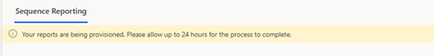
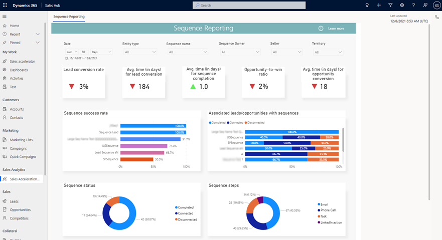
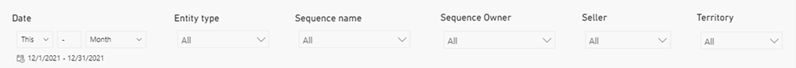
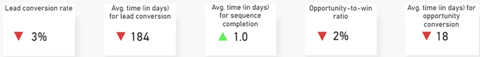
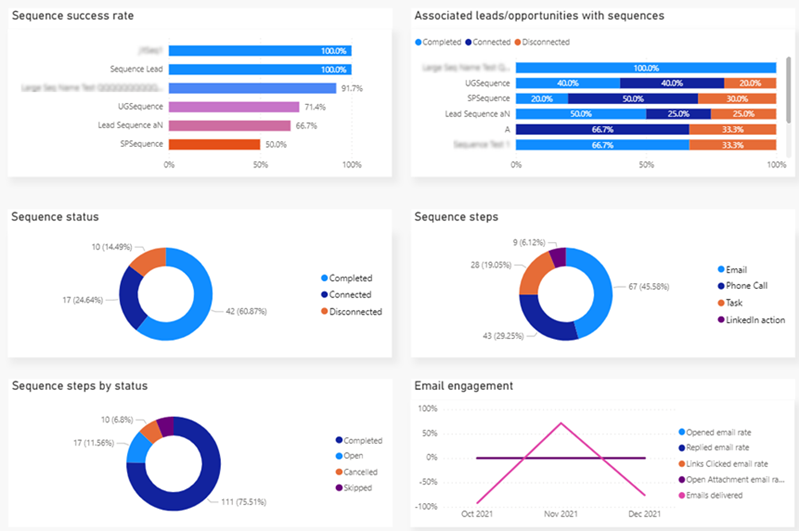

# View and understand sales acceleration reporting

View and understand the report for sales acceleration to get a broad overview of the sequences related to leads and opportunities in your organization.

## License and role requirements
| Requirement type | You must have |  
|-----------------------|---------|
| **License** | Dynamics 365 Sales Premium  More information: [Dynamics 365 Sales pricing](https://dynamics.microsoft.com/sales/pricing/) |
| **Security roles** | Sales Manager or Sequence Manager    More information: [Predefined security roles for Sales](security-roles-for-sales.md)|

## What is sales acceleration reporting?

Sales acceleration reporting gives you a broad overview of the sequences related to leads and opportunities in your organization. The reports use AI to provide insights into which sequences are doing better and emerging with the most successful conversion rates. Also, you can analyze metrics and key performance indicators (KPIs) to identify areas for improvement that might have the greatest effect on sales growth.

>[!NOTE]
>- Sales acceleration reporting is not available on Government Community Cloud (GCC).
>- The sales acceleration reporting is not supported on mobile devices.  
>- After your administrator enables reporting, the application might take up to 24 hours to display the data in the reports. When the reports are being provisioned for the first time, the following message is displayed:   
>   
>Subsequently, the reports are refreshed every 24 hours. You can view the last updated date on the upper-right corner of the page.

## Who can view the reporting page?

By default, the users with sales manager and sequence manager roles can view the reporting page. For other roles to view the reporting page, contact your administrator to get read access at the organizational level for the sales acceleration reports table. More information: [Security roles and privileges](/power-platform/admin/security-roles-privileges)

## View sales acceleration reporting

1.	Go to the lower-left corner of the page, and select **Change area** > **Sales**.
2.	On the site map, under **Sales Analytics**, select **Sales Acceleration Reporting**. 
    The reporting page opens.
 
    >[!div class="mx-imgBorder"]
    >

## Understand sales acceleration reporting

By default, the report displays KPIs for all sequences that are related to leads and opportunities over the past month. The reporting view can be categorized into the following sections:

-	[Data filters](#data-filters)
-	[KPI summary charts](#kpi-summary-charts)
-	[Metric charts](#metric-charts)

### Data filters

Use the data filtering options to select data for specific time periods, entity type, sequence name, sequence owner, seller, and territory. To filter data by duration, channel, queue, or agent, select a value from the respective dropdown list. 

>[!div class="mx-imgBorder"]
>

### KPI summary charts

The KPI summary charts summarize the key performance indicators for the specified time period and the percent change during the period. You can further filter these areas by entity type, sequence name, sequence owner, seller, and territory. Also, a trend is displayed corresponding to the value specifying how the KPI is doing in the selected timeframe when compared with the previous timeframe. A green upward triangle indicates an improvement in the score, and a red downward triangle indicates a decline in the score.

>[!div class="mx-imgBorder"]
>
 
The following table shows the KPIs that are displayed in the report.

| KPI | Description |
|-----|-------------|
| Lead conversion rate | The percentage of leads in a sequence that are successfully converted into opportunities. |
| Avg.time (in days) for lead conversion | The average number of days a lead takes to be converted to an opportunity when it's connected to a sequence. |
| Avg.time (in days) for sequence completion | The average number of days it takes for a sequence to be completed in an attached record. |
| Opportunity-to-win ratio | The percentage of opportunities in a sequence that are successfully converted into win deals. |
| Avg.time (in days) for opportunity conversion | The average number of days that it takes for an opportunity in a sequence to be converted into a win deal. |

### Metric charts

The metric chart provides a detailed view into the individual values of a sequence, such as status, number of steps, and the status of the steps.

To view specific data that's related to a value in the charts, select the value. Other metric charts in the report will be refreshed to show data that's related to the value you select. Drilling down into these values helps you to identify the areas of improvements for the sequence.

>[!div class="mx-imgBorder"]
>
  
The following metrics are displayed in the charts.

| Metric chart | Description |
|--------------|-------------|
| Sequence success rate | A breakdown of sequences that are active in your organization, with the percentage of records that have been successfully converted. |
| Associated leads/opportunities with sequence | A breakdown of sequences with the status of their associated lead or opportunity records: •	Completed •	Connected •	Disconnected  |
| Sequence status | A breakdown of sequences by their status: •	Completed •	Disconnected •	Connected  |
| Sequence steps | A breakdown of sequence steps that are added to active sequences in your organization. |
| Sequence steps by status | A breakdown of sequence steps by their status in all the sequences that they are added to: •	Completed •	Canceled •	Skipped •	Open |
| Email engagement | A breakdown of the status of emails that are linked to sequences through email steps. The status displayed in the chart is based on the status that's defined in the email engagement feature. More information: [Use email engagement to view message interactions](email-engagement.md) |

[!INCLUDE [cant-find-option](../includes/cant-find-option.md)]

### See also

[Sequence reporting](customize-sales-accelerator-sellers.md#sequence-reporting)    
[Understand the sequence stats page](understand-sequence-stats.md)

[!INCLUDE[footer-include](../includes/footer-banner.md)]
