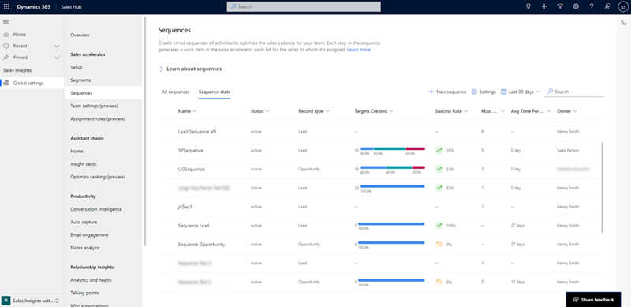
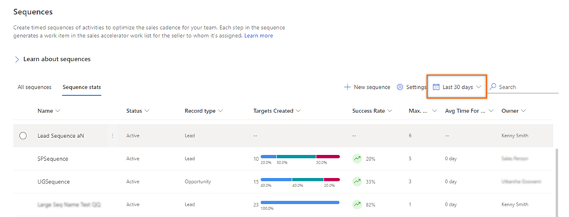
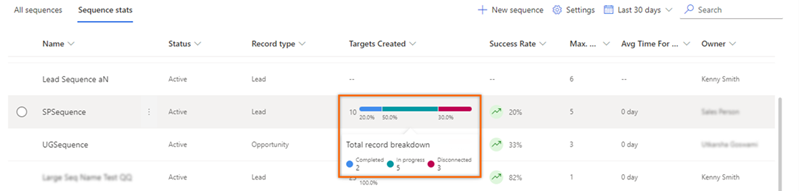
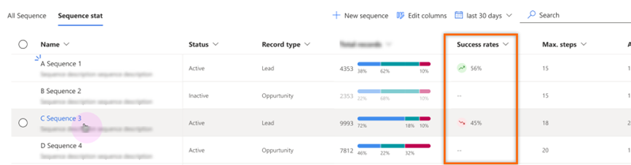

# Preview: Understand the sequence stats page

[!INCLUDE [cc-beta-prerelease-disclaimer](../includes/cc-beta-prerelease-disclaimer.md)]

The stats about sequences provide insights on the performance of a sequence, such as, success rate and the state of records that are connected. The data helps you view the sequences that are doing better and emerging with high successful conversions rate. 

## License and role requirements

| &nbsp; | &nbsp; |  
|-----------------------|---------|
| **License** | Dynamics 365 Sales Premium  More information: [Dynamics 365 Sales pricing](https://dynamics.microsoft.com/sales/pricing/) |
| **Security Role** | Sales Manager or Sequence Manager    See [Predefined security roles for Sales](security-roles-for-sales.md)|
|||

## Who can view the stats page?

By default, the users with sales manager and sequence manager roles can view the stats page. For other roles to view the reporting page, contact your administrator to get read access at organizational level for the **Sales acceleration reports** table. More information: [Security roles and privileges](/power-platform/admin/security-roles-privileges).

## View sequence stats page

>[!NOTE]
>-	Verify that the administrator has enabled the Sales acceleration reporting preview in your organization. More information: [Enable the Sales accelerator reports preview](enable-configure-sales-accelerator.md#enable-sales-accelerator-reports).
>-	After administrator enables reporting, the application may take up to 24 hours to display data in the stats page for the first time. Subsequently, data in the stats page refreshes every four hours. 

**To view the sequence stats:**

1.	Go to **Change area** in the lower-left corner of the page, and select **Sales Insights settings**.
2.	In **Sales accelerator**, select **Sequence**.
3.	On the **Sequences** page, select the **Sequence stats** tab.
    The **Sequence tab** opens.

    >[!div class="mx-imgBorder"]
    >        

## Understand the sequence stats page

The sequence stats page consists of information on data related to each sequence that are available in your organization and a time frame for which you want to view the data.

### Select time frame  

Select the time frame in which you want to view the data. When selected, the table refreshes to show data for the selected time frame. By default, the time frame is selected as 30 days and the following time frames are available for you to choose:
-	30 days
-	90 days
-	180 days
-	1 year
-	2 years

>[!div class="mx-imgBorder"]
>
 
For example, if you want to view the data for the last 90 days, choose Last 90 days from the date dropdown list. The table refreshes to show data for the last 90 days.

### Sequence stats list

The sequence stats list consists of sequences that are available in your organization, including inactive, for all record types. You can view the information for the selected time frame such as targets created and success rate.   
-	The **Target Created** column contains information on the total number of records that are linked to the sequence in the selected time frame with their statuses. Hover the mouse over the column to view information on the number of records that are in completed, in-progress, and disconnect statuses.

    >[!div class="mx-imgBorder"]
    >
 
-	The **Success Rate** column displays the trend of the sequence with its successful conversion rate for the connected records in the selected time frame. 

    >[!NOTE]
    >The **Success Rate** column is available only for lead and opportunity record types.  

    >[!div class="mx-imgBorder"]
    >  
 
    The trend shows how a sequence is performing in the selected time frame compared to that of the previous time frame. For example, if you select 30 days and a sequence related to lead record type shows an upward trend (Green), specifying that the sequence has performed better in converting leads into opportunities in the current 30 days when compared to the previous 30 days. **Green** indicates improvement, Red indicates downwards trend, Orange indicates no change in the success rate.    
    The percentage shows the average number of records that are successfully converted into win deals or opportunities when compared to the previous time frame.

[!INCLUDE [cant-find-option](../includes/cant-find-option.md)]

### See also

[Enable the sales accelerator reports preview](enable-configure-sales-accelerator.md#enable-sales-accelerator-reports)    
[Understand sales acceleration reporting](understand-sales-acceleration-reporting.md)

[!INCLUDE[footer-include](../includes/footer-banner.md)]
