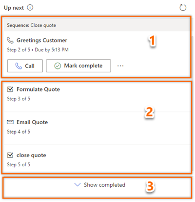
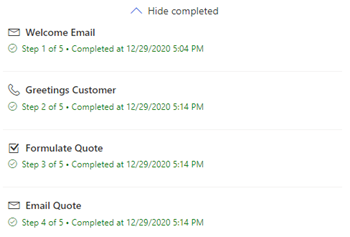

# Understand the Up next widget

The **Up next** widget displays activities that you can view and perform actions on records. 

## License and role requirements
| Requirement type | You must have |  
|-----------------------|---------|
| **License** | Dynamics 365 Sales Premium  More information: [Dynamics 365 Sales pricing](https://dynamics.microsoft.com/sales/pricing/) |
| **Security roles** | Any primary sales role, such as salesperson or sales manager   More information: [Primary sales roles](security-roles-for-sales.md#primary-sales-roles)|

## What is the Up next widget?

Using the **Up next** widget, you can view and perform actions on activities on a record. The widget displays the current activity, upcoming activity, and completed activities. You can add these activities to a record manually or by using a sequence:

- In a sequence, a sales manager creates activities and applies them to the record according to business requirements. The activities in the sequence are displayed in the **Up next** widget.    
- For manual activities, you or a sales manager can create an activity on the timeline. The activity is displayed in the **Up next** widget as a current, upcoming, or completed activity, depending on its due date. This activity is available to you and other sellers who have access to the record.

To do actions on activities, see [Connect with customers by using a record or the Up next widget](connect-with-customers.md).

The following image shows an example of the **Up next** widget.    

> [!div class="mx-imgBorder"]
>     

1. **Current activity**: The current activity is a task that you must complete or skip to go to the next activity, which moves the record closer to completion. To perform an action such as making a phone call or sending an email, select the action icon displayed in the activity. More information: [Connect with customers by using a record or the Up next widget](connect-with-customers.md).   

   After you complete the action, select **Mark complete**, and the activity is closed and moved automatically to completed items and is displayed on the timeline.

   You can choose to skip the activity if you think it's not relevant to the record or you don't want to perform the action. Select **More options**, and then select **Skip**. The activity is skipped and moved to completed items.
   
    Also, you can view suggestions for the record and preview the sequence to get an overview of the sequence steps. More information: [Preview a sequence](#preview-a-sequence) 

2. **Upcoming activity**: The upcoming activity section is view-only, and you can't perform an action on these tasks. This section is displayed so you know which activity will appear next when you complete the current activity.

3. **Completed activities**: These activities are marked as complete or skipped for a record.

     To view the completed activities list, select **Show completed**. The section expands to display the list of completed activities with details such as whether the activity was completed (with date and time) or was it skipped. You can't perform any actions on these tasks; they're view-only. The following image is an example of an expanded section of completed items.

     > [!div class="mx-imgBorder"]
     >    

## Add manual activities to records

Using the sequence, your sales manager can define activities for you such as email, phone calls, tasks, and appointments. To meet business requirements, you might have to add extra activities to a record. You can manually add activities for records to appear in the **Up next** widget in addition to activities defined in the sequence for a given day. The manual activities include email, phone calls, tasks, and appointments.

Only one manual activity is displayed in the **Up next** widget at a time. After the activity is marked as complete, the other manual activity is displayed. Activities with due date are prioritized and displayed first and then the activities with no due date. 

The characteristics of manual activities are similar to an activity defined in a sequence. Sellers must perform the activity and mark it as complete. Then the activity will be moved to the list of completed activities in the **Up next** widget. A sales manager or you, as a seller, can add the manual activity to the records that you or your security role owns.

To add manual activities, see [Track and manage activities](manage-activities.md). After the activity is added to the record, based on its due date, the activity will be displayed in the **Up next** widget.  

## Preview a sequence

[!INCLUDE [cc-beta-prerelease-disclaimer](../includes/cc-beta-prerelease-disclaimer.md)]

The sequence preview gives you a complete overview of the sequence, including the progress and activities related to different paths. To preview a sequence, select the name of the sequence in the **Up next** widget. The sequence opens in a pane displaying the list of activities that have been defined within the sequence.

> [!VIDEO https://www.microsoft.com/videoplayer/embed/RW16PET]

The following image shows an example of a sequence preview.

:::image type="content" source="media/sequence-sequence-preview.png" alt-text="Screenshot of with sequence preview pane.":::

Using sequence preview, you get the following information of the sequence:  

- View the total number of steps along with the number of steps that have been completed and remaining. 
- View the number of days spent on each activity and along with the days required for completion.

By analyzing this information, you can track the progress made throughout the sequence and make necessary adjustments to ensure that you reach your goal. Also, you can review the activities that have been completed to ensure that nothing has been missed.

[!INCLUDE[cant-find-option](../includes/cant-find-option.md)]

### See also

[What is the sales accelerator?](sales-accelerator-intro.md)  
[Create and manage sequences](create-manage-sequences.md)  
[Connect with customers by using a record or the Up next widget](connect-with-customers.md)  
[Prioritize sales pipeline through work list](prioritize-sales-pipeline-through-work-list.md)  
