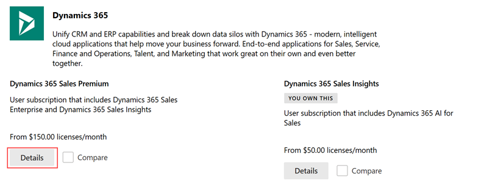
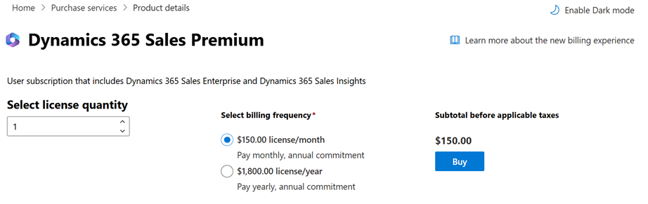

# Upgrade to Dynamics 365 Sales Premium

Learn how to upgrade from Dynamics 365 Sales Enterprise to Dynamics 365 Sales Premium

## License and role requirements
| Requirement type | You must have |  
|-----------------------|---------|
| **License** | Dynamics 365 Sales Enterprise and Dynamics 365 Sales Professional  More information: [Dynamics 365 Sales pricing](https://dynamics.microsoft.com/sales/pricing/) |
| **Security roles** | System Administrator   More information: [Predefined security roles for Sales](security-roles-for-sales.md)|

## Upgrade from Dynamics 365 Sales Enterprise to Dynamics 365 Sales Premium

Dynamics 365 Sales Premium empowers sellers to achieve more as they align to new customer engagement expectations and transformational business opportunities. Sales Premium helps sellers to:

-   Become more productive and spend time on valuable activities

-   Build stronger relationships with their customers

-   Stay on top of their pipeline

Dynamics 365 Sales premium collects data from Dynamics 365 and the entire Microsoft 365 eco-system. With the power of AI, it provides insights and recommendations handed in a delightful experience to your sellers.

Dynamics 365 Sales Premium offers a comprehensive set of intelligent capabilities to help sellers work less and sell more. The license includes Dynamics 365 Sales Enterprise and Sales Insights capabilities. It removes the limitation of three hours of conversation intelligence per month, 1,500 sequence-connected records per month for Sales Accelerator, and 1,500 scored records per month for predictive scoring.

For frequently asked questions about Sales Premium, go to: [Frequently asked questions for Sales Premium](faqs-sales-insights.md)

The premium features help organizations in the following areas:

- **Guided selling:** Guide sellers on their next course of action with timely and actionable insights.

- **Productivity intelligence:** Free up sellers' time by minimizing manual data entry with contextual, real–time suggestions for updating existing records and creating new records, making sure your data is always up to date.

- **Relationship intelligence:** Build stronger relationships with customers and move relationships forward with AI -guided selling. Take pre-emptive steps to mitigate risks with a relationship health score.

- **Predictive models:** Increase conversion and win rates by using AI to prioritize leads and opportunities with the highest likelihood to convert and buy.

## Dynamics 365 Sales Premium licensing and pricing

Sales Enterprise customers who wish to roll out the latest premium capabilities can do so by upgrading their existing Sales Enterprise License to be Sales Premium. We also offer a separate purchase of the Sales Insights should organizations wish to keep the licensing separate. Dynamics 365 Sales Enterprise and Dynamics 365 Sales Insights pricing is available from your Microsoft account team, partner service provider, or at: [https://dynamics.microsoft.com/pricing/\#Sales](https://dynamics.microsoft.com/pricing/\#Sales)

## Purchase Sales Premium license

To purchase a Sales Premium license:

-   [Buy a full license](https://dynamics.microsoft.com/en-us/sales/pricing/) from Dynamics 365.

-   Upgrade an existing Dynamics 365 Sales Enterprise license with the purchase of Dynamics 365 Sales Insights or Dynamics 365 Sales Premium package by contacting us. The contact number can be found on [https://dynamics.microsoft.com/](https://dynamics.microsoft.com/) under the **Contact us** section.

-   [Purchase a Sales Premium license from Microsoft 365 admin center](#purchase-a-sales-premium-license-from-microsoft-365-admin-center)

-   Contact your existing Microsoft business partner

-   Contact your Microsoft account manager

### Purchase a Sales Premium license from Microsoft 365 admin center

1.  Go to the [Microsoft 365 admin center](https://admin.microsoft.com/).

2.  In the left pane, select **Billing** &gt; **Purchase services**.

3.  Find **Dynamics 365 Sales Premium**, and then select **Details**.

    

4.  From the **Select license quantity** box, select or enter the number of licenses to purchase.

5.  Select **Buy**, and then complete the purchase process.

    

### See also

[Dynamics 365 Licensing Update](/dynamics365/licensing/update)
