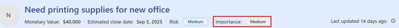
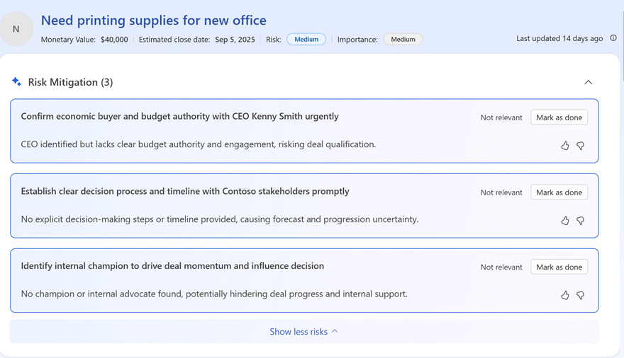
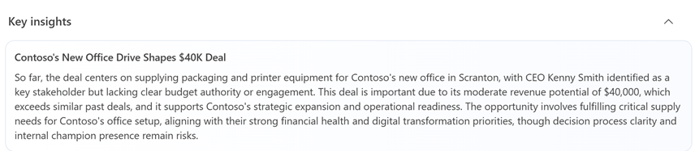
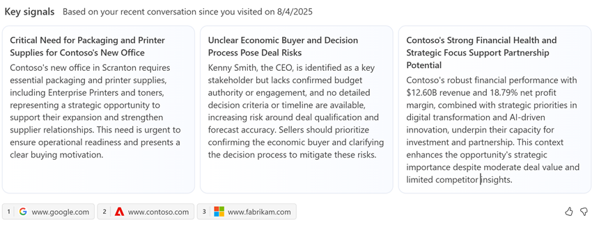
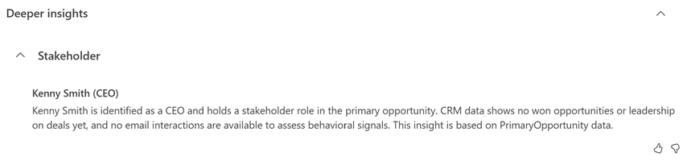
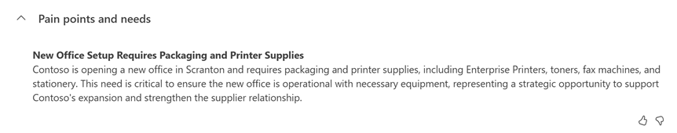
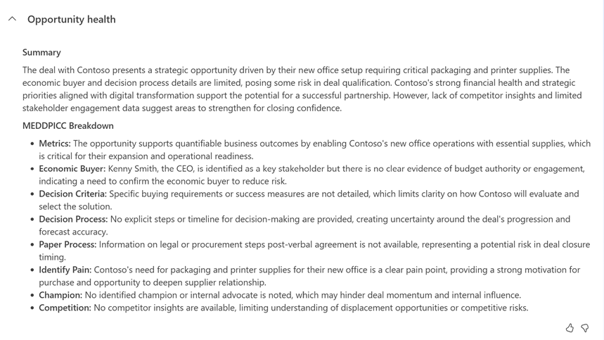
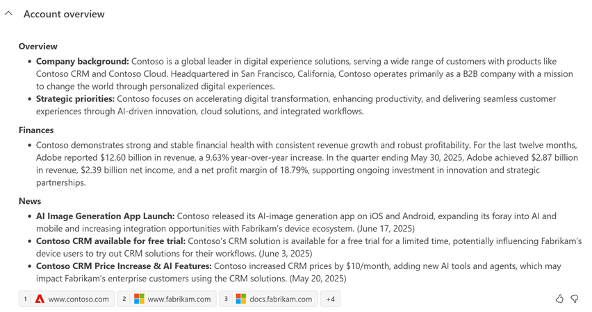

# Work on opportunities handled by Sales Close Agent - Research (preview)

[!INCLUDE [preview-banner](~/../shared-content/shared/preview-includes/preview-banner.md)]

The Sales Close Agent - Research in Dynamics 365 Sales helps you focus on the most important opportunities. By identifying high-value and at-risk opportunities, the agent helps you prioritize your efforts. With critical insights and recommendations, you can quickly ramp up on opportunities, engage the right stakeholders, and mitigate risks effectively.

[!INCLUDE [preview-banner](~/../shared-content/shared/preview-includes/preview-note-d365.md)]

## Prerequisites

You need the following prerequisites:  

- Your admin has configured the Sales Close Agent - Research for your organization.  
- You're part of the sales team that works on the opportunity segment that the agent is configured for.  
- You have the necessary permissions to view and work on the opportunities researched by the agent.  
- Your mailbox is configured to allow tracking of email messages. This setting is required for the agent to gather insights from your emails and meetings. See the personalization setting explained in Step 4 in [Configure server-side synchronization](configure-opportunity-research-agent.md#configure-server-side-synchronization).

## View opportunities researched by the Sales Close Agent - Research

1. In the Sales Hub app, select **Opportunities**.  
1. From the views drop-down, select **My top opportunities from AI agent**.  
   The view lists all the opportunities that the agent researched on and includes the importance and risk for each opportunity. The list includes only opportunities with high and medium importance.  
   > [!NOTE]
   > The agent uses the estimated revenue, estimated close date, predictive score, and other factors to calculate the importance and risk of the opportunities.  

1. Open an opportunity.  
   After a few seconds, you'll see a **Summary** section at the top of the page, displaying a quick summary of the research outcome and actionable recommendation, if any.  
   :::image type="content" source="media/opportunity-research-summary.png" alt-text="Screenshot of the Opportunity research summary section.":::
1. Select **See full research**.  
 
   The Opportunity research page opens with the complete research insights and recommendations. Learn more about the insights in the section [Opportunity research page](#opportunity-research-page).
   :::image type="content" source="media/opportunity-research-insights-with-no-risk.png" alt-text="Screenshot of the Opportunity research page with research insights when there are no risks.":::
    
   If you see a banner prompting you to provide consent for Microsoft 365 Services, read the section [Provide consent for Microsoft 365 Services](#provide-consent-for-microsoft-365-services)

> [!NOTE]
> The research insights are refreshed based on the refresh frequency configured by your admin and when specific fields in the opportunity record are updated. Learn more in [How often does the Opportunity Research Agent refresh research data?](opportunity-research-agent-faqs.md#how-often-does-the-opportunity-research-agent-refresh-research-data).

### Provide consent for Microsoft 365 Services

If your admin has enabled Microsoft 365 Services for the agent, a banner prompts you to grant permission for the agent to access your emails in Microsoft 365. The agent uses your emails to gather insights only for the opportunities you own. 

If your admin has configured the agent to use server-side synchronization instead, you won't see this banner. In that case, the agent reads only the emails and meetings that are already synced to Dynamics 365 Sales. 

:::image type="content" source="media/opportunity-research-agent-m365-consent.png" alt-text="Screenshot of the Microsoft 365 Services consent prompt on the Opportunity research page for sellers.":::

Consider the following information:

- The agent reads your emails directly from Microsoft 365 without storing them. 
- After you grant consent, the agent analyzes up to 100 recent emails from your inbox to gather opportunity insights. This consent can't be revoked. 
- The agent processes emails every six hours to keep research insights current. 
- The agent reads emails of the opportunity owner to generate insights for an opportunity. However, the insights are visible to all users who can access the opportunity.

## Opportunity research page

If the insights are in a different language than your preferred language in Dynamics 365 Sales, it's possible that the agent's language is different from your preferred language. Learn more in [What happens when the agent's language is different from user's preferred language?](opportunity-research-agent-faqs.md#what-happens-when-the-agents-language-is-different-from-users-preferred-language).

The Opportunity research page includes the following sections:

- **Deal importance indicator:**  
     

   The agent evaluates how critical the opportunity is by analyzing factors like account win history, fortune 500 status, deal size, and so on.  It looks at CRM data such as, estimated revenue and public info about the account (whether it's a Fortune 500 or key industry player?) to label the deal High, Medium, or Low importance. Your administrator can configure the importance criteria and add custom criteria specific to your business. Learn more in [Configure the importance criteria](opportunity-research-agent-advanced-settings.md#configure-the-importance-criteria)

  *How this insight helps you:* Instantly know why the deal matters. You can quickly see which deals are high-value or strategically important and prioritize those. This lets you focus your time on the most impactful opportunities, ensuring critical deals get the attention they need.  

- **Deal risks and mitigations:**  
     
   The agent scans for warning signs in the deal's data and communications. It monitors signals like slowing momentum (for example, no reply from a key contact in two weeks), slipping close dates, lack of an executive sponsor, and so on. When it detects a risk, it generates a brief alert describing the issue and suggesting mitigation steps. Your administrator can configure the risk criteria to suit your business needs. Learn more in [Configure the risk criteria](opportunity-research-agent-advanced-settings.md#configure-the-risk-criteria)

   *How this insight helps you:* You get early warnings about what could derail the deal and advice on how to counter each risk. For example, if no decision-maker is engaged, it might recommend "loop in an executive sponsor now." Acting on these tips helps you course-correct in real time.  

- **Deal overview:**  
     
   A concise summary of the opportunity's fundamentals (the deal's objective, status, and key facts) is automatically compiled. The agent pulls the latest details from your CRM fields (like deal value, products, stage) and recent updates from emails or notes to provide a quick recap of what the deal is and what's happened so far.  
 
  *How this insight helps you:* You get an instant understanding of the deal's basics and progress. Instead of digging through CRM fields and past notes, you get a one-paragraph snapshot. This helps you ramp up on the opportunity quickly and jump in prepared, even if it's been a while since you looked at it.  

- **Key signals:**  
     
   A running highlight of the most relevant developments for this deal, which updates dynamically as things change. The agent looks at all incoming data (new emails, status changes, meeting outcomes, and so on) and surfaces the top one or two "need-to-know" points whenever you view the opportunity. Early on, it might spotlight critical info (such as a newly identified urgent requirement or a major stakeholder added). On later visits, it will emphasize what's changed since you last checked – for example, "New stakeholder (CTO) engaged via email" or "Budget increased after latest meeting."  

   *How this insight helps you:* Keeps you up-to-date. Each time you open the opportunity, you see what's new or different, without having to hunt for updates. Whether it's your first look at the deal or you're coming back to it, the agent immediately flags the latest important signal. This means you can quickly catch up on changes and respond to new developments, keeping the deal moving forward with full awareness of its current state.  

- **Deeper insights:**
  This segment provides detailed insights into the opportunity, covering various aspects that help you understand the deal better. The agent analyzes CRM data, emails, meetings, and public information to generate these insights. 
  :::image type="content" source="media/ORA-deeper-insights.png" alt-text="Screenshot of the Opportunity research page with deeper insights.":::
    - **Stakeholder insights:**  
         
       Identifies the most important people involved with or influencing the deal and summarizes their roles. The agent scans the contacts linked to the opportunity in CRM, and communication patterns (email/meeting history) to determine who the key stakeholders are. It then highlights roles like decision-maker, champion, influencers, and so on, and notes each person's relevance. For example, "CFO – likely economic buyer" or "Tech lead – active champion who drives the project".  
 
      *How this insight helps you:* Know your buyer group. You instantly see who the key players are and their roles, without manual research. For example, you might learn that Jane Doe – CFO is the final approver and John Smith, the Project Lead is the day-to-day contact. This helps you focus on building the right relationships with the right people and tailor your approach to each role. It saves you time piecing together org charts and ensures no important stakeholder is overlooked.  
    
    - **Pain points and needs:**  
         
       Outlines the customer's pressing problems and requirements related to this opportunity. The agent sifts through CRM, meeting notes, emails, and public info about the account to identify what the customer is trying to solve. It then summarizes these pain points in a few bullet points or sentences. It also references where the info came from (for example, noting that a need was "mentioned during the kickoff call").  
 
       *How this insight helps you:* Know what the customer cares about. Clearly highlights why the customer is interested in this deal – for instance, it might show "Pain Point: High maintenance costs with current system; Need: a more efficient, automated solution." With this insight, you can directly address these issues in your discussions and proposals. It helps you ask the right questions rather than starting from scratch or asking obvious questions.  
    
    - **Competitor highlights:** 
       Alerts you about any competitors or alternative solutions that may derail the opportunity. The agent checks the opportunity's CRM data (such as any competitors already listed) and scans communications for mentions of other vendors. It also performs web searches if needed to see if the customer is evaluating known competitors. It then provides a short rundown of the competitive landscape – for example, noting "Competitor X (incumbent provider, contract up for renewal)" or "Customer also considering Competitor Y's product." It may include a quick comparison or a suggested talking point about how your offering differs.  

       *How this insight helps you:* Stay ahead of the competition. Gives you immediate insight into who you're up against so you can strategize accordingly. You'll know if the customer is also talking to, say, Competitor X, and you might see a note like "Competitor X is known for lower price, but lacks feature Y that we offer." This lets you proactively address the competition in your sales pitch, emphasizing your strengths. It saves you time on competitive research and helps you avoid being blindsided by a rival in late stages.  
    
    - **Opportunity health:**  
         
       Provides the health check of the deal, framed around the MEDDPICC framework (Metrics, Economic Buyer, Decision Process, Decision Criteria, Paper Process, Identify Pain, Champion, Competition). The agent evaluates each of these elements by looking at CRM data and communications. Rather than a checklist, it generates a brief narrative on how well these areas are covered. For example: "Overall, the deal shows strong value metrics and a clear champion. However, the decision process is unclear and no Economic Buyer is engaged yet." It highlights what's solid and what's missing, often ending with a suggested next step (like "Work with client to clarify procurement process").  

       *How this insight helps you:* Get a snapshot of the deal viability. You get an expert-like assessment of how ready this deal is to close, without manually analyzing every MEDDPICC element yourself. The overview calls out strengths (for example, "strong champion in place") and gaps (such as "no identified economic buyer"), giving you a quick sense of whether the deal is on track. This helps you prioritize actions.  
    
    - **Account overview:**  
         
       A brief profile of the account (the customer's organization) behind the opportunity. The agent gathers key facts about the company from both CRM and external sources. It might include basics like the company size, industry, and any recent news or big events related to the account. The agent uses public web research (news articles, business info) to enrich what's in CRM and generates a one-stop summary of the account's situation and any notable developments.  

       *How this insight helps you:* Know the customer's context. In a snapshot, you learn important background on the customer's business – for example, "HQ in Seattle, 5,000 employees, recently announced a new product line" or "Major initiative: digital transformation of supply chain in 2025." This helps you tailor your sales approach to align with the customer's reality. You can validate that your deal's value proposition fits the customer's current needs and reference recent developments in your conversation, showing that you're informed and invested in their success.  
    
    - **Product insights:**  
       This section is displayed only if you have products linked to the opportunity. 
       Key information related to the product(s) or solution being offered in this deal. The agent looks at the products linked to the opportunity in CRM and any discussion around them in emails or documents. It may pull in details like the main features or benefits of those products, or whether this is a new product for the customer. If multiple products are involved, it highlights the most important ones. It might also retrieve any relevant collateral (like case studies or product updates) to summarize how the product can meet the customer's needs.  

       *How this insight helps you:* Be more product savvy. Equips you with quick facts about what you're selling in this deal. For example, the insight might remind you “Product A is a new module for the customer, offering advanced analytics,” or “This product was mentioned as a top priority in the customer’s RFP.” This ensures you can confidently speak about the product’s value and address any product-specific questions. It saves you from having to dig through product manuals or recall feature lists, so you can focus on aligning the product’s benefits to the customer’s requirements.  
    
    - **Quotation insights:**  
       This section is displayed only if you have quotes linked to the opportunity.
       Highlights any key information about the sales quotation or proposal for this opportunity. The agent checks if there’s a quote document or pricing proposal associated with the deal either from CRM linked to the opportunity or mentions in communications. It then surfaces details such as the quote’s amount, status, and timing. For example, it might note “Quote for $50,000 sent on Aug 1, awaiting customer approval” or “Customer requested a revised quote with updated pricing on Aug 10.” If no formal quote has been sent yet and the customer has asked for one, the agent would flag that as well.  

       *How this insight helps you:* Be informed about where the deal stands in terms of pricing and paperwork. You’ll know immediately if a quote has been sent, accepted, or if there’s a request pending. For instance, if the insight says the quote is awaiting approval and due to expire soon, you can promptly follow up with the customer. If the customer is waiting on a proposal, you’ll see that and can take action. These insights help you manage the quotation aspect of the deal proactively and ensure that the deal stays on track.  

### Opportunity research insights examples

The agent refreshes the research insights based on the refresh frequency configured by your admin. The insights you see vary based on the recent activities and communications related to the opportunity. Here are some examples of insights you might see:  

- **Day 1:** Let's say that you have a strategic opportunity with a high estimated revenue, a close date in the next quarter, and no immediate risks. The Opportunity research page might look something like this:
   :::image type="content" source="media/opportunity-research-insights-with-no-risk.png" alt-text="Screenshot of the Opportunity research page with research insights when there are no risks.":::
- **Day N:** As the opportunity progresses, the agent continues to gather insights and discover risks. For example, if the agent identifies a risk related to a competitor's proposal, it might look like this:
   :::image type="content" source="media/opportunity-research-insights-with-risk.png" alt-text="Screenshot of the Opportunity research page with research insights when there are risks.":::

## Related information

- [Configure the Sales Close Agent - Research (preview)](configure-opportunity-research-agent.md)
- [FAQs about Sales Close Agent - Research (preview)](faqs-about-opportunity-research.md)
