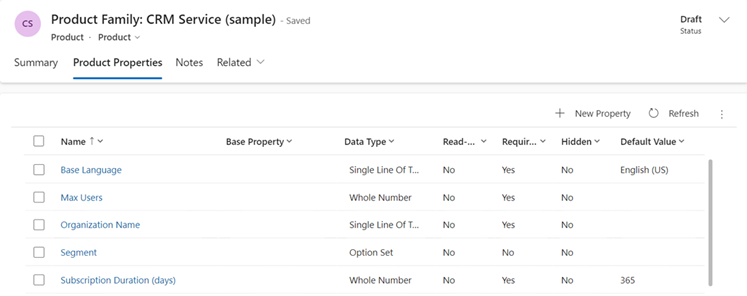
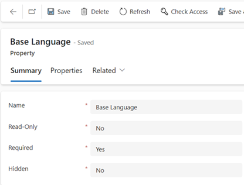

# Use properties to describe a product (Sales Hub) 

Simplify product management and classification by adding product properties in Dynamics 365 Sales.

## License and role requirements
| Requirement type | You must have |  
|-----------------------|---------|
| **License** | Dynamics 365 Sales Premium, Dynamics 365 Sales Enterprise, or Dynamics 365 Sales Professional   More information: [Dynamics 365 Sales pricing](https://dynamics.microsoft.com/sales/pricing/) |
| **Security roles** | Sales Manager, Sales Professional Manager, or Vice President of Sales   More information: [Predefined security roles for Sales](security-roles-for-sales.md)|

## What are product properties?

A property of a product could be its size, color, component, and so on. You can add properties to a family, bundle, or product when they're in **Draft** or **Under Revision** states. The child products, bundles, and families inherit the properties from their parent.  

Adding well-defined properties to products cuts down on the time spent by your agents trying to find products with the right specifications or properties for your customers when they're building orders.  

> [!IMPORTANT]
> - You can't set different prices for the different properties you define for a product unless you're using a custom pricing engine.  
> - Product families are only supported for Sales Enterprise and Sales Premium.  

## Add properties to a product, bundle, or family

1. Depending on the sales app that you're using, do one of the following:
 
    -  If you're using the Sales Hub app, 
        1. Select **Change area**  at the lower-left corner of the site map, and then select **App Settings**. 
        1. In the **Product Catalog** area, select **Families and Products**. 
   - If you're using the Sales Professional app,
       - Select **Products** from the site map.  

3. Open the product, bundle, or family you want to add the properties for.

3. On the **Product Properties** tab, select **Add New Property**.

    > [!div class="mx-imgBorder"]
    > 

4. In the **Property** form, on the **Summary** tab, enter the name of the property, and set other fields, as required.

   > [!NOTE]
   > You can hide a property by setting **Hidden** to **Yes**. When you hide a property, you block the child families or products from inheriting that property. 

5. On the **Properties** tab, select a data type for the property you’re adding.

    As an example, the following table shows a list of properties that you might want to add for a shirt product family:  

   | Property name | Data type  |          Values          |
   |---------------|------------|--------------------------|
   |     Color     | Option Set | red, blue, yellow, green |
   |     Size      | Option Set |   small, medium, large   |

6. Select **Save**. 

Repeat the steps to add multiple properties. 

## Change properties of product family, products, or bundles

You can make changes to the inherited properties of an individual product or family by overriding its properties. For example, for a shirt family, the size can vary between small, medium, and large. A product inside this family will inherit the same property. You can override the property to define the actual size of an individual shirt to medium.  

1. Open the product you want to override the property of.  

2. On the **Product Properties** tab, open the property you want to override. 

   > [!div class="mx-imgBorder"]
   > 

3. In the **Product Properties** form, select **Override**.  

4. Change the details as required, and save the properties record.  

   > [!NOTE]
   > You can override properties only for products and families that have inherited properties from the parent family.  

In the following cases, you'll see the **Overwrite** option instead of the **Override** option:  

-   You're trying to change non-inherited properties of a product family that's in the **Under Revision** status.  
    
-   You're trying to change the inherited and already overridden properties of a child product family or product. If the inherited properties of the child product or family weren't overridden, you'll see the **Override** option.  

> [!NOTE]
> Child families can have their own properties in addition to inherited ones.  

## Product versioning
At times, opportunities run for extended periods. During these periods, the associated product may change or retire. In such cases, the opportunity must still be taken through to completion.  

When you revise a product and change the properties, [!INCLUDE[pn-dyn-365-sales](../includes/pn-dyn-365-sales.md)] automatically creates a new version of the product and copies the product details from the existing product to the newer version. The new product version has all the details including price lists, product relationships, and properties. The already-created opportunities with the older version of product can continue to refer to the older version of the product. The opportunities that are created after the product is revised or retired will refer to the current (newer) version.  

[!INCLUDE [cant-find-option](../includes/cant-find-option.md)]

### See also  
 [Set up a product catalog](set-up-product-catalog-walkthrough.md)   
 [System Settings dialog box - Sales tab](/power-platform/admin/system-settings-dialog-box-sales-tab)   
 [Create a product family](../sales-enterprise/create-product-family.md)

[!INCLUDE[footer-include](../includes/footer-banner.md)]
