# Use the Sales Hub or Sales Professional app on your phones and tablets

The Dynamics 365 for phones and Dynamics 365 for tablets apps are model-driven apps that you can use to open any customer engagement app such as Sales Hub or Sales Professional on your phones and tablets. The apps work the same whether you're using it on your mobile device or on a web browser on your computer. 

> [!IMPORTANT]
> For a seamless mobile experience, we recommend that you switch to the Dynamics 365 Sales mobile app instead of using the Dynamics 365 for phones and tablets apps. For more information, go to [Overview of the Dynamics 365 Sales mobile app](sales-mobile/dynamics-365-sales-mobile-app.md).

## License and role requirements

| Requirement type | You must have |
|-----------------------|---------|
| **License** | Dynamics 365 Sales Premium, Dynamics 365 Sales Enterprise, or Dynamics 365 Sales Professional More information: [Dynamics 365 Sales pricing](https://dynamics.microsoft.com/sales/pricing/) |
| **Security roles** | Any primary sales role, such as salesperson or sales manager   More information: [Primary sales roles](security-roles-for-sales.md#primary-sales-roles)|

## Prerequisites

Before you can start using the app, you need to install the Dynamics 365 for phones or tablets app on your device.  

[!INCLUDE[proc_more_information](../includes/proc-more-information.md)] [Install Dynamics 365 for phones and tablets](../mobile-app/install-dynamics-365-for-phones-and-tablets.md)

## Open the app and navigate to records

1.	When you sign in, you'll see the MyApps page with all your apps listed.  
2.	Select **Sales Hub** or **Sales Professional** based on your license.

    > [!div class="mx-imgBorder"]
    > 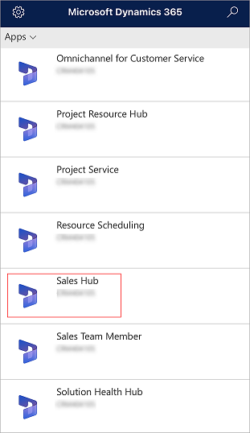

3. Use the site map to get to your work area, create a new record, search, or do other tasks. To access the site map, tap **Menu** () at the top-left of the screen.

   > [!div class="mx-imgBorder"]
   > 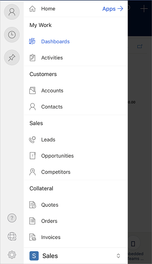

3. Use the **Pinned** and **Recent** sections to get quick access to your records, views, and dashboards.  

    - To access these sections, tap **Menu**  at the top-left of the screen, and then tap either **Recent**  or **Pinned** .

    - To pin an item, go to **Recent** list, and then tap the pin.

## How to use the Sales Hub or Sales Professional app on the go  

The Sales Hub or Sales Professional app on the Dynamics 365 for phones mobile app is designed to be your work assistant. The app helps you to engage with customers, close more deals, and acts as your office assistant.

Here are a few tasks that you can perform during your day-to-day activities by using the Sales Hub or Sales Professional app on the Dynamics 365 for phones mobile app:

- [Plan for your day](#plan-for-your-day)

- [Attend meetings with information at your fingertips](#attend-meetings-with-information-at-your-fingertips)

- [Send email](#send-email)

- [Take notes in a meeting](#take-notes-in-a-meeting)

- [Update deals and customer information after a meeting](#update-deals-and-customer-information-after-a-meeting)

- [Search for a record](#search-record)

- [Add and qualify leads](#add-and-qualify-lead)

- [Generate and share a quote or order](#generate-and-share-a-quote-or-order)

- [Manage your to-do list](#manage-your-to-do-list)

### Plan for your day

As you start your day, go to **My Appointments** to find out how busy you're going to be. The **My Appointments** feature provides insights into your meetings, travel, and free time. With this information, you can plan for the day by reviewing who you'll be meeting, where you'll need to travel, and how much free time you'll have left.

**To view your appointments**

*   On the site map, tap **Activities**, and then select the **My Appointments** view.

### Attend meetings with information at your fingertips

While you're traveling, you can open any appointment to view more details such as start time, duration, and description of the meeting. The following image shows an example.

> [!div class="mx-imgBorder"]
> 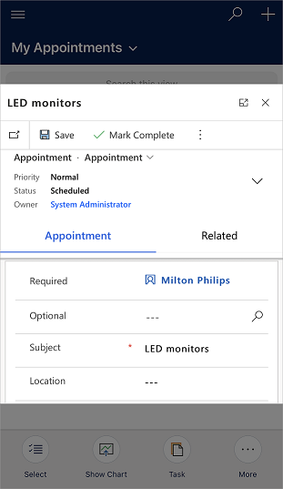

In addition, you can select the **Regarding** record to view which opportunity or account the meeting is about. As you view the opportunity or account, you can review the timeline of notes and past activities to ramp up on context before the meeting begins.

> [!div class="mx-imgBorder"]
> 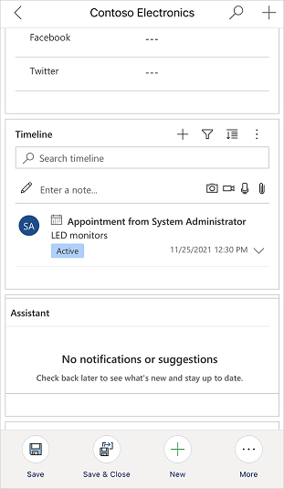

### Send email

Use the Dynamics 365 for phones and tablets app to compose an email within the app with the following capabilities:

- Full email editor formatting supported as available in Unified Interface apps.
- Add attachments to an email.
- Search for and apply a predefined template to an email. 

> [!NOTE]
> This feature isn't available in the [offline mode](Features-in-mobile-offline.md).

1. You can create emails from home page grid or by using quick create.

    1. **Home page grid**: On the home page, tap the site map button  at the the top-left corner, tap **Activities**, tap **More** at the bottom command bar, and then tap **Email**.
    
       > [!div class="mx-imgBorder"]
       > 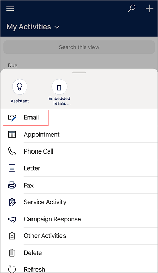

    2. **Quick create**: On the command bar at the top, tap **+** > **Activities** > **Email**.

       > [!div class="mx-imgBorder"]
       > 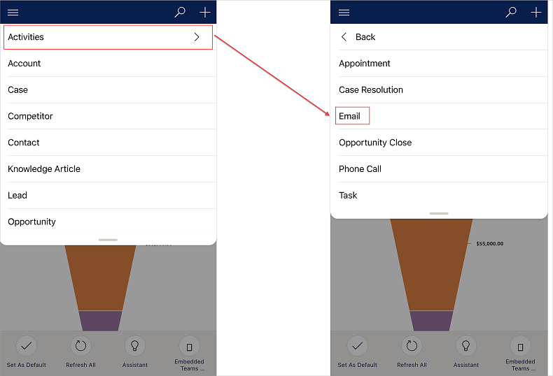

3. Draft the email and tap **Save** at the top-right to save your changes.

    The email is saved, a command bar is displayed at the bottom of the screen.

4. To add an attachment to the email, tap **More** at the bottom command bar, and then tap **Attach File**. Choose the file you want to attach to the email.

    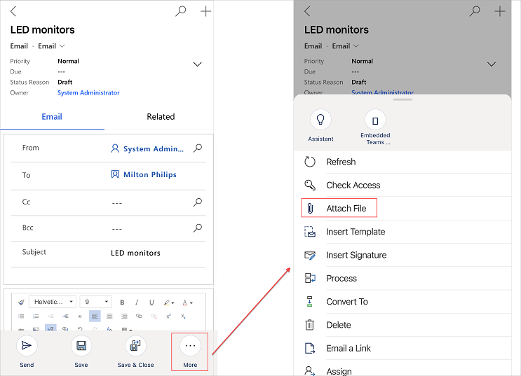
   
5. To use a template for the email body, tap **More** at the bottom command bar, and then tap **Insert Template**. Select or search for a template from the available templates, and tap **Select**.

6. When you're ready to send the email, tap **Send** at the bottom command bar.

### Take notes in a meeting

It's no longer necessary for you to open a laptop to add notes to an opportunity. You can use the app to quickly add notes to an opportunity by using your mobile device.

**To add notes to an opportunity**

1. On the site map, tap **Opportunities** >  **My Open Opportunities**.

2. On the opportunity, go to **Timeline** section and add a note.

    > [!div class="mx-imgBorder"]
    > 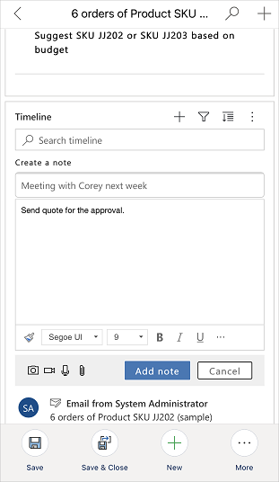

3. (Optional) If the customer shows interest in additional products, go to the **Products** tab, tap **More options** (...), and then tap **Add Product**.

    > [!div class="mx-imgBorder"]
    > 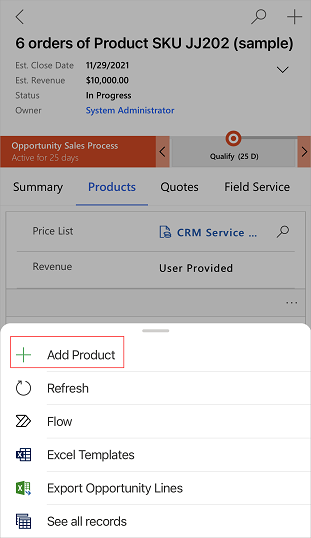

4. Select an existing product from the catalog, or create a new product.

    > [!div class="mx-imgBorder"]
    > 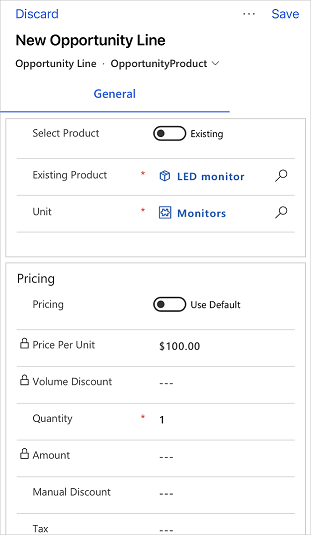

4. (Optional) If you've met a new stakeholder at the customer's office, on the **Summary** tab, go to the **Stakeholders** section, tap **More options** (...), and then tap **New Connection**. Then add the stakeholder. You can also add the contact from an account record.

### Update deals and customer information after a meeting

After you step out of a meeting, you can quickly update information about the deal or the opportunity.

**To update information after a meeting**

1. Open the opportunity from the relevant appointment.

    Or

    On the site map, tap **Opportunities**, and then select the **My Open Opportunities** view.

2. On the opportunity, you can update the estimated revenue or move to the next stage.

    > [!div class="mx-imgBorder"]
    > 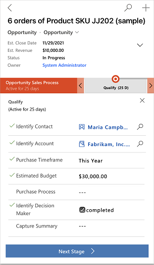

3. To create a follow-up appointment for the opportunity, go to the **Timeline** section, tap **Create a timeline record** (), and then tap **Appointment**.

    > [!div class="mx-imgBorder"]
    > 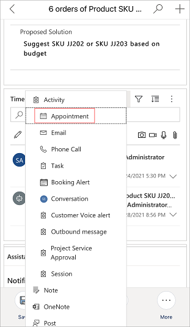

    On the **Quick Create: Appointment** form, enter the necessary information, and then save the appointment.

After you're done, you can open the appointment and mark it as complete.

### Search for a record 

You can search for records such as contacts, accounts, leads, and opportunities in the mobile app.

**To search for a record**

1. On the command bar at the top, tap the search icon.

2. On the **Search** page, enter text in the search box to find related information.

3. In the search results, tap and open the record to view more information.

### Add and qualify leads 

When you meet a new lead at an event, you can immediately add and qualify the lead with the app to make sure your team has visibility right away of the progress you've made.

**To add and qualify a lead**

1. On the site map, tap **Leads**.

2. On the leads page, tap **New** at the bottom command bar.

    > [!div class="mx-imgBorder"]
    > 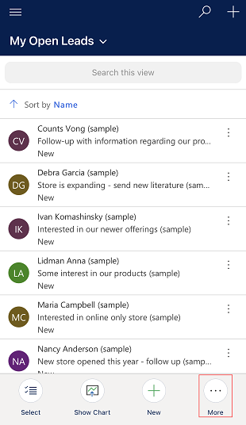

3. Enter the necessary information, and then save the lead.

4. To qualify a lead, open the lead, tap **More** at the bottom command bar, and then tap **Qualify**.

    > [!div class="mx-imgBorder"]
    > 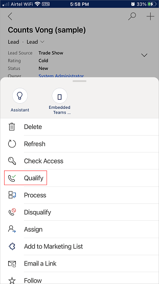

### Generate and share a quote or order

After a successful meeting, you can quickly generate a PDF of the quote from an opportunity or a PDF of the order related to an account and share it with the customer who requests it.

**To generate and share a quote or order**

1. On the site map, tap **Opportunities**, and then select the **My Open Opportunities** view.

2. Open the opportunity for which you want to generate a PDF of the quote, and then go to the **Quotes** tab. 

3. In the quote section, tap **More option** (...), and then tap **New Quote**.

    > [!div class="mx-imgBorder"]
    > 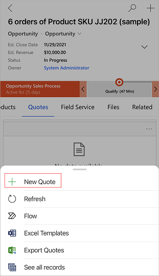

    A quote is generated.

4. From the quote page, tap **More** at the bottom command bar, tap **Email as PDF**, and then tap **Print quote for customer**.

    An email opens with the quote as an attachment. Verify the existing information and then save the email.

5. When you're ready to send the email, tap **Send** at the bottom command bar.

### Manage your to-do list

Before you wrap up the day, make sure your opportunity status is reflected correctly in the dashboards.

> [!div class="mx-imgBorder"]
> 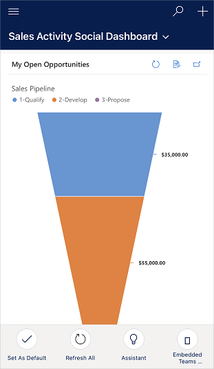

Quickly review pending tasks and close the ones you got to during the day.

**To manage your to-do list**

1. On the site map, tap **Activities**.

2. On the activities page, select the **My Tasks** view.

3. Review your tasks, and close any tasks that you've completed.

[!INCLUDE [cant-find-option](../includes/cant-find-option.md)]

### See also

[User Guide](user-guide.yml)  
[Actions supported in online and offline mode](Features-in-mobile-offline.md)

[!INCLUDE[footer-include](../includes/footer-banner.md)]
