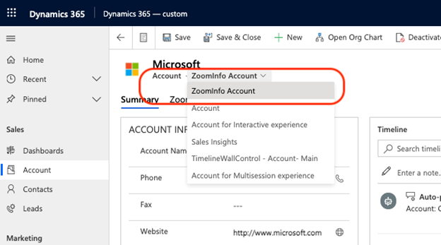
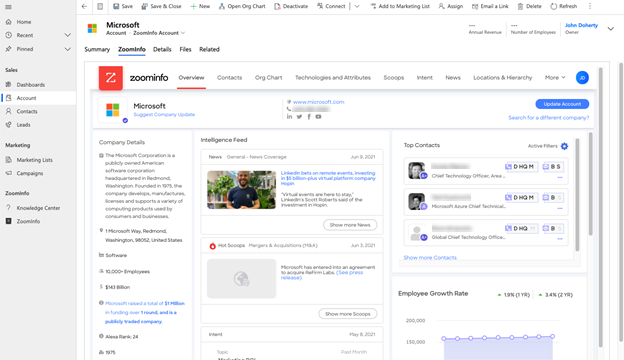

# Use ZoomInfo app data 

The ZoomInfo app for Dynamics 365 helps sales teams accelerate business growth with accurate contact and account information in their preferred Dynamics 365 Sales workflows. 

As a seller or sales manager, you can do the following tasks using ZoomInfo data in Dynamics 365 Sales:    
-	Find and import B2B account, contact, and lead information   
-	Update data on existing leads, contacts, and accounts

## License and role requirements
| Requirement type | You must have |
|-----------------------|---------|
| **License** | Dynamics 365 Sales Premium or Dynamics 365 Sales Enterprise   More information: [Dynamics 365 Sales pricing](https://dynamics.microsoft.com/sales/pricing/) |
| **Security roles** | Any primary sales role, such as salesperson or sales manager   More information: [Primary sales roles](security-roles-for-sales.md#primary-sales-roles)|

## Prerequisites   

Before you start, be sure you've met the following prerequisites:   
-	The ZoomInfo app is installed on your Dynamics 365 Sales organization. More information: [Install ZoomInfo app](install-zoominfo-app.md)
-	You have a license to use the ZoomInfo app.

## Access and understand the ZoomInfo data   

You can access the ZoomInfo app in the following ways:   
-	**Through the Dynamics 365 app center**: The ZoomInfo app is available as part of Dynamics 365 published apps. The app for Dynamics includes custom forms with the ZoomInfo iframe built into account, contact, and lead forms. Also included in the left navigation are links to the ZoomInfo app and Knowledge Center.
-	**Customized experience**: The customized experience is available when an administrator customizes the existing environment by adding the same elements available in the ZoomInfo app experience to the Dynamics 365 Sales app and to standard or custom account, contact, and lead objects. More information: [Customize the ZoomInfo app](customize-zoominfo-app.md).  

To access and understand the ZoomInfo data, follow these steps:   

1.	Open your Dynamics 365 Apps page and choose one of the following options to open the ZoomInfo data:   
    -	Select the **ZoomInfo** app and on the left navigation pane, select **Accounts**, **Contacts**, or **Leads**, depending on the record for which you want to view information.
    -	Select the **Sales Hub** app and on the left navigation pane, select **Accounts**, **Contacts**, or **Leads**, depending on the record for which you want to view information.
 
    >[!NOTE]
    >In this example, we're using the **Accounts** record type to explain the steps.   

2.	Open an account record and the record opens with a default form. 
3.	On the form selector dropdown, choose **ZoomInfo Account**.

    > [!div class="mx-imgBorder"]
    > 
 
    The **Summary** tab of the **ZoomInfo Account** form includes a **ZoomInfo Overview** that displays metadata describing the ZoomInfo data for the selected account. The metadata includes the date and time when the account was first updated, last updated with ZoomInfo data, and the unique ZoomInfo ID.

    > [!div class="mx-imgBorder"]
    > 

4.	Select the **ZoomInfo** tab to see the data of the account that's available in the ZoomInfo app.    

    > [!div class="mx-imgBorder"]
    > 

 
To understand more about each component of the ZoomInfo home page, see [Dynamics Native Application](https://university.zoominfo.com/learn/article/implementation-guide-dynamics-native-application).

[!INCLUDE [cant-find-option](../includes/cant-find-option.md)]

### See also

[Install ZoomInfo app](install-zoominfo-app.md)   

[!INCLUDE[footer-include](../includes/footer-banner.md)]
